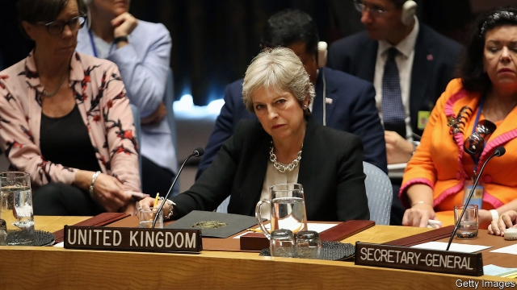

###### Declining UN influence

# Brexit weakens Britain’s influence at the UN 

##### Winning key posts and votes has already become trickier 

 

> Feb 21st 2019 

THIS WEEK UNA-UK, a pro-UN group, published a report on British influence at the UN. It starts well. Britain is an energetic Security Council member. It “held the pen” for fully a third of the 36 agenda items for which a country led drafting in 2018. It remains a skilled negotiator, and its mission is one many others “aspire towards”, says Jess Gifkins of Manchester University, a co-author. 

The rest of the report is bleaker. “We’ve lost our marbles,” one diplomat is quoted as saying. Many in New York see Brexit as grievous self-harm. Fearing defeat or retribution, Britain now champions fewer, less difficult causes. Wary of Chinese ire, it was loth to condemn Myanmar over the Rohingyas. It agonised over tabling a resolution on Yemen, fearing Saudi hostility. Such timidity only reduces its clout. 

In truth, Brexit is leaving Britain more exposed. Being a forceful human-rights advocate has in the past let it punch above its weight. But America, its usual supporter, has turned inward, and Brexit costs Britain automatic EU support. Its aura is also dimming in the UN general assembly. Britain still wins some kudos for being one of just six countries that spend 0.7% of their GDP on foreign aid. But some Brexiteers cast doubt over the commitment to that target. Rising anti-immigration rhetoric puts off other sympathisers. 

Damage to reputation has tangible costs. Britain was aghast when it failed to get a judge reappointed to the International Court of Justice in 2017. The number of British nationals on human-rights bodies is at an all-time low, says the Universal Rights Group, a Geneva-based think-tank. British candidates for special committees have been rejected 35 times since 2016. There is “increasing nervousness” about Britain’s chances of being re-elected to the Human Rights Council in 2021, says an insider. 

It could also become costlier for Britain to secure funding for mandates that it supports. East Africa illustrates this. Before 2016, Britain mobilised EU money to support the African Union mission in Somalia (which is backed by the UN). But France has since lobbied for the EU to focus on the Sahel instead. This has forced Britain to fork out more itself. It may have to do so more often to shore up its influence and justify its permanent Security Council seat. 

