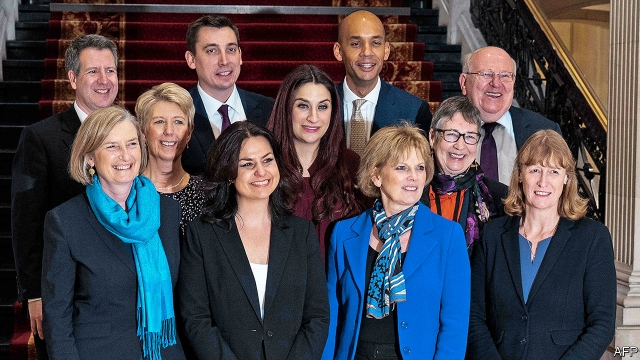

###### Political realignments

# Britain’s Parliament splinters 

##### A group of breakaway MPs may not dominate British politics, but it could help shape the future 

 

> Feb 21st 2019 

IT WAS SUPPOSED to be a quiet time in Westminster. But a week when the Commons was due to be in recess has instead seen the biggest political shake-up in four decades. It began on February 18th, in a conference centre overlooking Parliament. One by one, seven Labour MPs took to the podium to quit the party to which they had belonged for most of their lives, accusing its leader, Jeremy Corbyn, of racism, betraying voters on Brexit and being a national-security risk. Another Labour MP followed the next day, labelling Mr Corbyn and his allies Stalinist. And on February 20th three anti-Brexit Conservative MPs joined them. Theresa May, the prime minister, was running scared of her hard-right Brexiteers, they said. This coalition of MPs fed up with their parties, pictured above, has dubbed itself the Independent Group. 

Brexit has heaped pressure on Britain’s big political parties. The emergence of the Independent Group marks the biggest change since the Social Democratic Party (SDP) was formed by four ex-Labour ministers in March 1981. With 11 MPs—and rumblings of more to come, from both Labour and the Tories—the centrist former Labour MPs and liberal ex-Tories already make up the joint-fourth largest group in Westminster. But what difference will they make? 

Some big obstacles stand in their way. Britain’s first-past-the-post electoral system is unkind to small parties. The SDP peaked at 25% of the vote in the 1983 election; this translated into a measly 23 of Parliament’s 650 seats. Most of today’s rebels were already threatened with deselection by grumpy party activists, who will relish even more attacking them now they are independent candidates. 

The 11 MPs also lack experience. Some, such as Chuka Umunna, are recognisable in Westminster but not household names. By contrast, the original “Gang of Four” behind the SDP consisted of former cabinet heavyweights, including a dashing foreign secretary and the most influential home secretary of the 20th century. Between them, the independents can muster only a few years as junior ministers. 

This lack of experience is matched by a deficit of political nous. Their early decisions have left plenty for critics to home in on. All backed a “People’s Vote” on Brexit, arguing that voters should be allowed another say since Brexit has failed to live up to its promises. Yet each has refused to fight a by-election, despite ditching the party for which they were elected. A principled stand against racism was undermined when one ex-Labour MP was forced to apologise for saying during an interview that ethnic minorities had a “funny tinge”. 

Yet the new group has reasons for optimism. It is hard for new parties to break through, but not impossible. In the 1920s Labour replaced the Liberals as one of the two dominant parties. One early poll puts the new group on 14%—not bad for MPs who have yet to form an official party, have no manifesto and whose main footprint is a website asking for donations. 

More important, electoral success is not always needed to change British politics, as the rise of the UK Independence Party has shown, points out Robert Ford, a professor at Manchester University. UKIP peaked with two MPs, but still indirectly set the course for Britain’s departure from the EU. 

What the 11 MPs offered their colleagues was a lesson in bracing honesty. It is easy to find Labour MPs who gripe about Mr Corbyn privately. But the hope of booting the Tories out of Downing Street is enough to keep them loyal, despite misgivings about, say, his foreign policy. Likewise, many Conservative MPs think Brexit is a disaster and their colleagues are lunatics, yet stay quiet in public. Moderates see the risk of a chaotic Brexit as worth taking if it keeps Mr Corbyn out of power. Released from the yoke of party loyalty, the MPs let rip at their former colleagues. Anna Soubry, a former business minister, said the battle for the Tory party was over as the extremists had won. There is still a moderate majority in the Commons, albeit one that has lost its voice. A flock of independent MPs may help to find it again. 

Labour MPs expect further desertions. Yet the mood at the top is far from apocalyptic. Those close to the leadership admit that the departure of Luciana Berger, bullied into quitting by rampant anti-Semitic abuse, leaves a scar on the party. But the departure of the others—persistent critics who disagree with Mr Corbyn’s left-wing economics—was met with a shrug. 

Broadly, the breakaways are regarded with contempt. Mr Corbyn’s allies are sceptical about the popularity of the technocratic fixes reminiscent of Tony Blair’s era that were offered by the departing MPs. Others argued more simply that their former colleagues would merely keep the Tories in power. 

Whether the Independent Group is a Blairite death rattle, as those around the Labour leader hope, will depend a lot on who else joins it. Tom Watson, Labour’s deputy leader, warned that more MPs would follow unless the leadership did more to allay their concerns. Unexploded political issues, such as whether the leadership will eventually support a “People’s Vote” on Brexit, could trigger a swathe of defections. Some at least are alive to the risk. John McDonnell, the shadow chancellor, who has his eyes fixed on Downing Street, pledged a “mammoth listening exercise” to stop more MPs quitting. On the other side, the Conservatives do not yet see an existential threat. The prospect of a chunk of Tory MPs breaking off en masse is remote, says one backbencher. Yet more high-profile defections are possible, especially from among those determined to stop a no-deal Brexit. 

In Westminster it had long been assumed that Brexit would be like an asteroid crashing into British politics, triggering an extinction-level event for one or both leaders and perhaps for their parties. The dinosaurs could still be wiped out, but new species will emerge. A not-so-quiet week in Westminster has provided a peek at a possible brave new world. 

