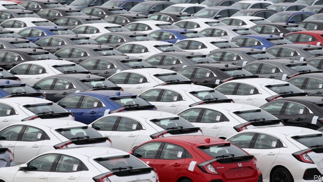

###### Honda shuts its British factory

# Honda’s departure adds to the gloom enveloping Britain’s car industry 

##### How Brexit matters in a devastating blow for British manufacturing 

 

> Feb 21st 2019 

WORKERS AT HONDA’s car plant near Swindon, in Wiltshire, were told not to report for work on February 19th. It was a bitter foretaste of an uncertain future. The previous day news leaked out that the factory will close in 2021. This will cost 3,500 jobs at Honda, and at least another 3,500 among its suppliers. Greg Clark, the business secretary, called it a “devastating” blow, not only to Swindon, where Honda is one of the largest employers, but to British industry as a whole. 

The announcement was a shock, as Honda had earlier promised to remain committed to Britain. But it follows a slew of bad news for the country’s car industry, which has a turnover of £82bn ($105bn), employs 186,000 people directly and accounts for 12% of Britain’s goods exports. Earlier this month Nissan, another Japanese carmaker, said it would shift production of the latest version of its x-Trail, an SUV, from Sunderland to Japan. Ford is scaling back engine production in Bridgend, in Wales. In January JLR, Britain’s biggest carmaker, confirmed 4,500 job cuts. Michelin, a tyremaker, is to close a factory in Dundee by 2020. Schaeffler, a German car-parts maker, is closing two factories, at Llanelli in Wales and Plymouth, with the loss of 500 jobs. Inward investment into Britain’s car industry fell by half in 2018. 

These companies are responding to big changes in the global car market. Falling sales in China have particularly hurt JLR. Emissions standards have been tightened, so both legislators and consumers have turned against diesel cars, such as the version of the x-Trail made in Sunderland, persuading Nissan to make petrol models in Japan instead. Honda’s decision to close Swindon, where it makes about 150,000 Civics a year, is another piece of a wider global rejig. The firm will also shut its Civic plant in Turkey. As 90% of the cars produced at Swindon are exported to the North American and European Union markets, production of the Civic outside Japan will now be concentrated in America. 

However Brexit also played a part in the decision-making. Honda has been bashing out cars at Swindon since 1989. Like Nissan and JLR, it has built up complex supply chains across Europe. This just-in-time manufacturing model is vulnerable to any hold-ups at the border, which are especially likely if there is a no-deal Brexit. Carmakers also worry about the risk of tariffs on exports to the EU, which average 10% on cars and 4.5% on parts. 

Some manufacturers have been explicit about the malign effects of Brexit. In a reported call between Theresa May and business leaders on February 12th, Ford told the prime minister it was preparing to move all production out of Britain in the event of no deal. Nissan cited “continued uncertainty” around Brexit for its x-Trail decision. In contrast, Honda did not cite Brexit as a reason for closing the Swindon plant. But it surely played a part. A comprehensive free-trade agreement between Japan and the EU will eventually reduce 10% import tariffs to zero. So it makes little sense for Honda to keep producing in Britain when, outside the EU, it might face tariff barriers. 

Just as Honda’s decision bodes ill for other global carmakers, it also marks another phase in the end of Japan’s love affair with industrial Britain. Margaret Thatcher, then prime minister, opened Nissan’s Sunderland plant in 1986. The Iron Lady didn’t open any old factory; she wooed the Japanese, selling Britain as a stable, low-cost manufacturing gateway into the EU. Since then some £50bn of Japanese investment has flowed into Britain. 

In recent months Japanese diplomats and businessfolk have been unusually vocal in expressing concerns about Brexit, especially in a no-deal form. Brexiteers have been largely unmoved by Japanese companies’ warnings, assuming that they were bluffing. Now it turns out that they were not. Two electronics companies, Panasonic and Sony, are shifting their European headquarters from Britain to the Netherlands, Nissan is scaling back, and now Honda is quitting. More firms may yet follow their example. 

