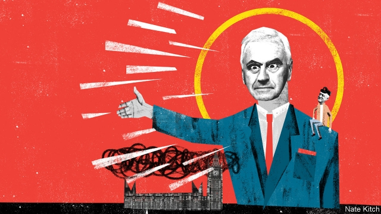

###### Bagehot

# John McDonnell, Labour’s hard man 

##### The Tories are wrong to dismiss John McDonnell as a Poundland Lenin. He is much more dangerous 

 

> Feb 21st 2019 

BRITAIN’S TWO big parties are in a race to see which can fall apart fastest. The Labour Party is leading in numbers: eight MPs quit this week and Tom Watson, the deputy leader, hinted that many more may go if the leadership doesn’t mend its ways. The Conservatives have managed just three defections, but even small numbers matter to a minority government trying to steer through the most controversial legislation in a generation. 

Labour’s defections have been described as the biggest challenge to Jeremy Corbyn’s position since he won the leadership in 2015. Yet the most interesting person to watch as Labour tries to clear up the mess is not Mr Corbyn but his shadow chancellor, John McDonnell. Mr McDonnell is the only member of Mr Corbyn’s entourage with the sense to try to restrain his fellow leftists from indulging their worst instincts—such as dismissing anti-Semitism claims as “Tory smears” and denouncing the defectors as the “traitorous eight”. He is also the only one with the self-discipline to focus on the real prize—creating a Labour government. 

Mr Corbyn and Mr McDonnell have been linked for so long that it is tempting to see them as Tweedledum and Tweedledee. They have spent their adult lives hanging out in the same fetid far-left subculture and supporting the same festering causes. But something odd has happened since they seized control of the party. Mr Corbyn has shrunk: he often seems just to be going through the motions. Mr McDonnell has grown. Like the Scarlet Pimpernel he is everywhere at once, giving interviews to Andrew Marr, holding town meetings, lunching with bankers. He is quite capable of sounding the familiar hard-left themes—Sir Nicholas Soames dismissed him as a Poundland Lenin when he called his grandfather, Winston Churchill, a “villain”. But he is also fizzing with ideas for reinventing socialism in the age of the iPad. 

Mr McDonnell has taken a more emollient approach to mainstream Labour MPs than Mr Corbyn. He has acknowledged that anti-Semitism is a genuine problem where Mr Corbyn has prevaricated. He immediately accepted that the Russians were responsible for poisoning people in Salisbury when Mr Corbyn again quibbled. Mr McDonnell makes a point of talking to all elements within the party—one of his favourite statements is that “my door is always open”—whereas Mr Corbyn spends much of his time in the bunker-like leader’s office with his far-left aides. Luciana Berger, one of the eight resigning MPs who has also suffered some of the worst anti-Semitic abuse, has revealed that she has not met Mr Corbyn in 14 months. 

There are lots of reasons why Mr McDonnell has grown in stature but Mr Corbyn has shrunk. He is cleverer not only than Mr Corbyn, which is not hard, but also than most MPs. He reads serious books (on a boating holiday last year he took along Aristotle’s “Politics”) and engages with serious thinkers from other parties. He is a Stakhanovite worker while Mr Corbyn is more Reaganite (“hard work never killed anyone, but I figure why take the chance”). But two qualities in particular make Mr McDonnell an especially formidable force on the left. 

The first is that he has been toughened by experience. Mr Corbyn has lived an austere life but also a cosseted one—he grew up in a manor house in Shropshire, doted on by left-wing parents, before immersing himself in the agitprop culture of north London. Mr McDonnell has seen more variety. His father was a bus-driver and his mother a shop assistant. He trained for the priesthood before discovering girls and politics. He dropped out of school without any qualifications before returning to higher education as a mature student. And he and his first wife looked after ten foster children, some of whom had been abused (he was an hour late for one exam at Birkbeck because one of the children had run away). 

The second is that he has a carefully thought-out ideology. Mr Corbyn does not so much have an ideology as an overwhelming sense of his own virtue, buttressed by a handful of slogans. This has made him maladroit in dealing with anti-Semitism because he treats it as an affront to his own moral purity. By contrast Mr McDonnell is steeped in Marxism-Leninism, with a heavy dose of Trotsky and Gramsci. 

Jon Lansman, founder of Momentum, once noted that Mr McDonnell was “both more ideological and more pragmatic” than Mr Corbyn. It would be truer to say that he is more pragmatic precisely because he is more ideological. Every concession he makes to what he calls “practical moderation” is driven by a desire to bring his socialist vision of the future closer to realisation. He talks cleverly about replacing a traditional top-down bureaucratic version of socialism with a more democratic, bottom-up version. Rather than nationalising industries (except for a handful of utilities), he will force companies to give 10% of their shares to workers. But far from empowering ordinary workers, this could well empower far-left tribunes who are willing to devote their lives to meetings. He prefers running things to weaving ideological fantasies. He proudly describes himself as a “bureaucrat”. The Labour Party figures he most admires are those who got things done—Clement Attlee, Nye Bevan and Gordon Brown. 

Mr McDonnell now has something else on his side which, as a veteran Marxist-Leninist, he can only relish—the sense that the world is running out of control. The prospect of Brexit is already polarising politics and breaking political loyalties. That polarisation and breaking will become a lot worse if Britain crashes out of the European Union with no deal. Mr McDonnell may see the dreams of a lifetime destroyed if, say, 50 MPs were to abandon Labour for a new party. He could equally find himself the real leader of a Labour government if Theresa May’s Conservative government collapsed. Whatever else you can say about Mr McDonnell, he is not the sort to let a good crisis go to waste. 

