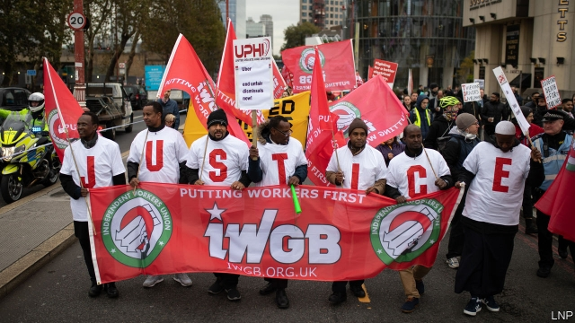
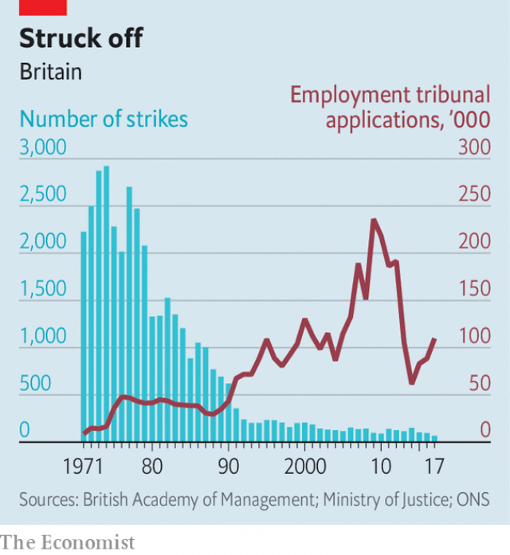

###### From the barricades to the bar

# Long hostile to the legal system, British trade unions have changed 

##### The IWGB best embodies British trade unions’ new legalistic approach 

 

> Feb 21st 2019 

BARELY A WEEK goes by without a court case on workers’ rights. In a case last month supported by the GMB, a union, the appeal court upheld an equal-pay ruling against Asda, a supermarket. Next week a case begins in the high court, backed by the Independent Workers Union of Great Britain (IWGB) and involving the University of London, concerning the extent to which outsourced workers have collective-bargaining rights at the place where they work. Before long the IWGBwill battle Uber in the Supreme Court over whether the ride-hailing firm wrongly classifies its drivers as independent contractors. Unions, it seems, increasingly see the courts as a good way to protect their members. 

Britain used to subscribe to a model of industrial relations which Otto Kahn-Freund, an Oxford legal theorist, termed “collective laissez-faire”. The state offered few employment rights, but let unions and employers fight over pay and conditions. That suited the unions. The courts were stuffed with members of the bourgeoisie who would always rule in favour of capitalists. Better, the unions thought, to have the right to bargain collectively and to strike—which they did until the 1980s. Now they realise that litigation can yield results. 

 

The state has also become more interventionist. Equal pay between men and women was legislated for in the 1970s. A national minimum wage was introduced in 1999. Britain’s accession to the European Economic Community in 1973 brought another set of employment rights, including more paid holidays. At the same time, governments from Margaret Thatcher’s on made it harder for unions to strike. The result was a fall in industrial action but a rise in litigation (see chart). 

The IWGB, which was founded in 2012, embodies British trade unions’ new legalistic approach. The outfit, which has a handful of staff and little money but an indefatigable general secretary, Jason Moyer-Lee, is hardly averse to the odd strike or demo. Its tiny office in north London is filled with posters and placards. John McDonnell, the shadow chancellor, enjoys going to theIWGB’s rallies. 

Yet the IWGBhas had more impact in the courtroom. As well as Uber and the University of London, it has battled in hearings with Deliveroo (a delivery firm), Addison Lee (a taxi company) and CitySprint (another delivery firm). So far it has been fairly successful in its battle with Uber. Lower courts have found that Uber’s drivers are not independent contractors, implying that the firm needs to pay at least minimum wages and holiday pay. 

The assumption behind unions’ legal strategy is that rulings translate into better conditions. In June 2018 a tribunal found that drivers for Hermes, a delivery firm, had been denied employment rights. In early February the firm offered somewhat improved terms. Mr Moyer-Lee argues that the union’s legal efforts against The Doctors Laboratory, a pathology company, have resulted in the firm’s couriers getting better conditions. 

Yet often legal victories have little impact. In June 2018 Pimlico Plumbers was found by the Supreme Court to have wrongly denied rights, including holiday pay, to one of its engineers. The decision “has had zero impact on our business model,” says Charlie Mullins, the firm’s founder. “People are knocking down my door to come on board.” Other gig-economy firms have just tweaked employment practices to skirt round court judgments. 

Many British workers find it hard to enforce their legal rights. In 2013 the government introduced hefty fees at employment tribunals, which explains the big drop in applications. UNISON, another union, challenged the fee rise and in 2017 the Supreme Court struck it down, yet rumours abound that the government wants to reintroduce high fees. And there is little scrutiny of employers who may be flouting the rules, with HMRC, the tax-collecting agency, lacking resources. Rights don’t mean much without a remedy. 

