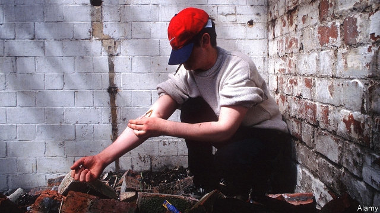

###### Trying to nail Mr Bigs

# Police need to rethink how they deal with organised crime 

##### Their attempts to tackle gangs have been badly managed 

 

> Feb 21st 2019 

FOR A TIME in the 1960s, the Kray twins were unstoppable. From their billiard club in Mile End, east London, Ronnie and Reggie outsmarted the cops and took a cut of all trades. They were the Candy brothers of racketeering; the Saatchis of the underworld. Yet their empire did not cross the Thames. Another crime family, the Richardsons, controlled the turf south of the river. Even Mr Bigs knew their place. 

Such boundaries appear quaint now. Britain’s criminal kingpins cross county and country borders. They smuggle drugs, guns and people to turn a profit, sometimes hundreds of miles from their home turf. The National Crime Agency (NCA), one of the law-enforcement bodies fighting organised crime, says there are 4,542 gangs in Britain, employing 37,317 criminals. 

Turf wars and the harm from the trade in drugs may explain a recent upsurge in violence. Crime rates in England and Wales have plummeted for two decades, but high-harm crimes are ticking up. There were more fatal stabbings in 2017-18 than at any time since records began in 1946. Drug deaths are also at a record high and gun crime is spiking. In all, the Home Office thinks organised crime cost Britain £37bn ($56bn) in 2015-16, the latest year for which numbers are available. The drugs trade accounts for more than half that sum. 

Britain’s cops have been slow to adapt. Three problems hinder efforts to tackle the new Mr Bigs. First, ministers have split responsibility for organised crime between a hotchpotch of agencies, some of which are struggling. The government’s latest organised-crime strategy, published in November, promises a “single, whole-system approach”, but provides a baffling organigram listing 19 national bodies. It also charts nine regional organised-crime units, 418 local authorities and 43 police forces in England and Wales, most of which were familiar in the Krays’ days. 

At the apex of the system is the NCA, which replaced the Serious Organised Crime Agency in 2013. Its £427m budget is smaller than that of some police forces, such as West Midlands and Greater Manchester. Lynne Owens, its director-general, must work with regional units and local forces on operations, but they are not arranged consistently. Some units have their own surveillance teams, while others rely on those of individual forces. “If I am going to task the system effectively, there has to be some coherence and there isn’t so much currently,” she admits. Police and crime commissioners, as elected watchdogs, also muddy the waters. Most prioritise visible, local issues like anti-social behaviour over the less tangible menace of organised crime, says Harvey Redgrave of Crest Advisory, a consultancy. 

Ms Owens envies the hierarchical structure of counter-terrorism policing. Neil Basu of the Metropolitan Police masterminds the response to terrorist incidents, wherever they happen. Ms Owens knows that campaigning for such a “controlling mind” for organised crime would be unpopular with some forces. So she is working with the Home Office to define which roles should be allocated locally, regionally and nationally. “To be frank, that’s never been a bit of work that’s been done.” 

Scotland offers a model for it. Eight forces merged into Police Scotland in 2013. Cops share offices with other crime-fighting agencies, including the NCA, in a single national “crime campus” dedicated to organised crime in Gartcosh, near Glasgow. Officers working on an investigation can talk easily to customs officers or the forensics lab. A single “joint operations centre” allows staff from different agencies to see video streams of operations anywhere in the country. Steve Johnson, an assistant chief constable who spent most of his career south of the border, says the Scottish structure is more agile, enabling him to put all surveillance teams onto a particular task without having to persuade several different chiefs. 

A second problem is poor data handling. Until last year, the spreadsheet that forces used to map the threat of organised-crime gangs was not linked to the national police database. The two would be matched just four times a year. Merging the two has increased the number of gangs that officers can link to each other from 6% to 45%. When the NCA set up a new co-ordination centre last year for gangs that traffic drugs across county boundaries, it found some forces unwittingly working on the same gangs. The agency is now setting up national data and intelligence units, but Ms Owens calls the funding from the Home Office “very small beer”. 

The final obstacle is the broadening definition of organised crime. Organised criminals traditionally distinguished themselves by working in groups for profit, especially by smuggling contraband or people. But ministers now class the sexual exploitation of children as organised crime, even though most of it is committed online by individuals for sexual rather than financial gain. The NCA must also tackle cyber-attacks and fraud. “It’s a really broad and growing spectrum,” says Ms Owens. Some officers grumble that this distracts attention from drugs, which yield most profit for organised-crime gangs. “We’re not good at defining it,” says one. “We throw everything into one bucket.” 

The police are playing catch-up. As they debate reforms, organised criminals go online to find more sophisticated ways of making money and covering their tracks. The NCA expects more use of the dark web to cut out middlemen. And messaging apps with built-in encryption software will make it harder to trace criminals. At least nobody gave the Krays a computer. 

