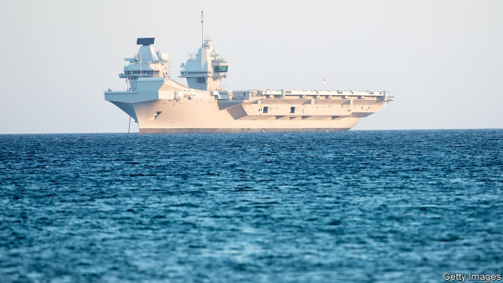

###### The not-so-golden era

# The British government is growing warier of China 

##### Ministers have grown twitchy about Huawei, among other things 

 

> Feb 21st 2019 

IN 2015 David Cameron and Xi Jinping propped up a bar in Buckinghamshire to toast a “golden era” in Anglo-Chinese relations over pints of ale. Things now seem to have turned bitter. The latest example came in a speech by Gavin Williamson, the defence secretary, on February 11th. Mr Williamson promised that Britain’s new aircraft carrier, the Queen Elizabeth (pictured above), would go to the Pacific for its inaugural mission in 2021, complete with American-piloted F-35 fighter jets. Britain, he said would “oppose those who flout international law”. 

His remarks were neither new nor remarkable. Mr Williamson’s predecessor, Michael Fallon, had quietly announced the carrier’s Asian voyage over two years ago. Yet China, still fuming over a Royal Navy passage close to Chinese-claimed islands in the South China Sea last year, has elevated offence-taking into an art form. It hit back sternly, casting a deep pall over imminent trade talks between the two sides. 

The defence secretary’s combination of bumbling and bombast makes him an easy punchbag. But the government’s attitude to China has clearly hardened. George Osborne, Mr Cameron’s chancellor, put trade and investment at the heart of the relationship, steamrolling any concerns about human rights and national security. When Theresa May took over as prime minister in 2016 the mood in the national security council changed overnight, say officials. She paused China’s involvement in the construction of the Hinkley Point nuclear-power plant (though she grudgingly allowed it to proceed with added safeguards) and refused to sign up to China’s Belt and Road Initiative, an intercontinental infrastructure project. 

More recently, some ministers have grown twitchy about the involvement of Huawei, a Chinese telecoms giant, in sensitive parts of Britain’s future 5G mobile network. Some close British allies, including Australia, have banned Huawei equipment. Others, such as New Zealand, are also clamping down. America is waging a sustained legal and diplomatic battle against Huawei. 

That has put Britain in an awkward position. It currently allows Huawei’s equipment to be used in existing networks, but insists that it be scrutinised by a dedicated body in Oxfordshire, the Huawei Cyber Security Evaluation Centre (HCSEC). That arrangement has come under pressure. In December Mr Williamson expressed his “very deep concern”. This week Ciaran Martin, head of the National Cyber Security Centre (NCSC), and chair of the board that oversees HCSEC, set out a considered view. The problem with Huawei, he said, was not that its equipment was compromised by Chinese spies—there was no sign of this, despite intense scrutiny—but that its security standards were so low. 

That would present just as big a risk to the integrity of telecoms networks as skulduggery. Accidental vulnerabilities, caused by cost-cutting or poor oversight, can be as damaging as deliberately created ones. Mr Martin suggested that none of the 1,200 significant cyber-attacks dealt with by the NCSC since 2016 involved back doors planted by other countries. Still, the annual report of HCSEC, due soon, is likely to blast Huawei’s failings. Mr Martin’s remarks suggest the NCSC will not recommend banning Huawei, but will call for it to meet much higher standards. The decision will rest on a review due soon from the Department for Digital, Culture, Media and Sport. Hawkish officials are gearing up to push back against the NCSC’s position. 

On the same day as Mr Martin’s speech, the Royal United Services Institute, a think-tank, released a report by Charles Parton, a former British official, on Chinese influence and interference in Britain’s politics, press, academia and much else. China, he conceded, was not running amok in the manner of Russia. But it was distorting Britain’s democratic norms and open society in more subtle ways. 

Mr Parton noted that China, “almost alone among foreign embassies”, sent lots of staff to hearings of the House of Commons’ foreign-affairs committee. “When, as on one occasion, four of an audience of around 16 are Chinese officials”, he argued, “it is worth asking whether the intention—and the effect—is to intimidate witnesses”. His report also pointed to China’s efforts to stifle academic debate by monitoring Chinese students in Britain or by exerting direct leverage. The report highlights the role of Confucius Institutes, educational centres under the ultimate control of the Communist Party’s Central Propaganda Department. Britain hosts more Confucius Institutes than anywhere bar America. On February 18th the Conservative Party’s human-rights commission warned that they “threaten academic freedom and freedom of expression”. 

Both old-fashioned and cyber-spying are also on the rise. In December Britain publicly rebuked China for “one of the most significant and widespread cyber intrusions against the UK and allies uncovered to date”, which targeted commercial secrets. It is not easy for Britain to combat all this, says Mr Parton, because “only a handful of officials are able to operate fully in Mandarin”. 

Despite these concerns, even hardened securocrats are eager to strike a balance. In January Sir Mark Sedwill, cabinet secretary and national security adviser, urged a “calibrated approach”. He noted to MPs that Mrs May had reaffirmed Mr Cameron’s policy of a “golden era” of relations—with one eye on post-Brexit trading opportunities. Yet it is not clear how long America will indulge such caution. The beer seems unlikely to flow as freely as in 2015 when Mrs May next meets Mr Xi. 

