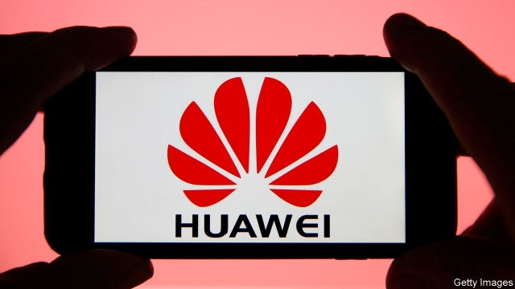

###### Huawei

# America and its allies disagree on Huawei 

##### Britain is the chief dissident, but Germany and Italy are pushing back too 

 

> Feb 21st 2019 

THE “FIVE EYES” is probably the world’s most comprehensive spying agreement. Originating in Allied intelligence-sharing during the second world war it now links together the signals-intelligence agencies of America, Australia, Britain, Canada and New Zealand. Despite its undercover nature, its members are having a very public disagreement over what to do about Huawei. 

The big Chinese technology firm makes everything from set-top boxes and routers to smartphones. Western worries concern back-end equipment of the sort used to construct mobile-phone networks. Huawei has quickly caught up with established firms in that market, such as Ericsson and Nokia, particularly when it comes to the machines necessary to run fast “fifth-generation” (5G) networks. As its gear has been installed around the world, worries have grown that it might contain “back doors”—deliberate security flaws inserted to allow the Chinese state to conduct espionage, or even to attack phone networks themselves. 

America is waging a campaign against Huawei around the world. In two recent speeches Mike Pence, America’s vice-president, urged allies to shun the firm’s gear. He mentioned a Chinese law passed in 2017 that would require firms to co-operate with the country’s intelligence services. Australia has already banned Huawei’s equipment. Japan has passed laws that seem designed to target the firm. In December Canadian police arrested Meng Wanzhou, the daughter of Ren Zhengfei, Huawei’s founder, at America’s request. She—and Huawei—are charged with evading American sanctions on Iran. 

Support for America’s tough stance is not universal. The most prominent exception is Britain, which allows Huawei’s kit but scrutinises it at a laboratory run by the National Cyber Security Centre (NCSC), part of GCHQ, Britain’s electronic-spying agency. On February 20th, speaking at a security conference in Brussels, Ciaran Martin, a member of GCHQ’s board, gave the spooks’ view. GCHQ has probed Huawei’s hardware and code for years. It found no evidence of back doors but discovered that Huawei’s code is a spaghettified mess full of holes and weak security. 

Despite those criticisms, Britain’s conditional seal of approval is important for Huawei as a counterbalance to American pressure. Germany and Italy also seem reluctant to ban it. Germany recently opened a test laboratory similar to the one in Britain. New Zealand has blocked an application by Spark, a phone network, to use Huawei’s gear on national-security grounds. But it has not blacklisted the firm outright. Poland, which arrested both a Chinese Huawei employee and one of its own citizens on espionage charges in January, has pleaded for Western unity. 

Huawei itself points out that no evidence of back doors has ever been found and argues that implementing them would be commercial suicide. The firm’s tone is both conciliatory and defiant. Mr Ren has described American concerns as “politically motivated” and said that the country will be unable to “crush” his firm. Huawei has said it will address Britain’s criticisms but that doing so will take years. 

The arguments are about more than coding. Huawei is a Chinese champion. As an aspirant superpower, China sees technology as a vital national interest. The incumbent superpower, America, thinks similarly and a technological cold war is developing between the two. Britain, pondering its place in the world after Brexit, is a traditional ally of America but is also courting Chinese investment. 

Canada’s position is the trickiest of all, at least for now. Its government must decide by March 1st whether Ms Meng’s extradition hearing can go ahead. In what are widely seen as reprisals for her arrest, two Canadian citizens have been detained in China. A third has been sentenced to death for drug-smuggling, after initially being sentenced to 15 years in prison. Expect the temperature to carry on rising. 

