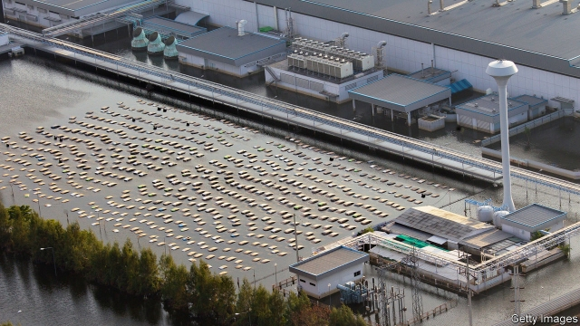
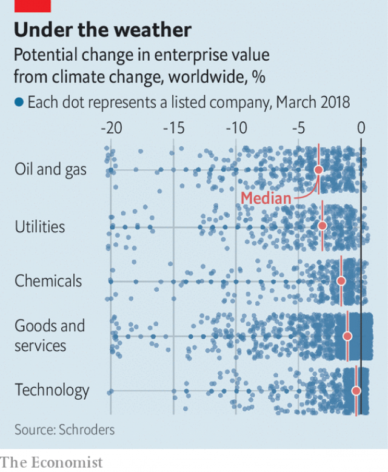

###### After the deluge

# Business and the effects of global warming 

##### Some companies are tackling the results of global warming, but most are not 

 

> Feb 21st 2019 

NESTLED IN A forest an hour’s drive from Providence, Rhode Island, sits what some employees call “the world’s biggest facility for property destruction”. Here workers for FM Global, an engineer-cum-insurer, set fire to wall cladding, hurl projectiles at reinforced glass or test roofing designs for the gusts of wind they can take before tearing off. The experiments are designed, monitored and replicated with laboratory precision, beams Louis Gritzo, FM Global’s head of research. All simulate what wildfires, hurricanes and other natural disasters could do to the structures of its customers, which include such well-known names as Disney, Caterpillar and the Massachusetts Institute of Technology. 

Mr Gritzo’s job is to help future-proof assets—corporate headquarters, factories, theme parks, campuses and the like—worth a total of $10trn globally. When Hurricane Maria swept away most of Puerto Rico’s thriving pharmaceuticals sector in 2017, the building belonging to Mylan, a drugmaker which works with FM Global, was one of the few in its neighbourhood left intact. A strengthened roof had withstood 150mph winds. Mylan kept churning out medicines and FM Global was spared a big payout. 

Nature has always disrupted business. But global warming is making the task of dealing with it more urgent. Hastened by feeble progress on curbing greenhouse-gas emissions, businesses face wetter floods, fiercer wildfires and stormier storms than in the past (see article). Hotter, more humid days imperil the productivity both of employees and equipment such as that in data centres. 

It is not only storms and floods that are a threat. Climate change is also responsible for a lack of water where it is needed. Last summer low levels on the Rhine grounded barges that BASF, a German chemicals giant, uses to ferry its products. Industrial firms fret constantly about water supply. “We are the last in line,” behind residents, farmers, and other businesses, sighs an executive at a big Indian conglomerate. In January PG&E, a utility facing billions of dollars in liabilities over its possible role in sparking wildfires in California, which proliferate as the state grows more parched, filed for bankruptcy protection. 

“Business is no longer business as usual,” says R. Mukundan, chief executive of Tata Chemicals, part of another Indian conglomerate based in Mumbai (a city that was the victim of an epic deluge around the time of Maria). Some creditors, investors and insurers murmur similar sentiments. So do senior executives touring Mr Gritzo’s lab. Those worries have grown louder in the past year or two, he reports. 

 

There is reason to be concerned. Last August analysts at Schroders, an asset manager, looked at 11,000 listed global companies and estimated that properly accounting for physical climate risk could on average shave 2-3% off their value. Some sectors would take a bigger hit: utilities and oil and gas stand to lose 4-4.5% (see chart). Some firms face potential losses of up to 20%. Most have no idea of their exposure, suspects Andrew Howard of Schroders. 

Climate nonchalance pervades many a corner office. One senior European oil executive says that he worries more about snow for his upcoming skiing holiday than he does about his company’s rigs. Bosses have plenty of things on their minds—from trade wars and Chinese hacking to artificial intelligence and the future of work. Those that do profess to think about climate change volunteer stories about their latest solar panels or renewables contracts rather than the physical threat to their infrastructure. But recurrent droughts, floods, heatwaves and storms can all hurt—particularly in a world of complex, just-in-time supply chains readily thrown out of whack. “All reasonable boards should be asking themselves these questions,” declares Bjorn Haugland, vice-president of DNV GL, a Norwegian maritime-services firm. Why aren’t they? 

A dearth of data is one reason. Peter deMenocal at Columbia University has been bringing executives and investors together with academics to discuss climate vulnerabilities since 2015. Scientists feel more comfortable talking in terms of general, long-term trends, he explains. Risk managers want information they can use, about specific threats to specific facilities over a specific (and brief) time period. They tend to fall back on old tools such as flood maps, which presuppose a stable environment. But with the climate changing, “500-year floods” may come far more frequently—just ask Houston’s oilmen, who suffered them in 1979, 2001 and 2017. 

A few companies aim to bridge the data gap themselves. Microsoft obsesses over “georedundancy”: where best to locate its cloud servers so that they are close to customers yet unlikely all to be taken out by a single disruption. Like FM Global it relies on climate models, not historical data. Royal DSM, a Dutch chemicals company, employs half a dozen people to unpick climate risks at its 250 locations worldwide, and has produced a detailed threat map. 

A cottage industry of climate consultants, often claiming to use cleverer, more granular climate models, has mushroomed to assist companies’ efforts. Acclimatise, a British firm in the business for 14 years, now advises around 40 big corporations (and dozens of public-sector bodies and NGOs). Four Twenty Seven, based in Berkeley, California, screens hundreds of thousands of facilities for exposure and sensitivity to climate risks. In 2017 it ranked the preparedness of France’s 40 biggest firms (LafargeHolcim and Solvay, two materials producers, scored lowest, admen at Publicis and Capgemini’s consultants topped the table, and manufacturers were clustered in the middle). Jupiter, another upstart in the Bay Area, is run by a former research assistant to William Nordhaus, an economist who last year won the Nobel prize for his climate-related work. McKinsey, Oliver Wyman and other big consultancies are getting in on the action, too. 

Better data will help. But they do not solve a second problem: first-mover disadvantage. “Unless you’ve faced disruption, building slack into your supply chain is an inefficiency—if others aren’t doing it,” says Mr Howard of Schroders. Four Twenty Seven will not disclose its clients, apologises its founder, Emilie Mazzacurati, because firms do not want to appear vulnerable. “You will be penalised [by the market],” grumbles the sustainability chief of a big European food company. Easier to wait for disaster to strike, then write it off as a non-recurring expenditure, he shrugs. 

“Ninety percent of the time risks are being accepted only after they happen,” says Rodney Irwin from the World Business Council for Sustainable Development, which unites green-minded companies. According to S&P Global, a rating agency, in 2017 just 15% of companies in the S&P 500 index disclosed effects on earnings from weather-related events. Under 5% of firms quantified the damage—an average hit to profits of 6%. 

The Taskforce on Climate-Related Financial Disclosures, under the auspices of the Financial Stability Board, a global grouping of regulators, issued reporting guidelines in 2017, including for physical risks, but these remain voluntary. “One way to keep risk undisclosed is not to look at it,” says John Firth, who co-founded Acclimatise. Consider the experience of a multinational carmaker, as revealing as it is commonplace. Its procurement chief relates a hailstorm that struck a factory in the tropics. The response, to erect a roof over the forecourt, was “reactive”, he admits. The incident did not prompt a systemic look at risks elsewhere, let alone investments to pre-empt them. 

That is because, in the absence of reporting requirements, “cold accounting logic undermines the economic rationale to actively manage climate risks”, explains Rowan Douglas of Willis Towers Watson, an insurance broker. Although climate risks have risen, insurance premiums and borrowing costs—two signals to which the real economy responds—have not grown much costlier. Policies are typically written for one year, so an incremental shift in risk can be hard to discern. Moreover, the price of premiums also depends on other factors, such as availability of capital, with which the industry is awash. It coped with record insured catastrophe losses of $135bn in 2017 without so much as a hiccup. Signals from creditors have been similarly muted. 

Rating agencies are gradually incorporating physical climate risk into their scores. In 2017 environmental and climate considerations led S&P Global to alter 106 corporate ratings, mostly downwards, roughly double the number two years earlier. In 42 cases physical risks were chiefly to blame. In January S&P cut its rating of Edison, an American utility, citing exposure to wildfires. Fitch, another rater, warned that “multi-notch downgrades cannot be ruled out.” A third, Moody’s, last year warned that wildfires threatened PG&E’s solvency. 

PG&E’s woes stem from legal liabilities, not a direct hit to operations. But its fate should make climate-blind CEOs nervous. On the hook for billions of dollars in damages beyond its policy cover, then downgraded by rating agencies, it found itself locked out of the insurance market. Credit dried up and bankruptcy beckoned. When a big unacknowledged risk comes to light, market signals can become very loud, very quickly, cautions a short-seller eyeing climate-vulnerable firms. 

Compare that with DSM’s approach. In drought-prone places identified by its survey the company is helping nearby towns harvest water, not least to keep local employees healthy and productive. It badgers the authorities to bring in pre-emptive measures, such as more resilient infrastructure. “We provide jobs, you provide protection,” Feike Sijbesma, DSM’s chief executive, told politicians. Tata and other firms in climate-stressed India have long taken similar steps, for similarly hard-nosed reasons. As the future unfolds, this strategy should bring bigger rewards than hiding your head in the sand. 

