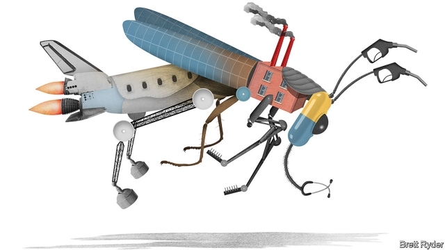

###### Schumpeter

# Conglomerates will never die out, but their form is evolving 

##### As industrial conglomerates break up, tech firms are bulking up 

 

> Feb 21st 2019 

INDUSTRIAL CONGLOMERATES have long been considered the megafauna of the corporate world: big beasts like mastodons, who were condemned to extinction by spear-wielding corporate raiders in the 1980s. But a better analogy is with cockroaches because, against the odds, conglomerates have refused to die out. They flourish in most climates and are highly adaptive. And they have long been considered pests—at least to shareholders and business-school professors, if not to their numerous employees. 

Today the industrial world is in full cockroach-extermination mode. There has recently been a slew of proposed break-ups and spin-offs, most notably at America’s General Electric (GE), United Technologies Corp (UTC), DowDuPont and Honeywell, and at their European counterparts, ThyssenKrupp, ABB, and Siemens. UTC’s Greg Hayes, a strapping chief executive who drives a pickup truck and tells it like it is, says that even Warren Buffett’s Berkshire Hathaway and Jeff Bezos’s Amazon are too big to manage. While investors tolerate Berkshire and the digital conglomerates for now, the double standard will not last for long. 

There are several reasons why executives at industrial firms have a soft spot for unwieldy structures, despite the fact that shareholders usually detest them. The biggest is megalomania: bosses believe they are best placed to run empires. Executives also place undue emphasis on history, conventional wisdom and emotional ties. In order to break up a conglomerate, all of these arguments usually have to be confronted. 

The experience at UTC is illustrative. Last year, after adding Rockwell Collins to its Pratt & Whitney aerospace business thanks to a $30bn takeover, it said it would spin off UTC’s two other divisions, lifts, and temperature and security, retaining aerospace as its focus. The break-up came only after a painstaking effort by Mr Hayes, a UTC veteran, to convince himself and the board that the old sprawl was no longer viable. All the excuses had to be taken on. 

First history. The firm dates back to the 1920s, when Pratt & Whitney was part of the granddaddy of aerospace monopolies with Boeing and what would become United Airlines. When that was broken up in the 1930s it became United Aircraft, changing its name to UTC in 1975, after which it bought Otis, a lift company, and Carrier, created by the inventor of air-conditioners. 

In 82 years UTC has never missed a dividend, added to which it is now worth more than GE, an ailing rival in whose shadow it long stood. So it was not obviously begging to be put out of its misery. When Mr Hayes first presented the board with his proposal for a break-up, half of its members resisted, as did some shareholders. 

On top of that was conventional wisdom. For years it had been axiomatic that UTC needed the cash from the lucrative servicing contracts of Otis and Carrier to support the long-cycle, capital-intensive development of jet engines. But no one had ever checked. When Mr Hayes did, he discovered it was an “old wives’ tale”; each business made enough cash to sustain itself and the dividend. That helped clinch it with the board. 

Yet even then, a chief executive’s natural inclination to preserve the legacy of his forebears runs against the logic of focus. As he puts it, “It’s hard for me emotionally to go from a $75bn [sales] business in 2019 to a $50bn aerospace business.” But Mr Hayes says that, ultimately, he knew that it was the right thing to do. 

Had he not broken up the company, others might have done it for him. That is because the resistance to change inside companies is increasingly overwhelmed by external forces, particularly from active investors anxious to boost returns. Shortly before Mr Hayes announced the break up of UTC, two hedge funds, Third Point and Pershing Square, started breathing down his neck. They may have come late to the process, but they are a symptom of a bigger change in the world of investment. As low-cost, index-tracking funds grow, active asset managers are under pressure to justify their fees, which makes them more likely to support break-ups. Hence the recent surge in activist campaigns. Lazard, a bank, says their number soared to a record 247 globally last year, up by 17% from 2017. 

Even in developing countries, where conglomerates have long maintained their superiority, the tide may be turning. Bain, a consultancy, has studied such “dinosaurs” in India and South-East Asia and found that for years they outperformed more focused “pure-play” firms, because of better access to raw materials, regulatory favours and brains. But as local capital markets have developed, the advantages have eroded. Last year Bain reported that in 2007-16 a sample of 102 conglomerates underperformed a group of 287 more single-minded firms. 

Such developments make it tempting to think that it is curtains for the cockroaches. Yet new forms are evolving. In another report, Bain noted that last year was the first time global M&A activity was dominated by deals taking firms into new lines of business, rather than ones to build scale, which generate synergies. Examples were Amazon buying PillPack, an online pharmacy, and Alibaba buying ele.me, a Chinese food-delivery business. Amazon’s move into logistics, which has recently rattled incumbents such as XPO Logistics, FedEx and UPS, reinforces the trend. 

For the time being, investors are tolerating these fashionable firms in a way that they no longer do the sprawling metal bashers. Perhaps, says Jerry Davis of the University of Michigan, that is because shareholders have mastered the art of valuing conglomerates that own traditional hard assets but still struggle with those holding nascent digital ones. Hence they give bosses like Mr Bezos the benefit of the doubt. But once markets evolve further and businesses mature, firms like Amazon will discover the drawbacks of probing into every nook and cranny. By then the activists will probably be crawling over the digital cockroaches, who will resist break-ups—just like their industrial forebears. 

