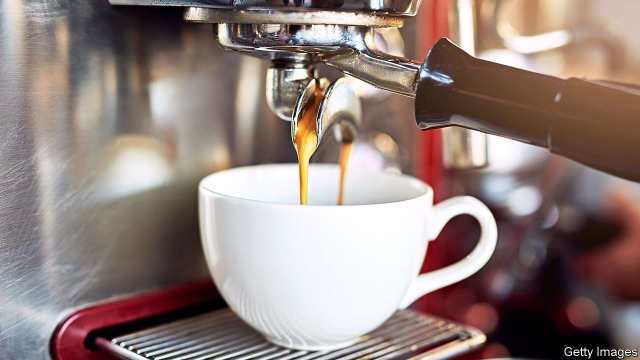
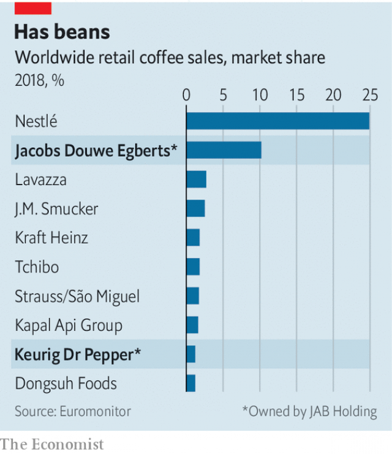

###### Storm in a coffee cup

# JAB upends coffee trading 

##### The owner of Peet’s and Pret a Manger is pressuring suppliers already ground down by low prices 

 

> Feb 23rd 2019 

BRAZIL, GUATEMALA or Kenya are the sorts of exotic locations that most people would associate with the cup of coffee that kickstarts their day. But increasingly it is Luxembourg that is providing the coffee business with an industrial shot of caffeine. JAB Holding, a private-investment company based there, has rapidly become the world’s second-largest coffee retailer and roaster. On February 14th the firm, which looks after the fortune amassed in the chemicals industry by Germany’s secretive Reimann family, said it planned to list its coffee empire in a couple of years. 

JAB has paid dearly to secure around 12% of the global retail market, second only to Nestlé, which accounts for a quarter of sales. Italy’s Lavazza, the third-biggest roaster, is tiny compared with the top two (see chart). JAB has coughed up tens of billions of dollars since 2012 on acquisitions of retail brands such as Jacobs Douwe Egberts and coffee-shop chains including Peet’s and, most recently, Britain’s Pret a Manger, which it bought for £1.5bn ($2bn) in May. The spending spree on coffee and other sectors could weigh on the group’s balance-sheet. Both Moody’s and Standard & Poor’s, two credit-rating agencies, recently warned that JAB’s appetite for deals might lead to a downgrade. 

 

Paying such frothy sums has also led JAB to stir up a “very traditional” supply chain, says Antti Belt of BCG, a consultancy. Coffee companies, such as JAB, which process beans and then market and sell them either in a packet or a cup, already grab most of the profits of the business. They buy raw beans from traders, who earn tiny margins—generally 1-2%—for much of the work. Roasters rely on traders’ expertise to blend different beans to balance strength and body (often associated with Brazilian beans) with flavour and acidity (from African or Central American ones). 

Until a few years ago, traders would usually get paid within 30 days. To raise cash JAB lengthened payment terms to up to 300 days. Finding financing to cover the gap has squeezed traders’ slender margins. “These guys have money, but they’re not banks,” says Oscar Schaps of INTL FCStone, a brokerage. The banks lending to traders may take into account the financial position of their biggest customers. So the traders’ borrowing costs could rise if the roasters’ credit standing were to deteriorate. 

Big traders, such as Swiss-based ECOM or Germany’s Neumann, face a less favourable balance of power. They rely on the big buyers in a fragmented industry. JAB’s tactics are compounding other problems. Bumper harvests have pushed bean prices below $1.20 a pound, forcing farmers to sell at a loss. Traders are also struggling to cover costs. Some could see their best staff leave. Andrew Kerr, a headhunter, says salaries are “starting to ease off” in Geneva, the world’s centre for coffee trading. 

One answer for traders may be greater scale. Consolidation would allow costs to be cut while increasing negotiating power. More investment in storage, ports and transport would help them take greater advantage of arbitrage opportunities across the globe. That should position them well to meet Asia’s growing thirst for instant coffee. Another strategy would be to capitalise on the trend for pricey gourmet brews that boast traceability and sustainability. Small independent roasters have sprung up in richer cities. They are looking for specialist traders with direct links to farmers. The dominant roasters have also woken up to high-end coffee. Nestlé paid around $425m in 2017 for Blue Bottle, a fancy Californian chain. Supplying them with top-quality beans may be another way for traders to escape the grind. 

