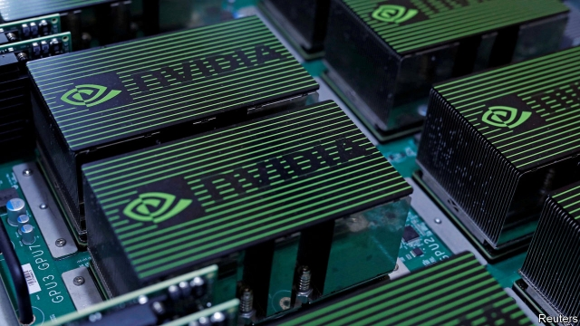
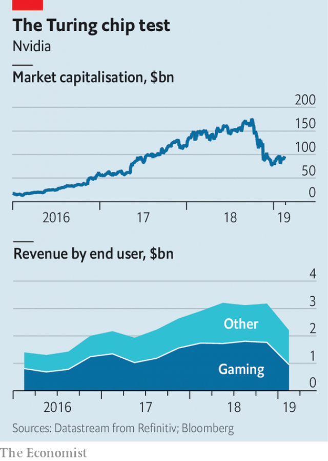

###### Not a pretty picture

# Nvidia plays the diversification game 

##### But takes its eye of its core business 

 

> Feb 23rd 2019 

THE CHIP-DESIGN business is enjoying a “golden age”, declared John Hennessy and David Patterson, two gurus of computer design, earlier this month (Mr Hennessy chairs Alphabet, Google’s parent company). The shift to cloud computing, the rise of specialised computing tasks such as artificial intelligence (AI) and the slow death of Moore’s Law have conspired to create a growing market for “accelerator” chips designed to speed up drastically certain common types of calculation. 

One of the standard-bearers for this trend is Nvidia, an American firm that makes graphics-processing units (GPUs), customised chips designed to produce the demanding visuals in modern video games. Those chips, it turns out, are also well-suited to the sorts of calculations needed by everything from complex climate simulations to machine learning. Tweaked versions of Nvidia’s GPUs can now be found in supercomputers, data-centres and cars. Excitement about such opportunities helped propel the firm’s share price to a peak of $289 in October. 

Since then its shares have tumbled. On February 14th the firm reported dire quarterly results. Revenues had fallen by 24% from the same period last year, and profits by 49%. Jensen Huang, Nvidia’s founder and boss, described it as “a turbulent close to what had been a great year”. 

 

Despite its ambitions to diversify, Nvidia still makes most of its $11.7bn of annual revenues from selling chips to gamers (see chart). And it was the firm’s gaming division that posted the biggest slump, with revenue falling by 45% in the latest quarter compared with the year before. Nvidia’s gaming numbers include money it makes from selling GPUs to cryptocurrency miners, a bubble that has recently burst. But that is not the whole story. 

The firm’s newest “Turing” chips, which support an advanced graphics technique called ray-tracing, have sold slowly. Ray-tracing gives more realistic lighting but requires huge amounts of computing power. For that reason it has not generally been used in games. Only a handful of big titles currently support it. Even without ray-tracing, the chips offer decent performance improvements over the firm’s previous products. But Nvidia’s chips are also generally faster than those from AMD, its only significant competitor in gaming, and that has encouraged it to raise prices (Turing graphics cards can cost $1,500). Charging big sums for a modest improvement has, unsurprisingly, proved tough. 

Nvidia’s terrible quarter will probably prove to be a blip. The firm expects revenues to recover next year. All but one of the non-gaming divisions grew in 2018. As cloud computing grows and AI becomes more prevalent, demand for Nvidia’s products will increase. But it faces growing competition. Bigger chipmakers such as Intel are eyeing similar markets. Many of Nvidia’s potential clients, including Google and Microsoft, are entering the chip-design business themselves. Facebook announced an AI chip on February 18th. Navigating all that will require much of Mr Huang’s attention. So will keeping his core customers happy. 

