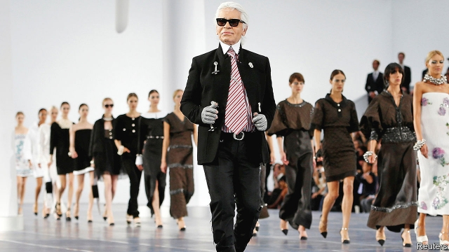

###### After Kaiser Karl

# The future of Chanel without Karl Lagerfeld 

##### How will the French fashion house fare without its influential creative director? 

 

> Feb 23rd 2019 

“I AM VERY grounded, just not on this earth,” was one of numerous bon mots from Karl Lagerfeld, who died on February 19th. Mr Lagerfeld, born in Hamburg 85 years ago, may not have felt he belonged on this planet but he knew very well what its wealthier inhabitants wanted to wear. As one of the great artists of French couture alongside Christian Dior, Coco Chanel and Yves Saint Laurent, Mr Lagerfeld made Chanel, where he was creative director for over 35 years, the multinational brand it is today. His death will ensure that Parisian gossips, already abuzz with rumours about the future of the fashion house, will have plenty to chat about. 

Chanel’s owners, Alain and Gérard Wertheimer, owe their vast fortune to Mr Lagerfeld’s tenure at the fashion house. When the brothers hired him to take over, the brand had become “old hat” in Mr Lagerfeld’s words. The boxy suits that had been Coco Chanel’s signature design appealed mostly to middle-aged women. Mr Lagerfeld modernised the Chanel look with longer, thinner lines and snazzy details. A workaholic, he hardly ever took time off, designing around 14 collections a year ranging from couture to high-street fashions. “To design is to breathe, so if I can’t breathe, I’m in trouble,” he often said. 

The extravagant and costly fashion shows for which Chanel became renowned also had a purpose. A 115-foot rocket that simulated a blast-off surrounded by models, or a fake supermarket stocked with Chanel washing powder, ketchup and pasta, created a stir which helped not only the sales of exquisite, expensive frocks but also hugely profitable accessories such as sunglasses and perfume. Those around him also had an unusual instinct for the fashion business. Jacques Helleu, the firm’s long-serving head of marketing, understood the importance of protecting a luxury brand. Chanel fought for its intellectual property long before other fashion houses realised the importance of doing so. 

A once closely guarded secret—the rewards of the diverse portfolio of handbags, scent, cosmetics, clothing, jewellery and shoes, and fierce protection of its brand— was revealed last year. The firm’s financial results, released for the first time in its 108-year history, showed revenues of $9.6bn in 2017 and an operating profit of $2.7bn. 

Chanel’s cash and cachet are attractive propositions. Bernard Arnault, the boss of Moët Hennessy Louis Vuitton (LVMH), the world’s biggest luxury-goods group, is said to have coveted Chanel for years. Philippe Blondiaux, Chanel’s chief financial officer, last year denied any plans to sell or seek a stockmarket listing. 

An insider says the Wertheimer brothers had vowed to keep Mr Lagerfeld in his job until he died. Will the plans for Chanel now change? A sale still looks unlikely, according to Dirk Boventer of Atreus, a retail consultant. Alain, the chief executive, announced that Mr Lagerfeld would be succeeded by Virginie Viard, his closest and most trusted associate for some 30 years. Ms Viard will need to make a mark. Until she does, Chanel without Mr Lagerfeld is less of a trophy for potential investors. 

