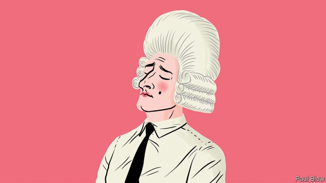

###### Bartleby

# The new aristocrats of power 

##### Executives rules their companies. Why not countries? 

 

> Feb 21st 2019 

THIS AUTUMN “Downton Abbey”, a film based on the British television series, will be released and audiences will once more be transported back to the days when a powerful elite was surrounded by subservient staff who catered to their every need. But the modern versions of Lord and Lady Grantham are in the headlines every day. Chief executives are today’s aristocracy. Chauffeurs ferry them around and private jets whisk them overseas. The best chefs provide the meals in their corporate dining rooms. 

Corporate headquarters are the modern equivalent of country estates, spreading over prime acreage in Silicon Valley or dominating the skylines of New York and London. Walls are decorated with fashionable art, rather as the aristocracy used to hang a Canaletto or Rembrandt in the drawing room. 

There is even a social “season” for executives which kicks off every January at the Davos forum in Switzerland. And executives will be seen in the best seats at sporting events like the Superbowl or Wimbledon. A few will buy their own sports teams, as a marker of their status. 

Executives have joined celebrities as the subject of public fascination. In recent weeks the British press has been filled with allegations about the way Sir Philip Green, a retailer, has treated his staff. On the other side of the Atlantic the headlines have been dominated by the divorce of Amazon’s founder, Jeff Bezos, and his feud with the National Enquirer, an American scandal sheet. 

Of course, there are some differences between CEOs and the landed gentry. Executives work a lot harder than the aristocrats ever did and, with the exception of family firms, their positions are not hereditary. But like the landowning blue-bloods before them, bosses have been tempted to display their talents on a wider stage: the government. In America this tradition is long-standing. Robert McNamara took his organisational and number-crunching talents from the Ford Motor Company to the Vietnam war, albeit with unhappy results. 

A more recent development has been executives trying their hands at elected politics. The trend began with Silvio Berlusconi whom voters hoped would bring his business skills to the Italian economy. A businessman now occupies the White House and two other executives, Howard Schultz of Starbucks and Michael Bloomberg of the eponymous data firm, may become candidates for president in 2020. 

Businesspeople have the wealth to fund their campaigns. Many enjoy some name recognition and they tend to have close allies in the media who can support their cause (Mr Berlusconi had direct ownership of a media group). Entrepreneurs can also promote themselves as apolitical outsiders, above the partisan fray, a role once played by generals like Charles de Gaulle or Dwight Eisenhower. 

The business elite may not be confined to a single party. In 18th-century Britain, the aristocrats divided into Tories and Whigs, depending on their attitude towards issues such as constitutional monarchy and the established church. You can still divide business elites into Tories who emphasise low taxes and reduced regulation and Whigs who focus on social liberalism and the environment. The next few decades may see them battle for electoral favour. 

The problem is that running a country and a company involve quite different skills. Italy’s recent record of dire economic growth began during Mr Berlusconi’s tenure. His time at the top of ExxonMobil did not make Rex Tillerson an effective secretary of state. A chief executive has financial targets to meet and a few board members and important shareholders to keep happy. Politicians are judged on a wider set of goals, many of which may be beyond their control. Those coming from business also have conflicts of interest, which blind trusts do not entirely eliminate. 

Nor is it likely that a dalliance with electoral politics will improve the image of an executive’s own company, or of business in general. Entrepreneurs have always been able to claim that they were above petty politics and focused on creating wealth and jobs. Now they will get the blame for all that goes wrong, toxifying their brands in the process. As wits are already pointing out, nobody who has been in a Starbucks toilet will assume that Mr Schultz is qualified to clean up the country. If you think there is a lot of anti-elitist sentiment now, just wait until the voters are asked to choose between two billionaires. 

