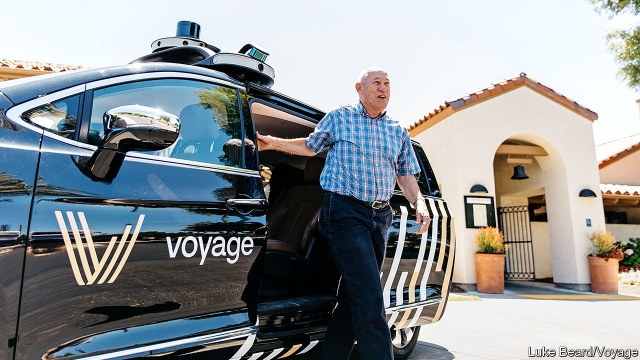

###### It takes a village

# Why retired people could be ideal customers for self-driving cars 

##### Autonomous vehicles come to retirement communities 

 

> Feb 21st 2019 

NEW TECHNOLOGIES, from the Walkman to the iPhone, have tended to be adopted first by the young. But when it comes to self-driving cars, the most logical early adopters are the retired. That, at least, is the conclusion reached by Voyage, a startup based in Silicon Valley. It is testing its autonomous vehicles (AVs) in The Villages, a retirement community in Florida with a population of 125,000 people. Retirement towns are ideally suited to AVs for three reasons, says Oliver Cameron, Voyage’s CEO. 

First, the environment is simpler and easier for an AV to navigate than a bustling city centre. Speed limits are lower, road layouts are less complex and there are fewer other vehicles. Second, there is strong demand for mobility. Active retirees want the ability to get around but they may not want the expense and hassle of owning a car. For residents who are unable or have lost the confidence to drive, summoning a vehicle when needed has obvious appeal. Prototype AVs have attracted criticism and outright hostility from locals in some parts of America. Voyage has been warmly welcomed in The Villages, says Mr Cameron. 

Third, there is a clear road to a large market. The Villages is America’s largest retirement community and one of the fastest-growing residential areas in the country. “We expect it to be the first city in the world to adopt AVs as the primary means of transport,” says Mr Cameron. The number of such communities is growing fast as America ages. 

There are other reasons why retirement communities and AVs fit together neatly. People generally prefer to retire to warm, sunny regions, so there is little risk of snow confusing an AV’s sensors. Because the roads are private property, there are fewer reporting requirements on AV operators and the regulatory situation is much simpler. And because everyone is retired, demand for rides is consistent throughout the day, which should make it easier to handle peaks without the need for a large fleet. 

Voyage is now operating six prototype AVs in The Villages, with safety drivers on board for the time being to monitor performance and handle unexpected situations. It is also testing in a retirement community in San Jose. As part of its deal to become the exclusive provider of AV services in these places, Voyage granted a 0.5% stake in the firm to the owners of the two communities. That helps align incentives, says Mr Cameron. The final pricing model has yet to be decided. But he favours monthly contracts covering a certain number of trips (just as mobile-phone plans provide set amounts of calls and data). 

Replacing car ownership for the aged may be easier than providing ride-sharing for young urbanites. “The state of the art in AVs is not ready for downtown San Francisco,” says Mr Cameron. A 93-year-old woman who rode in one of Voyage’s cars told him that she recalls travelling in a horse-drawn cab as a young girl. In old age, some people retreat into their past. But some Americans in retirement may already be living in the future. 

