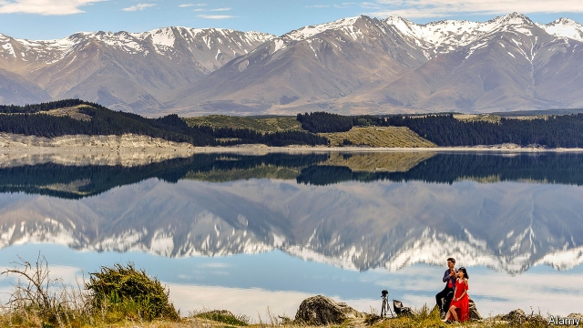
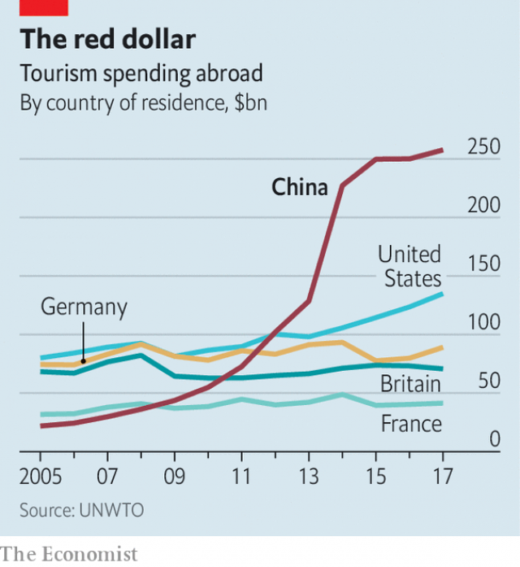

###### Sun, sea and a diplomatic point

# China’s high-spending tourists bring political clout 

##### Countries at odds with China find holidaymakers from there stop coming 

 

> Feb 23rd 2019 

EARLIER THIS month the great pyramids of Giza and the nearby Sphinx were lit up in “Chinese red”. Spectators, many of them from China, were then given another unprecedented treat. The sound-and-light show, a staple of pyramid entertainment since 1961, was narrated in Chinese. 

The event was sponsored by the Chinese government, which takes pride in its travellers’ growing influence. Since 2012 China has been the world’s biggest source of tourists. Chinese travellers racked up nearly 150m trips abroad last year. Their spending—over $250bn in 2017—far outstrips that of their American counterparts (see chart). Chinese officials know these tourists buy influence. Take Egypt, which China sees as a regional hub of its Belt and Road Initiative—an effort to boost its influence through massive spending on infrastructure. China’s leg-up for the country’s tourist industry is a way of showing thanks for Egypt’s enthusiasm. 

 

China even uses the term “tourism diplomacy”. The Communist Party’s mouthpiece, the People’s Daily, says this has become an “important and indispensable” tool of China’s foreign policy. And, just as Chinese tourism can win friends, so its curtailment can be used to show displeasure. Some analysts call this tactic “weaponising” outbound tourism. In countries where Chinese visitors play an important economic role, any twitch by China that may curb the flow soon spreads anxiety. 

New Zealand (pictured) is one such country. Tourism is the country’s biggest earner of foreign exchange. China is its second-biggest source of tourists after Australia. So the cancellation of a ceremony due to be held this week in Wellington to mark the launch of the China-New Zealand Year of Tourism understandably caused jitters. New Zealand cited “changes of schedule on the Chinese side”, but speculation blamed China’s pique with New Zealand for airing anxieties about the security of 5G technology made by Huawei, a Chinese firm. 

An article published by Global Times, a tabloid controlled by the People’s Daily, fuelled concerns in New Zealand that China’s enthusiasm for the year of tourism was waning. The newspaper said “tense political relations” had “sparked boycotts” by potential Chinese visitors, quoting a Beijing resident as complaining: “New Zealand stabbed us in the back but asks for our money? This is two-faced.” 

China’s resentment may subside. On February 19th New Zealand’s prime minister, Jacinda Ardern, denied reports that her government had banned a company, Spark, from using Huawei equipment. She said no final decision on Huawei had been made. Global Times, for which poking foreigners in the eye is a business model, may have strayed from the government line. The overseas edition of the People’s Daily had a very different message, reporting on February 15th that “fervour” among Chinese tourists for trips to New Zealand was “continuously rising”. It referred to the launch of the year of tourism as “upcoming”. 

The Chinese government has never admitted it cuts tourist numbers to punish other countries. But it certainly does. Take Taiwan, where the numbers of visitors from China grew rapidly after the election in 2008 of a China-friendly president, Ma Ying-jeou. He was replaced in 2016 by a China-sceptic one, Tsai Ing-wen. The number of Chinese trips fell from nearly 4.2m in 2015 to about 2.7m last year. Direct or indirect government pressure on China’s tour operators to reduce the number of package tours is the most likely cause. 

After South Korea installed an American-owned missile-defence system, THAAD, in 2017, that country also suffered a dramatic decline in visitors from China. By late last year restrictions appeared to be loosened. In 2018 there were nearly 5m visits by Chinese tourists, up from just over 4m in the previous year. The numbers are still far from pre-THAAD levels, however. 

Japan and the Philippines have also suffered. In 2012, during anti-Japanese protests in China, the number of Chinese visitors to Japan fell sharply. By 2014, however, they were back again in record numbers. In 2012 some travel agencies suspended group tours to the Philippines during a standoff between that country and China in the South China Sea. No such trouble mars ties under the country’s current China-friendly leader, Rodrigo Duterte. A year ago the Philippines said China had overtaken America to become its second-biggest source of tourists, after South Korea. 

How much Chinese government meddling is responsible for falling numbers is often hard to gauge. Public patriotic sentiment, albeit whipped up by official rhetoric, may also be an important factor. Cautious travel agents in China proactively curtail trips to certain countries when they sense that the diplomatic mood is souring, says someone in the business. 

Turkey is a case in point. It had been enjoying a Chinese-tourism boom owing, not least, to a reality-television show (featuring in this instance hot-air ballooning)—a fairly typical reason for a surge, say travel agents. On February 9th Turkey called China’s gulag for “re-educating” Muslims in Xinjiang province a “great shame for humanity”. China responded with a safety alert to Chinese travellers to Turkey, as it did recently for Canada, another country embroiled in a Huawei-related spat. 

The tiny Pacific-island country of Palau provides refreshing evidence, however, of Chinese tourists’ resilience to governmental tampering with their holidays. Their numbers in Palau rose from fewer than 650 in 2008 to more than 91,000 in 2015. Then they began to drop, partly, perhaps, because of official reminders to travel agencies that Palau, which recognises Taiwan, does not enjoy “approved destination status”—a cachet that only China’s diplomatic partners may enjoy. Yet many Chinese tourists seem happy to ignore that. The government can stop tour groups, but independent travel is far harder to curb. Last year about 50,200 Chinese still made it to Palau, despite the closure, for conservation reasons, of its wondrous Jellyfish Lake. 

