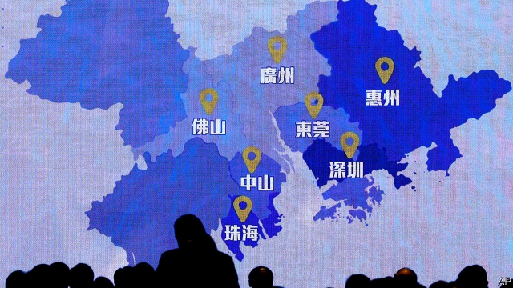
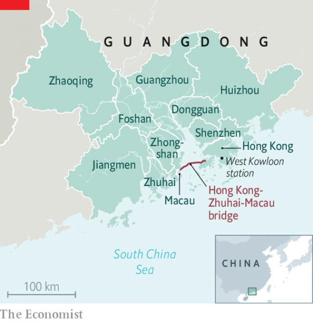

###### At bay

# China’s master-plan rings alarm bells in Hong Kong 

##### The Greater Bay Area seems to threaten Hong Kong’s special status 

 

> Feb 21st 2019 

IT DOES NOT lack ambition. On February 18th China unveiled a long-awaited master blueprint for the Greater Bay Area (GBA), a mammoth urban cluster comprising the special administrative regions of Hong Kong and Macau, and nine cities in the southern province of Guangdong. The GBA will boast a population of 71m and a total area of 56,000 square kilometres. It will become by far the world’s biggest integrated “bay area”, surpassing rivals such as Tokyo and San Francisco. The master plan calls on the GBA to play “the leading role in the country’s economic development”. 

Like most big Chinese ideas, this one is attributed to President Xi Jinping himself. It has two overarching goals. The first is to align Hong Kong and Macau more closely with the mainland. Macau has rarely caused trouble for China; but Hong Kong, a former British colony, has seen a rise in pro-independence sentiment in recent years. So the preamble to the blueprint notes that the GBA will allow “compatriots” in Hong Kong and Macau to “take pride in a strong and prosperous motherland”. 

However, the plan is being marketed on the second goal. The GBA aims to become a “first-class” innovation hub. The idea is to make the most of the strengths of the region’s cities so that they co-operate rather than compete with one another. Hong Kong will be the leader in financial and other professional services. Shenzhen, home to tech giants like Tencent, an internet firm, will become “the capital of creativity with global influence”. The comparatively poorer cities in Guangdong province will continue to focus on manufacturing, producing everything from intelligent robots to new-energy vehicles. 

 

The blueprint also assigns cities new industries. Macau, for instance, is supposed to develop a traditional Chinese medicine industry in a bid to diversify away from gambling. The business community is warming to the GBA. A recent survey by KPMG, an advisory firm, of more than 600 executives across the region found that 80% supported “integrated development”. 

China’s national government has already been trying to bind the region together more closely. Last September Hong Kong was connected up with the mainland’s bullet-train network. In October a mega-bridge linking Hong Kong, Macau and Zhuhai, in Guangdong, opened to traffic. The blueprint proposes further measures of integration, such as mutual recognition of professional qualifications. 

But unlike other city clusters, the GBA involves three customs zones, three legal systems and two hard borders (Guangdong’s with Hong Kong and Macau). Its success will depend on how free the movement of people, goods and capital will be. Hong Kongers, however, will not be keen on open borders with Guangdong. 

Some have a bigger worry. The city’s long-standing strength, points out Alvin Yeung, the leader of the pro-democracy Civic Party, is in being “not just an ordinary Chinese city”. Hong Kong is permitted a high degree of autonomy until 2047. So, for example, American restrictions on exports of sensitive technology to China have so far not applied to Hong Kong. Yet by tying the city ever closer to the mainland, Mr Yeung fears that the GBA may end up costing Hong Kong its special status. At worst, it would be treated by America and the rest of the world as just another Chinese city. 

