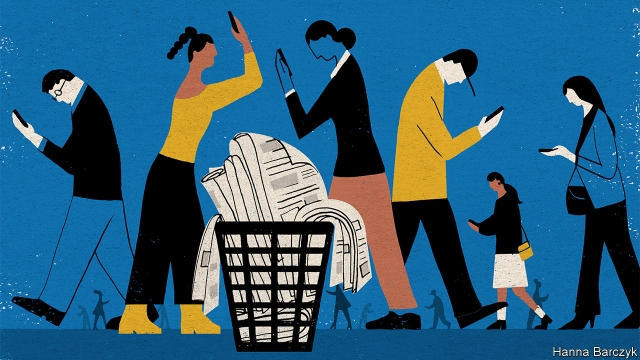

###### Chaguan

# Economic woes hurt Chinese journalists as much as censorship does 

##### But the profession continues to attract young hopefuls 

 

> Feb 21st 2019 

SOME DAUNTING obstacles must be overcome to study journalism at the University of Hong Kong (HKU), home to the region’s best college for reporters. Applicants must speak good English, find annual tuition fees of over $25,000 and—to secure places on courses that are oversubscribed each year—persuade HKU professors that their interest in journalism is heartfelt. A surprising number of mainland Chinese youngsters, who represent about 60% of students on the master’s programme for journalism, then face a further obstacle: telephone calls from parents, begging them to shun careers in news lest they doom their whole family. 

A group of mainland students, hosting Chaguan in an HKU common room, share stories of tough parental calls. Lansie (her chosen name in English) fields frequent pleas from her mother to avoid writing about Chinese politics, which end: “Do you want us all to be in prison?” Fernando’s father works for the state media, but still he urges his son to start a business and forget about the “noble things” journalism can do. As for Ann, her family’s concerns seem more trivial. Her parents have begged her “thousands of times” to consider a career in finance. They complain that, for now, they are respectably middle-class. But if Ann becomes a journalist they fear she will pull them into poverty. 

Parents are right that Chinese journalists can lose their jobs, and in rare cases their freedom, if they touch on sensitive subjects or challenge the state or a powerful vested interest. When outsiders say that that China lacks a free press, they are usually talking about such controls, which have grown stricter since Xi Jinping became China’s leader in 2012. 

Yet within the news industry the blows that hurt most, day-to-day, are economic, not political. Ann’s parents are not snobbish outliers to worry about money. They give voice to a fear that every week drives good journalists to quit, many to jobs in public relations. It is hard to lead a middle-class life on a journalist’s pay, or to start a family. A junior reporter in Beijing may earn $1,000 a month, barely enough to cover the rent. China’s newspapers enjoyed a golden age of profitability from the mid-1990s until 2010 or so. The boldest tested the limits of censorship and held (some) powerful wrongdoers to account. Those business models have collapsed, as consumers desert traditional outlets for bite-sized, often sensational social-media posts, watched on smartphones. 

A remarkable new study in the Journal of Communication details how readers and advertisers have fled metropolitan newspapers. More than 100 editors, managers and reporters, from obscure inland provinces to giant coastal cities, were interviewed for the study “Chinese Newspaper Groups in the Digital Era: The Resurgence of the Party Press”. The authors, Wang Haiyan of Sun Yat Sen University in the southern city of Guangzhou, and Colin Sparks of Hong Kong Baptist University, recall the rise of powerful provincial newspaper groups, typically anchored by a staid-but-authoritative party paper, for instance Southern Daily in Guangzhou, and commercially driven sister titles, such as Southern Metropolis Daily. All such newspapers report to provincial propaganda departments. But when “metro” papers were at their most profitable they could defy lowly officials, answering only to the most senior. 

The best used that breathing-space to report on wrongdoing by officials below them in the pecking order or in other provinces. Scoops were painstakingly gathered by their own reporters, or were slipped to them by colleagues from other provinces whose work was being suppressed by local censors—a trick known as “supervision in another place”. The study quotes anonymous editors recalling glory days when propaganda directors would plead with them to stop exposing blunders, with one reduced to asking: “Can you stop for a while and perhaps you can continue next year?” 

It did not last. Total Chinese newspaper circulation peaked in 2012, and newspaper-advertising revenues plunged by 75% between 2012 and 2016. Since then, staid party newspapers have proved more resilient than their commercial cousins. For one thing, the Southern Daily and its kind can rely on government subscriptions. Recently, party papers have been seeing more advertisements placed by local governments hoping to buy positive coverage of their policies, and to impress higher-ups. At the same time party newspapers, including the most important, the People’s Daily, have been ordered to create digital sites and apps. Often backed by hefty subsidies, some are unexpectedly lively. Meanwhile, ailing titles are expanding side-businesses. The study reports on a group with morning newspapers that uses its distribution network to deliver eggs and fruit in the afternoons. 

Investigative journalism is not extinct in China. The boldest business publications, such as Caixin, still expose crooked firms. Optimists note the cacophonous rise of bloggers and social-media sites on commercial platforms such as Weibo or WeChat. Some blogs are written by veteran journalists and publicise stories that evoke such a public response, so rapidly, that censors cannot contain them, leaving state media scrambling to catch up. A good example involves a scandal involving childhood vaccines last year. Such successes help to explain why young Chinese want to study journalism. Cao Peixin, who teaches broadcast journalism at the Communication University of China in Beijing, notes that 8,000 students applied this year for 30 undergraduate places. Students see journalism as a cause, not an industry, he says. 

But, with career ladders collapsing, it is not clear how idealistic youngsters can become authoritative journalist-bloggers. Revealingly, even HKU students determined to defy parental qualms to work as reporters are doubtful about returning to the mainland. Censorship is one reason, but also low pay. Chinese journalists have long sacrificed safety and a quiet life to do good work. They now wonder if they must forgo their dignity, too. 

