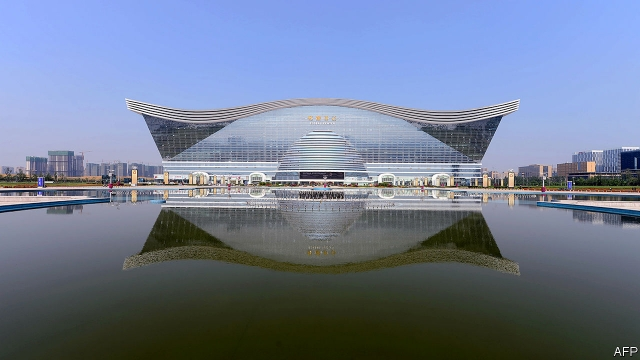
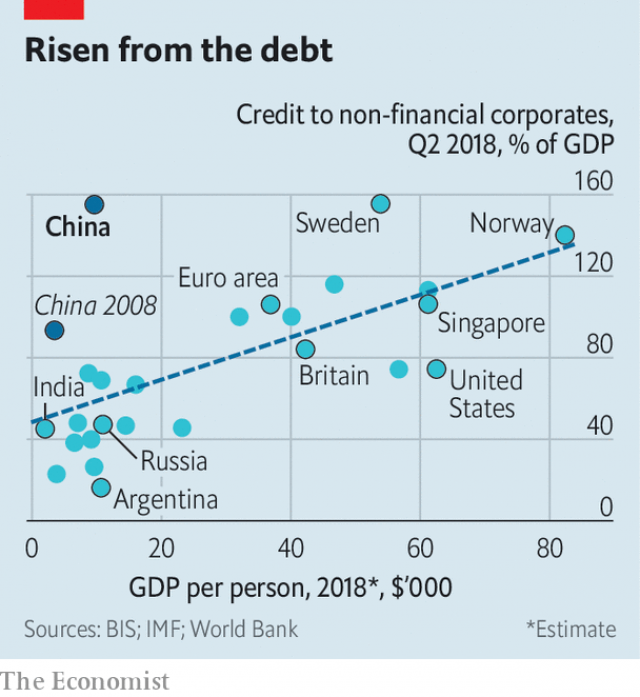
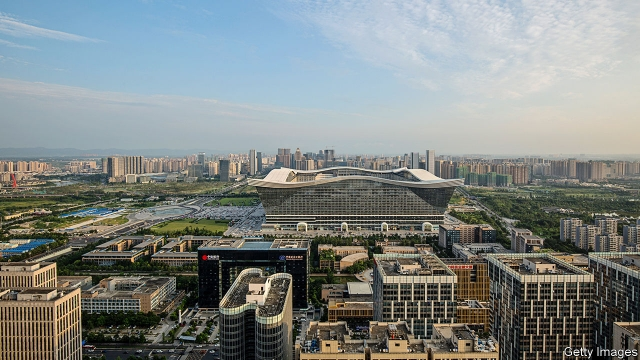
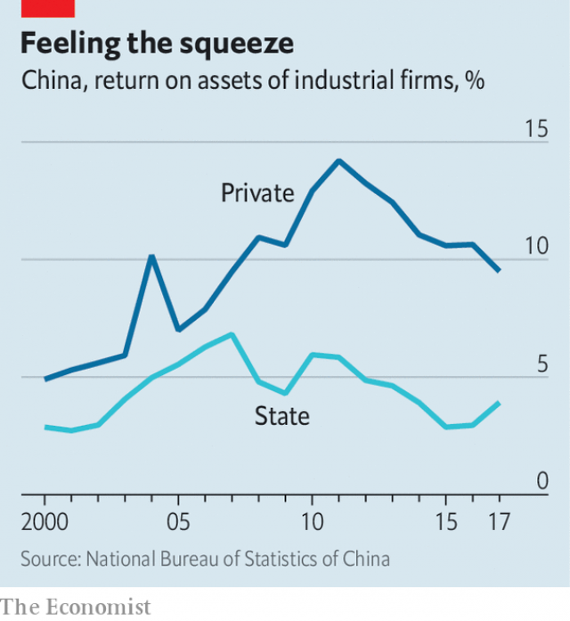
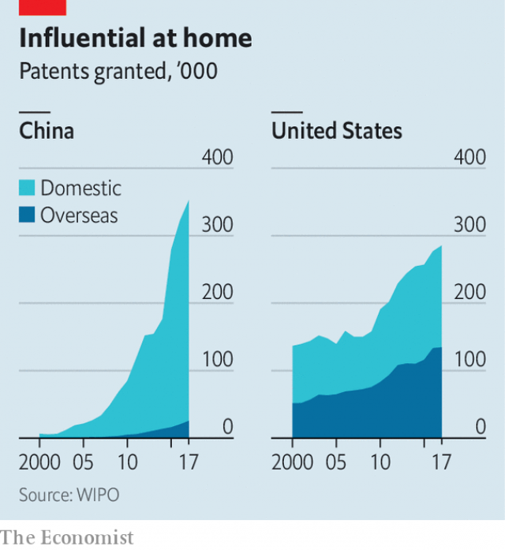

###### The global centre

# How one building reflects the Chinese economy’s struggle with itself 

##### It is a microcosm that reveals how much China is master of its own fate 

 

> Feb 23rd 2019 

THE WORLD’S biggest building got off to a bad start. On the eve of its opening, Deng Hong, the man who built the mall-and-office complex, disappeared. 

For years Mr Deng had received tributes in local media for turning farmland into glistening conference centres and hotels. The billionaire “conference king” walked with a swagger, chomped on cigars and knew how to please officials. Hefty contracts rolled his way, including one to develop a landmark in the suburbs of Chengdu, a city of 14m in south-western China. This, the New Century Global Centre, was to be his crowning accomplishment, the world’s largest structure by floor space, the size of 246 football fields, or nearly three Pentagons or eight Louvres. 

But then he was gone, swept up in a corruption investigation just before the building’s doors opened in 2013. The media focus shifted to his hubris and his wasteful, pharaonic venture. Inside, it had a massive waterpark with an artificial beach, an ice rink, a 15-screen cinema, a 1,000-room hotel, offices galore, two supersized malls and its own fire brigade, but just a smattering of businesses and shoppers. It became a parable for the economy’s excesses and over-reliance on debt. 

Today, more than five years on, the story has taken a series of surprising turns. For one, the building is not a disaster. During the summer, the waterpark is crowded. The mall has come to life, a testament to the rise of the middle class. The offices are a cauldron of activity: 30,000 people work there in every industry imaginable, from app design to veterinary care. Mr Deng has been released and is back in business, declaring last summer that he had a clean slate. 

A triumphant return? Not quite. Mr Deng’s freedom is marred by the fact that he no longer owns the centre but is now an employee. It was bought by an arm of the state—a transaction that regulators are probing for financial irregularities. From one angle the world’s biggest building seems to be thriving; from another it is once again under a cloud. 

Discussions on China’s economic future also tend to swing between two extremes. At one end of the spectrum, it is seen as an unstoppable juggernaut, destined to dominate the 21st century. At the other end is the conviction that a crash is inevitable. The trade war with America has achieved the improbable feat of bringing these views together, reflecting both a fear that China must be confronted before it is too strong and a desire to hasten its collapse. 

The Global Centre—the tale of its construction, its occupants and its evolution—hints at a different future. It is neither a spectacular success nor a catastrophic failure but a long economic struggle, a contest between China’s tremendous potential and the cracks in its foundations. America is only a secondary player in the drama. China, for better and for worse, is writing its own story. 

The centre is now surrounded by broad roads and tall buildings. But for years the land it sits on was home to the fields of Huang Fenyu, a stout woman in her 50s, and the few thousand residents of Yumin village. Many lived by timeless rural rhythms, sowing rice in the spring and harvesting green stalks in the autumn. 

In 2005 those rhythms came to a halt. Chengdu officials ordered the people of Yumin to relocate to high-rise housing a short drive away. It offered each one 35 square metres (377 square feet) of floor space and as much as 8,000 yuan (then $1,000), or two years’ income. Razed of the last vestiges of its former life—narrow lanes, rice paddies, cheap bungalows—Yumin village was renamed GX92 (211/252), an 80-hectare (200-acre) land parcel to the city’s south. In September 2008, it was sold for 480m yuan to Mr Deng’s company, the Exhibition and Travel Group. 

 Ms Huang now works as a janitor in a nearby bank. She knows the compensation she received was paltry. The one time she went to the Global Centre for dinner, it cost her two days’ salary. “My heart ached,” she says. Even so, she is not bitter. Her new home has better plumbing and sturdier walls. The younger generation will, she says, benefit from a stronger economy. It is a quiet optimism that remains typical of modern China. Though nearly 5km from where she lives, the Centre is so big that it looks as if it is just down the street, its wavy roof outlined with neon lights at night.   

Yumin village’s transformation—the conversion of farms into a construction site—has been replicated all over China. It provides the most basic answer to the question of how the economy has grown so fast. Officially, the government dates its “reform and opening” period to 1978. Yet for the first 15 years progress was uneven. Gradually unshackled from central planning, the Chinese people showed their entrepreneurial flair. But the Communist Party was divided on the critical issue of how to build the roads, homes and factories that it sorely needed—how, in the jargon of economists, to accumulate the physical capital that fuels growth. 

 It was only in the 1990s that China settled on a model that has, in many respects, persisted to this day. It started evaluating local officials by how quickly the economy grew under their watch. They, in turn, competed with each other to woo firms, offering them cheap land, tax breaks and low-cost labour. Transforming the bureaucracy into something more like a large startup business, hungry to expand, yielded dramatic results. China accounted for 4% of the global economy in 1990; now that is close to 18%. 

Three factors have underpinned this model. Each can be found in the origins of the Global Centre. The first is land, all of which is publicly owned. This puts a valuable asset at the disposal of local officials. They can offer cheap long-term rents to attract businesses or sell big leaseholds to developers. As long as growth continues, this is sound economic logic. Developers buy up land, assuming, mostly correctly, that they can sell what they build. For local governments it is a source of wealth. In Sichuan province, of which Chengdu is the capital, land sales bring in nearly as much as taxes. 

A second feature of China’s economy is cronyism. Mr Deng bought the land in 2008 at a steep discount, according to state media. The city government had supposedly attached strict conditions to the sale. He was to build an arts centre as well as a landscaped park. A mall-and-office complex was not part of the plan. Yet today the only building on the site is the Global Centre. 

Officials must have known. The city government is across the street. At the time Chengdu’s Communist Party chief was Li Chuncheng. His given name means “spring city”, but locals dubbed him Chaicheng, or “demolish the city”. Mr Deng got close to him: when Mr Li wanted a relative’s remains moved somewhere with better feng shui, Mr Deng made the arrangements. 

Mr Li’s fortunes turned soon after Xi Jinping came to power in 2013. Jailed for graft related to construction, he is one of the dozens of high-flying local leaders cut down by Mr Xi’s anti-corruption campaign. Mr Deng himself was detained but never publicly charged. The official line is that he was asked to “assist an investigation”, a euphemism for helping the party net a bigger fish. 

Still, Mr Li’s downfall offers a window into the nexus between government and business. Local officials can dole out contracts in exchange for benefits, like covering their children’s tuition overseas or buying homes for their relatives. The path is then clear for projects that in other countries would be almost inconceivable. 

The third feature in China’s model is debt (see chart). Mr Deng bought the land in 2008 just as the country embarked on a manic phase of growth. Worried about drag from the global financial crisis, Beijing unleashed a huge stimulus. Local officials ran up debts, and seized lots of land for development. A building boom ensued. 

 

The Global Centre is one of the many projects from that period that dot the country. Some are useful, such as China’s high-speed rail network. Others, less so: scores of cities built big futuristic districts but are still struggling to attract residents. China’s total debt soared from about 150% of GDP in 2008 to more than 250% today. Rapid increases of this magnitude have presaged financial trouble elsewhere, from the banking crises that ripped through the West a decade ago to Japan’s stagnation in the 1990s. 

Yet the striking thing about these three factors in China’s economic system is that they were all useful until recently. The government’s control of land gave it a lever to kick-start investment. Land also played an overlooked role in governance, says Michael Song, an economist at the Chinese University of Hong Kong. In a large country with a lack of accountability, it functioned as a disciplining tool. To raise the value of land, officials had to invest in infrastructure, from highways to power grids. If they did not, they would have a harder time selling land in the future. 

Many economists also believe that corruption was, counterintuitively, a lubricant. Emerging from the Maoist era, a little graft gave officials an incentive to do what was needed to support growth, whether in selling state assets or enticing firms to invest. 

Debt also greased the wheels. Up to a point, the increase in borrowing is a sign that the financial system is operating as it should, channelling savings into investment. Virtually all developed economies have debt levels that are at least as high as China’s, albeit mostly built up over longer periods. 

The challenge now is to shift to a different economic model, because all three factors are hitting their limits. Land is a finite resource, and the government’s appropriations have got ahead of market need. Gan Li of Chengdu’s Southwestern University of Finance and Economics estimates that 65m homes—21% of urban housing stock—are vacant. Corruption has reached corrosive levels. Frailties from all the debt are showing. Corporate-bond defaults in 2018 reached $18bn, more than triple the previous annual record. 

But turning onto a new path is hard. Local governments cannot easily find revenue sources as bountiful as land. The anti-graft campaign has sapped the motivation of officials while leaving the rotten system around them intact. Efforts to tame debt have also hurt growth, forcing regulators to ease up in recent months. China’s problems are simple enough to diagnose. Treatment, though, is painful, and the disease more chronic than acute. So instead of taking bitter medicine, officials hope time will be a balm. But China’s ills are likely to get harder to cure. 

  

2. The billionaire factoryConsumption is booming, but so is inequality 

IF THE LESSONS from the Global Centre’s construction seem gloomy, counter that with some time inside it. Here, China’s commercial promise is almost palpable. From the main entrance, visitors walk into a cavernous atrium which mixes high-end touches with a fairground atmosphere. The glossy marble floor is flanked by long gold-trimmed escalators. To the left is one large mall; to the right another. Straight ahead is the waterpark, under the glare of an ultra-long LED screen, projecting seaside scenes. 

 

The park’s main attraction is a wave pool (pictured), which generates huge artificial swells. On a summer’s day, it is raucous. Hundreds of bathers are in the surf, many with mobile phones in plastic pouches hung around their necks. Pulsating music is blasted at top volume as dancers in bikinis take to elevated platforms. 

One father, Zhang Meng, sits in the waterside food court, his belly spilling over his trunks as his four-year-old son licks chocolate sauce off a dessert plate. An ad salesman for a media company, Mr Zhang has money to spend but is far from rich. When the waterpark started selling annual passes at just 700 yuan ($104) for an adult, he jumped at the offer. Twice a month in the summer he brings his wife and son. They stroll around the mall, go for a swim and dine on spicy dumplings. “We love the environment,” he says. Squint a little, and it could be Coney Island or Blackpool in the 1950s, albeit with digital touches under a vaulted glass roof. 

This scene underscores the long-awaited emergence of Chinese consumerism. China’s economy is often described as unbalanced. Investment accounts for nearly half of GDP, more than double the level of developed economies. Consumption, meanwhile, accounts for about a third of GDP, half the level of developed economies. Yet a simple emphasis on these two ratios misses something important, argues Arthur Kroeber, founder of Dragonomics, a China-focused research firm. Consumption has such a low share of GDP in China not because people are staying away from shops but because its investment has been unusually large. 

Looked at from a different vantage, consumption is already booming in China. Between 1990 and 2017, consumer spending per person rose nearly eightfold in inflation-adjusted terms, more than double the increase in India. China is the world’s biggest market for passenger cars, smartphones, luxury goods and beer. This is not a country of repressed shoppers. 

The pressing concern is, therefore, not whether China can rebalance towards consumption but whether its spending boom can be sustained. In recent months much ink has been spilled over the idea that China might be cutting back on consumption. Evidence is patchy at best. Car sales fell sharply in 2018, but that was partly because a tax benefit was eliminated. Retail sales, more broadly defined, remain strong. 

Obviously Chinese consumers cannot defy the laws of gravity. If the economy were to slump into a recession, household spending power would, inevitably, suffer. Yet there is also reason to think that, short of that, consumption in China will be resilient. 

Big trends work in its favour. Over the past few years the labour force has started shrinking, which has pushed up wages. Low-end factories are moving abroad. For consumption this is an unalloyed positive. When workers earn more, they can also spend more. Household consumption bottomed out with a 36% share of GDP in 2010, when construction of the Global Centre was in full swing. This year it is on track to reach 40%. 

Income levels have reached about $5,000 per person in cities, a level at which discretionary spending has taken off in other countries. The fact that the Global Centre was built in Chengdu, far inland, illustrates the strength of this trend. It is poorer than the coast, but big hubs of prosperity have nevertheless emerged. Chengdu’s economy has quadrupled over the past decade. 

Estimates of the size of China’s middle class vary from 100m to 600m, depending on how it is measured. Precise estimates are beside the point. What matters is the direction of travel. Consumer numbers are destined only to grow. Even in an age of e-commerce, people flock to malls like the Global Centre. Along with the usual array of clothing stores and jewellery shops, there are toddlers’ play centres, virtual-reality arcades and cosplay cafés. On weekday evenings people queue outside restaurants on the top floor. 

But there is a darker side to China’s rise as a consumer society: its yawning inequality. Most countries that undergo rapid growth experience rising wealth gaps. In China this natural tendency has been exacerbated by the state’s control over where people can live. The government gifted urban residents their homes in the late 1990s when property was privatised. Those in rural areas had no such luck. Moreover, the hukou residency system makes it difficult for rural citizens to settle in cities. They are barred from certain jobs and their children are sidelined in the schooling system. 

When the post-Mao era began, Chinese were poor but equal. The income gap rose sharply from the 1990s. It is among the world’s most unequal countries today, with the richest 1% holding one third of all household assets. China has more billionaires than America, even though its income per head is just one-fifth. For those on the bottom rungs of the Chinese income ladder, climbing up it has long been a motivation, but it is getting harder. 

Yang Fanji and her family run a restaurant on a dusty street near the Global Centre. They deliver about 80 takeaway meals every day to its office workers. Ms Yang (not her real name) used to work at an electronics factory on the coast for better pay, but returned to Chengdu, just four hours from her home village, so that her eight-year-old son could live with her. She was able to get him into a local school by pulling some strings. But with a low wage and high living costs, she is unable to save much, making her part of a large and seemingly permanent urban underclass. 

In fact there is much China could do for those like Ms Yang if it truly wanted to reduce inequality. For a start, it could make it easier for those born in rural areas to move to cities. It has, over the past decade, built up a social-security system that gives almost all citizens health insurance and old-age pensions. But payments are meagre. As ageing accelerates, the burden will only increase. 

Tax reforms would also help. The government does not tax the investment earnings and property of the rich, which are basic revenue sources in developed economies. Officials seem more fearful of angering rich urbanites than of neglecting poor farmers. 

In a provocative article in 2017, Barry Naughton, an economist at the University of California, San Diego, asked whether China was a socialist country. In some respects, he ventured, it was: the government can exercise much more control than is normal in a capitalist system. But on the key question of what it does with that power, he concluded that China was decidedly non-socialist. Redistribution policies have been conspicuous failures. 

The number of shoppers splashing in the Global Centre’s waterpark or splurging in its restaurants will continue to rise. But the other part of the population, those on the outside looking in, scrubbing dishes late into the night after a long day serving its workers, also looks firmly entrenched. It is not a happy picture. 

  

3. Means of productionThe market is under increasing pressure from the state 

CROWDS START arriving at the Global Centre before nine in the morning every weekday, well before the shops open. They are the 30,000 people who work in the offices on its upper floors. These contain a motley mix of companies, 1,800 in all—a rough cross-section of China’s business world. 

Some, like Huodongjia, would be at home in Silicon Valley. Its main product is an app for conference listings. Wang Qing, its founder, clad in skateboarder shoes and shorts, is refreshingly frank about the headaches of tech entrepreneurs in China. There’s too much short-termism, he says. “The mentality for investors is, if I give you 10 yuan today, you’ve got to give me 11 back tomorrow.” 

 

Other offices are starkly different. At the Quanxing law firm, Fu Shaojie talks of China’s progress in developing the rule of law. But he believes the law answers to the Communist Party, not the other way around. “We are making our system more democratic,” he says, explaining that this means his firm works with the government to stop disputes reaching courts. His waiting room displays a book with the collected wisdom of Xi Jinping, China’s president. 

China is certainly not a fully free market. Yet it has come a long way since Chairman Mao. The structure of the economy looks very different depending on where you focus. There is an exuberant private sector, vital to China’s success. Employment in state firms plummeted in the 1990s when the government closed thousands of loss-making companies. The private sector more than made up for them. These days, officials use a rough “56789” formula to describe its significance: it accounts for 50% of tax revenues, 60% of GDP, 70% of innovation, 80% of jobs and 90% of companies. The point is clear. China would be nowhere without its private firms. 

In many industries, China’s entrepreneurs face more cut-throat competition than their Western peers. Take property: the ten biggest developers account for 30% of sales in America but around 15% in China. The rush into new industries can be frenzied. China already has more than 1,000 robotics firms. 

But at the same time, the government seems to be everywhere. China has 150,000 state companies. With preferential access to banks, they account for 70% of corporate debt. And in many industries, from finance to shipping, the government aims for what it calls “absolute controlling power”, limiting competition and blocking entrants. This is a danger for China when its economic priority is to increase productivity. State firms are much less efficient. Their return on assets is less than half that of their private peers (see chart). 

 

These two parts of the Chinese business world are often described as separate, as if plucky private firms are battling clumsy state-owned rivals. In reality they are deeply intertwined. The challenge for private firms is not so much how to compete against state firms as how to coexist with them. Wanjiang Gangli, a water-monitoring company with headquarters in the Global Centre, has seen its business boom as the government has targeted pollution. “In this system when leaders focus on an issue, it’s highly effective,” says He Xin, its general manager. But that same power makes for frustrations. To get contracts, his firm must partner with state firms, which have little technology but lots of political clout. 

The worry is that this coexistence, already fragile, is breaking down. Complaints about guojin mintui (the state advances, the private sector retreats) emerged a decade ago, when the government gave state firms lots of cash to help the economy through the global crisis. “Retreat” may at first have been an overstatement, but there is no doubt that the private sector stopped advancing: its shares of both investment and industrial output levelled off. 

Now, under Mr Xi, it looks more like a full retreat. In the three years before he became president in 2013, private firms received roughly half of all bank loans. State firms got just a third. In the three following years, more than 70% flowed to state firms, according to Nicholas Lardy of the Peterson Institute for International Economics. The tone has also changed. The Communist Party has insisted that private companies, including foreign multinationals, establish party cells. A foreign manager at a car-parts company which cut staff last year says he had to discuss “social stability” concerns with his firm’s party secretary. It was a warning shot. 

Some observers had thought Mr Xi would take China in the opposite direction. He initially pledged that market forces would play a “decisive role” in the economy. But he also vowed to strengthen state-owned firms. The latter pledge has been more potent. Over the past five years the government has merged steel mills, chemical companies and rolling-stock manufacturers, hoping to make them mightier. It has prodded private companies to invest in state firms, to make them more efficient. China Unicom, a state-owned telecoms giant, now counts three big private internet companies—Alibaba, Baidu and Tencent—as shareholders. 

This risks dulling the edge of the private sector. Normally, companies get higher returns as they grow and reap economies of scale. In China the reverse happens, says Mark Williams of Capital Economics, a research firm. His hypothesis is that big companies draw more attention from officials. Political meddling hurts them. 

Last year a little-known blogger published an article arguing that the private sector had fulfilled its “historic task” of enriching the country, and that it was time for it to fade away. The article went viral not because people agreed but because it encapsulated their fears. Since then officials have tried to reassure businesses that they are still wanted. Mr Xi has vowed “unwavering” support. Yet these protestations count for only so much. As long as the government remains determined to strengthen state-owned companies, there will be no level playing-field for private firms. 

Even when officials craft sensible policies, this imbalance can knock them off course. A dispiriting case has been their attempt to defuse financial dangers. To do so they have clamped down on shadow banking, a lightly regulated universe that includes everything from banks’ off-balance-sheet books to investment vehicles for the wealthy. Peer-to-peer lending is at the extreme risky end. One P2P firm, Zhongke Loans, resides inside the Global Centre. Wu Jinjun, its founder, describes his work with missionary verve. P2P lenders, he says, serve small borrowers, whom banks ignore. 

But many P2P firms have either been fraudulent or mismanaged. Of the 4,000 that existed, two-thirds have failed. For Zhongke, staying afloat will be hard. It offers investors sky-high annual returns of 14%, which few companies can sustain. A ticker on its website measures, with disconcerting precision, how long it has been in operation: four years, three months, three days. Mr Wu’s immediate concern is the central bank’s belated decision to vet all P2P platforms and bar those that do not meet its standards. 

Restoring order to the financial system is the right idea. But in doing so, the government has inadvertently stifled the private sector. Private firms are by far the biggest recipients of shadow loans. Banks prefer to lend to state companies that carry implicit government guarantees, especially when the economy slows. They do not favour the state for ideological reasons but because it is the best bet for them to get their money back, plus interest. 

Even Western investors fall prey to these incentives. The manager of a major European fund recently met a Chinese bank to ask about a regulatory order to lend more to small firms. The fund manager feared that this would force the bank to take on undue risks. Fear not, the bank’s executive promised, it would reclassify subsidiaries of big state firms as smaller entities. This way it could satisfy regulators without imperilling its loan portfolio—a natural outcome in a system so heavily anchored by the state. 

  

4. A new long marchGlobal economic dominance is not assured 

LOTTE MALL, a high-end South Korean department store in the Global Centre, normally wants to attract people. But on March 7th 2017, it was trying to keep them away. Despite a chill in the air, dozens had gathered on the plaza in front. They waved the Chinese flag, played the national anthem and unfurled banners, one of which read: “We will not tolerate violations of our motherland’s safety!” It was, in short, not a typical day for staff more accustomed to selling face cream. 

The trigger had been a decision by South Korea to install an American anti-missile system on its soil to defend itself against the threat of attack by North Korea. China perceived itself as the real target. State media lashed out at South Korea, and specifically at Lotte, because it had leased land in its home country for the anti-missile batteries. Protests hit some of Lotte’s 100-plus stores around China. 

Sitting more than 1,000km inland, the Global Centre can seem remote from the rest of the world. But the global tensions surrounding China’s economic rise resonate in its corridors. The Lotte protests are a crude example of how China uses its biggest advantage—its huge market—to cow others into submission. Indeed, they were just the latest in a series of protests or boycotts freighted with political significance. Norway, the Philippines, Japan and Taiwan have all been on the receiving end. 

China uses these outbursts of nationalism, whipped up by state media, to punish offending countries. The commercial pressure is hard to endure. Eventually South Korea promised China that it would refrain from additional deployments of the American defence system. But for Lotte it was too late. Its China business has not recovered. Having already sold dozens of stores, it is reportedly considering selling the rest, including its Global Centre branch. 

There is an even bigger concern about the way that China wields its market power: as a lever to get companies to give up their technology. This is one of the core grievances behind America’s trade war with China. The American and European chambers of commerce estimate that a fifth of their members have faced such demands, and in high-tech sectors as many as two-fifths. 

When China joined the World Trade Organisation in 2001, it pledged to stop requiring transfers of technology as a condition of market entry. The difficulty in building a case against China is that it has generally abided by the letter of its WTO commitments. Its methods are more subtle. From car manufacturing to cloud computing, foreign companies need local partners to operate in China. Regulators can also use product testing and approval procedures to compel them to disclose intellectual property. An unstated goal of these policies is to give Chinese firms access to foreign technology. But when challenged, China often replies that they are voluntary, commercial agreements. 

Even more blatant is the outright theft of intellectual property. An IMAX theatre on the top floor of the Global Centre mall is an emblem of how brazen Chinese firms can be. The screen is one of 600 around China, IMAX’s biggest market in the world—but also one of its thorniest. In 2014 it won a $7m court judgment in Canada against a former employee, Gary Tsui, for copying its 3D technology and starting a rival in China. 

It was a limited victory. Mr Tsui is still active in China, filing patents under his local name, Cui Xiaoyu. And he now works as chief engineer for China Film Digital Giant Screen (CGS), part of a state-owned company. No wonder foreign firms sometimes feel they are competing not against commercial rivals but against the state. In Chengdu, not far from the Global Centre, CGS opened its 100th screen in 2015. It now has more than 300. 

There is no way to know exactly how much China has stolen. The American government estimates that its firms lose intellectual property worth up to $600bn annually to foreign thieves, with China the leading culprit. Like any claimant in a dispute, though, it has reason to overstate the damage. 

China is not the first country to steal intellectual property or demand tech transfers. Brazil, India and Mexico insist on joint ventures in various industries. China, though, is unusual in its heft. If the behaviour of, say, Malaysia or Argentina seems unreasonable, foreign firms can leave. Forgoing China is tougher. 

So the real question is whether China can get away with it. It is in this regard that Donald Trump’s hard line has been most notable. From an economic perspective American tariffs make little sense; they are a blunderbuss that will hurt America’s growth as well as China’s. Yet, unlike more delicate negotiating tactics in the past, they have made China pay attention. 

The fallout has reached the Global Centre. At the office of Anbang Logistics, an international shipping company, employees are attempting to get goods to and from Chengdu. Li Jing, its vice-president, is blunt about the impact of the trade war, a view that seldom comes through in China’s state media. “Our business is exports, so we feel the pain directly,” she says. 

The tariffs are having big knock-on consequences. Her firm can charge more for delivering electronics, allowing it to defray the cost of moving heavier products. But with Chinese electronics now facing tariffs in America, the cost of shipping other products has gone up. And Ms Li expects 2019 to be even worse. Unless, that is, America and China reach some kind of deal. Already, China has watered down some of its joint-venture requirements for foreign carmakers and banks. 

Nevertheless, it is also easy to exaggerate the threat. The portrayal of China as an efficient, commercially minded, strategically brilliant government that, at its leisure nabs technology from foreign companies, rarely accords with reality. Policies are often much more muddled than they appear to the outside world. 

Take the joint ventures. Perhaps the most notable fact is how rarely they have been effective. Despite an array of aviation partnerships, China has failed to create a decent passenger jet even after years of trying. A former industry minister famously described carmakers’ joint ventures as opium: Chinese firms are hooked on them for profits and make little of value themselves. Even theft only gets China so far. IMAX, for instance, believes the 3D technology stolen by its former employee is now outdated and that its Chinese rival has failed to keep up with its latest advances. 

China has done well at building first-rate ports, highways and railways. But promoting innovation is harder. Patents filed by Chinese companies, for instance, are not all they seem. In the Global Centre, Finchos Electronics, a company that produces fingerprint readers, proudly displays dozens of patent certificates on its wall. Yet more than half are for incremental changes. Overall, China generates more patents in a year than America, Europe and Japan combined, but less than a quarter are for genuine inventions, and few of its domestic patents are recognised abroad (see chart). 

 

Government subsidies also have shortcomings. DoubleFlyer, an education-technology company in the Global Centre, was granted a rent-free office in an industrial park in the suburbs. Such support works well for manufacturers but less well in knowledge-based industries. After six months Luo Sai, the young founder, moved DoubleFlyer back to the centre, to be closer to its business partners. Ms Li of Anbang Logistics raises her eyebrows at the Belt and Road Initiative, China’s mega-plan for investing abroad. Rail links between western China and Europe are the big accomplishment so far, an increasingly popular route for moving goods. But, without subsidies, she reckons that train costs would soar and exporters would go back to boats. 

This is not to say that China is failing. Judging by growth or innovation, it has excelled compared with most other countries at its income level. But it still has far to go. Despite the name of its plan to develop advanced industries—“Made in China 2025”—which has caused so much concern in America, the bureaucrats who drew up the plan did not think that China could rival foreign prowess until 2049. That is cold comfort for firms whose technology has been stolen. But it is an indication of where China stands: its rise will be measured in decades, not years. 

An irony of the trade war is that many of America’s demands are ideas that would propel China’s ascent. Opening more industries to competition would boost the private sector and productivity. Curbing subsidies would ease pressure on the public purse and curtail excess production. Better protection of intellectual property would stimulate innovation. 

But it is China’s call. That a tycoon built the world’s biggest building deep in the interior, and that his building has been filled up with a dizzying array of businesses, gets at an essential truth: this is an economy whose fate is being written domestically. It is not pressure from outside that will make or break China, but its own decisions. 

The direction is far from certain. Soon after Mr Deng ran into legal troubles, he put his assets, including the Global Centre, on sale. A local fund manager who looked over the books proclaimed that maintenance was too expensive and returns too low. But a buyer did come forward: the Yunnan Metropolitan Construction Investment Group, a state-owned firm. 

The deal throws up red flags. The Yunnan group’s finances are wobbly. It has razor-thin returns and debt more than ten times higher than its earnings. The group is supposed to focus on building infrastructure in Yunnan, one of China’s poorest provinces, not on snapping up property elsewhere. It is a case of how state firms often hurt rather than help China by squandering capital. 

Meanwhile, as one part of the deal, Mr Deng is back. He is working for the Yunnan group, tasked with helping it make a success of his buildings, including the Global Centre. A little more than five years after it opened, he can take some pride in it. Millions of people have come through its doors. 

But he still has a challenge on his hands. To retain a shareholding in his projects, he has promised to deliver nearly $1bn in profits from 2018 to 2020, ten times more than over the previous three years—a nearly impossible task. Problems are also showing up. The waterpark now closes for half the year, because it is too costly to run in the winter when crowds are sparse. Doors have started to fail on some of the 200 lifts. Rainwater drips through the roof. This is one more way in which the Global Centre reflects the Chinese economy. Glittering from afar, the structure looks shabbier and less solid up close, and is sorely in need of renovation. 

See alsoIn the second item in the podcast below (beginning at 8:28) our correspondent reports from the Global Centre. 

 

