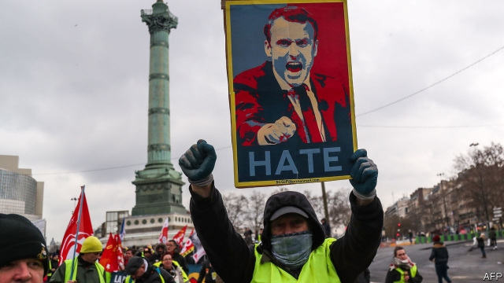

###### A climate of hatred

# Anti-Semitism, racism and anti-elitism are spreading in France 

##### The level of publicly expressed loathing harks back to the 1930s 

 

> Feb 21st 2019 

 

WHEN HERVÉ BERVILLE was growing up in rural Brittany, he was often the only black child around. But, he says, he encountered scarcely any racism. Adopted by a French couple during the genocide in Rwanda in 1994, the lanky economist went on to be elected in 2017 to the National Assembly, for President Emmanuel Macron’s party. Last year, when Mr Berville received a typed death threat by post at his parliamentary office, he threw it in the bin. When another arrived last month regretting the fact that he had “escaped the machetes”, the deputy decided to speak out. “It was so violent,” he says, and the atmosphere had shifted. “The border between threats, and acting on those threats, is shrinking.” 

A climate of hate is emerging in France. The targets are varied, apparently unconnected and shifting: Jews, journalists, the rich, policemen, members of parliament, the president. Sometimes violence is only threatened, as in Mr Berville’s case; two of his (black) parliamentary colleagues received the same threat. At other moments violence has been perpetrated—against symbols (a ministry, luxury cars) as well as people, usually in connection with the gilets jaunes (yellow jackets) protests. That movement, three months old, has radicalised as it has shrunk. Some 1,700 people and 1,000 policemen have been wounded since the protests began. 

When the gilets jaunes movement emerged last November, it was broadly a social protest and fiscal revolt. But the infiltration of ultra-left and extreme-right agitators, and the determination of a radical core to seek the overthrow of Mr Macron, has hardened the movement’s edge. Weekly scenes of violent clashes with riot police fill French television screens and plumes of tear gas fill the air on the streets of Paris and other cities. This relentless backdrop seems to have legitimised a form of violent hate. What was once confined to the unhinged ramblings of social-media groups has erupted into public. 

Earlier this month the Brittany home of Richard Ferrand, speaker of the National Assembly, was torched. Last week the constituency office in Le Mans of Damien Pichereau, another deputy from Mr Macron’s La République en Marche (LREM), was destroyed. Mr Berville says that 100 deputies from his party have been the victims of warnings or attacks of some sort. Among them are many women. Aurore Bergé, another LREM deputy, was the recipient of a particularly crude threat. During one protest, an effigy of Mr Macron was decapitated. Christophe Chalençon, a gilets jaunes organiser, recently warned that “if they put a bullet in my head, Macron will end up on the guillotine”. 

Anti-Semitism is mixed into the brew. After falling for two successive years, the number of anti-Semitic acts in France surged by 74% in 2018. On February 19th, 80 graves in a Jewish cemetery in eastern France were sprayed with swastikas. Christophe Castaner, the interior minister, says that anti-Semitism is “spreading like poison”. In recent days a bagel shop in Paris was defaced with the word “Juden”, swastikas were painted on to street art depicting Simone Veil, a former minister and Auschwitz survivor, and “Macron Jews’ bitch” was found sprayed on a garage door in the capital. Any link to the gilets jaunes is unproven. But last weekend gilets jaunes marchers were caught on video yelling “dirty Zionist shit” and “go back to Tel Aviv” at Alain Finkielkraut, a French philosopher of Polish origin, who was walking in the street near his left-bank home in Paris. 

Threats of death and intimidation are nothing new to politics. And anti-Semitism has deep roots in the country, reaching back beyond Vichy France to the publication of Edouard Drumont’s “La France Juive”, a popular anti-Semitic text, in 1886. Nor is France a stranger to periodic spasms of violence, such as the May ’68 uprising or the banlieue riots in 2005. “The specificity of the current period”, wrote Alain Duhamel in Libération, a newspaper, “is not the violence but the hatred.” 

There is no precedent under the Fifth Republic for the level of publicly expressed loathing, says Jean Garrigues, a historian at the University of Orléans. He compares today’s toxic mix of anti-parliamentarianism and anti-Semitism to the 1930s. If there is a link between these different strands it seems to be that those who are targeted are all regarded, rightly or wrongly, as part of the elite—or, more accurately, as part of an illegitimate, undeserving elite which is cheating the people. And those doing the most to promote this divide, at a time of eroding ideological attachments, are the country’s populists. 

Ever since Mr Macron upended the mainstream political parties at elections in 2017, political opposition in France has shifted to the extremes. “You are hated, massively hated,” declared François Ruffin, a deputy from the far-left Unsubmissive France, to the president in an open letter late last year. Marine Le Pen, on the far right, blames the “agitators, revolutionaries, anarchists” of the far left for the gilets jaunes violence. But she just as often lays into the self-serving political elite herself. Her campaign slogan reads simply: “Power to the people”. 

In protest at the current mood, a march against anti-Semitism on February 19th drew a cross-party collection of politicians and some 20,000 people in Paris. Even Ms Le Pen laid flowers to victims of anti-Semitism; she has consistently sought to distance her party from its anti-Semitic past even as she trades on identity politics. 

Ahead of a visit to the desecrated Jewish cemetery this week, Mr Macron described anti-Semitism as “the antithesis of all that is France”. He is hoping that his “great national debate”, a countrywide series of consultations and town-hall meetings, will counterbalance the hateful voices. Unfortunately, as the country prepares for elections to the European Parliament in May, in which the parties of Mr Macron and Ms Le Pen are the leading contenders, the harsh tone is unlikely to soften. 

