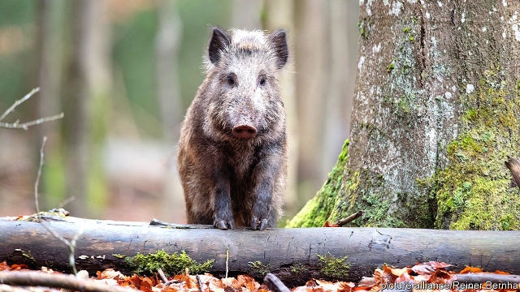

###### Denmark builds a pig wall

# Can a border fence keep out wild boar? 

##### Danes are building a controversial barrier along the border with Germany 

 

> Feb 23rd 2019 

MARTIN ELLERMAN, the mayor of Harrislee, a town on the German-Danish border, is fuming. At the behest of the Danish government, a five-foot steel fence is being built along the 70 km (40-mile) border to prevent an influx of immigrants from the rest of Europe. Mr Ellermann thinks it an aesthetic affront that violates the European ethos of invisible borders. 

The immigrants in question are wild boar, which can carry African Swine Fever (ASF). Although the disease has not yet been diagnosed in Germany, there have been outbreaks in eastern Europe and Belgium; and diseases travel fast among Europe’s vast numbers of boar. The virus poses no threat to humans but it spreads easily to domestic pigs, killing nearly all it infects. There is no cure and no vaccine, so the Danes have opted for a radical solution: shoot all the boar in Denmark and keep out foreign ones. 

Eradicating an entire species (albeit temporarily) seems an extreme approach to agricultural insurance, but Denmark has almost three times as many pigs as inhabitants. An outbreak of ASF would threaten more than 30,000 jobs and more than €4bn ($4.5bn) of annual exports of pig meat, which account for half of the country’s agricultural exports. 

Jens Munk Ebbesen of the Danish Agriculture and Food Council, which is responsible for helping farmers bring home the bacon, says America, China and Japan will stop their imports of Danish pork if a single wild boar infected with ASF is detected in Denmark—as happened in the Czech Republic in 2017. Vincent ter Beek, editor of Pig Progress, is sympathetic to the Danish move. Although he says it is not a fail-safe, the porcine publication is pro-fence. 

But critics say the fence will do more harm than good. According to Bo Oksnebjerg, the boss of the World Wildlife Fund in Denmark, only proper observance of rules on, for instance, using disinfectant and disposing of carcasses will offer protection against an outbreak of the disease; the new barrier, which reaches half a metre underground to stop boars from digging their way under it, will disturb flora and wildlife and will not prevent boar from crossing rivers along the border, for they are good swimmers. A pig of a problem, indeed. 

