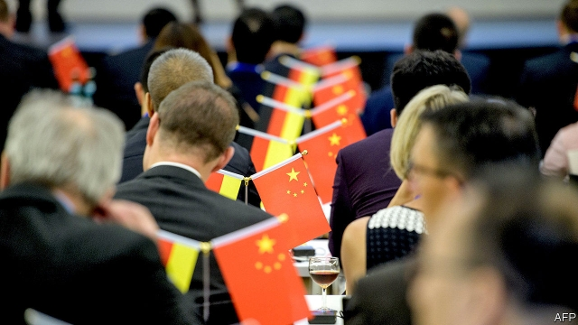
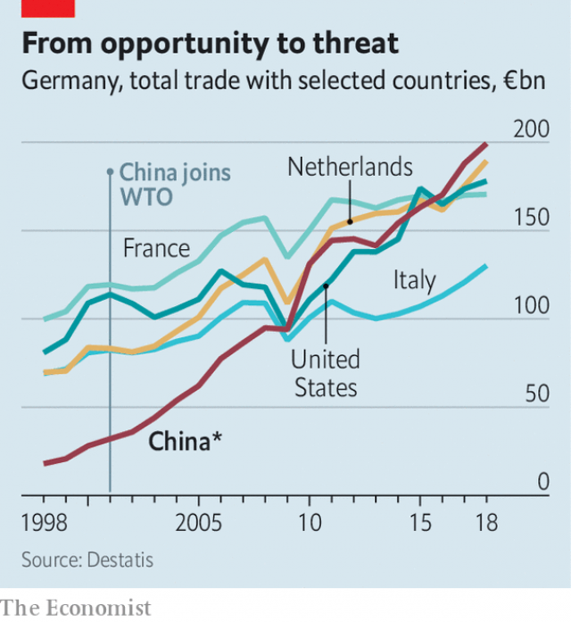

###### Germany’s fear of China

# How China has pushed Germany to rethink industrial policy 

##### China’s rise inspires some revolutionary thinking in Berlin 

 

> Feb 21st 2019 

IT WAS AN endearingly optimistic line. For years Germany’s China policy was guided by the motto Wandel durch Handel (“Change through trade”). There has certainly been plenty of trade (see chart), but the changes are not of the sort that were intended. 

Originally Germany imported cheap Chinese consumer goods while exporting its expensive cars, machine tools and gizmos. But German companies soon discovered that operating in China often means giving up technology and navigating rules that tilt the pitch in favour of domestic rivals. More recently some Mittelstand manufacturers have started to fear that China will eat their lunch, as Chinese companies, clambering up the supply chain and backed by juicy state subsidies, have embarked on shopping sprees inside Europe. Germany is particularly exposed to China’s new industrial policy. 

 

These developments have sparked a change of attitude. “German business used to want the government to get out of the way,” says Alexander Graf Lambsdorff, an MP from the liberal Free Democrats. “Now they find that reciting Hayek is no longer good enough.” Meanwhile Xi Jinping’s tightening grip on the Communist Party, and the party’s hold on industry, has squashed any lingering hopes that China might be brought into the Western fold. 

In January these concerns found dramatic expression in a paper from the Federation of German Industries (BDI), Germany’s biggest business group. Where its members once saw a lucrative new market, they now see a “systemic competitor”. The paper contains dozens of recommendations for European leaders, from tax breaks for research to investment in digital infrastructure. Its overriding message is that Germany and Europe must give up hoping that China will change, and instead produce policies to respond to its rise. 

And so they have. This week Peter Altmaier, Germany’s economy minister, and Bruno Le Maire, his French counterpart, unveiled a joint five-page industrial-policy manifesto “fit for the 21st century”. It made no mention of China, but the subtext was clear. The pair propose joint action to boost Europe’s capabilities in artificial intelligence, which Mr Altmaier’s department has called the most important innovation since the steam engine. They have pledged €1.75bn ($2bn) to fund next-generation battery-cell production. Most strikingly, France and Germany want to grant the EU’s governments power to overturn competition decisions made by the European Commission. The current rules, they believe, make it too hard for European firms to compete with Chinese state-backed giants. 

Such proposals are nothing new in France, which once declared yogurt-making a “strategic” industry. But in Germany they are revolutionary. Its “ordoliberal” philosophy—that it is the job of the state to establish a framework for the private sector, including tight antitrust laws, and then let the market do its work—inspired the EU rules the government now seeks to rewrite. Little wonder Mr Altmaier’s proposals have caused a fierce backlash at home. Lars Feld, an economics professor at the University of Freiburg, speaks for many when he declares himself “strongly opposed to this kind of mercantilist thinking”. 

China also threatens Germany’s already troubled relations with America. The government is split over whether to bow to American demands to block Huawei, a Chinese technology giant, from building its 5G telecoms network. Spooks, hawks and diplomats say it should, but Huawei may offer a better service than its rivals at a lower price. Above all Germany wants to avoid being caught up in Sino-American tensions. Finding a telecoms provider closer to home that is as cheap and capable as Huawei could help with that. But it is not clear that Europe has got one. 

