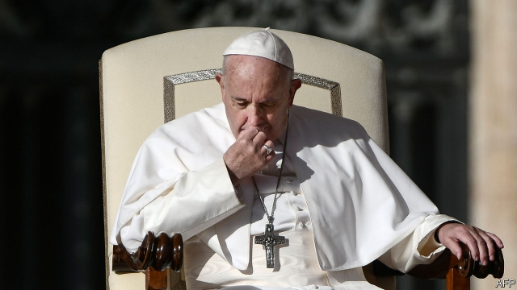

###### Praying about preying

# How far will Pope Francis go in rooting out sexual abuse? 

##### His own record comes under scrutiny as the Catholic church convenes a summit on the issue 

 

> Feb 21st 2019 

“WE HEAR THE cry of the little ones asking for justice,” said Pope Francis on February 21st to 100 bishops from around the world and other leading members of the Catholic hierarchy who had gathered in the Vatican for a four-day meeting on clerical sex abuse. The conference is the most conspicuous effort yet to extirpate the cancer eating at the world’s biggest Christian church. 

In the run-up to the meeting, a series of events had charged the atmosphere. Earlier this month, the pope admitted that there was truth in stories that nuns around the world had been raped by priests and bishops. This week a book by a French journalist, Frédéric Martel, was published, claiming that 80% of the clerics in the Vatican are gay. That may seem to have little bearing on the subject of the conference: there is abundant evidence to show that heterosexuals are as likely as homosexuals to prey on the young. But Mr Martel, himself gay, argues that sexually active homosexual priests are reluctant to report abusers for fear of being “outed” in revenge. 

Five days before the start of the conference, in an apparent effort to assure the world of its determination to root out predatory clerics, the Vatican threw an ex-cardinal, Theodore McCarrick, out of the priesthood. Vatican investigators concluded that the 88-year-old former archbishop of Washington, DC, had had homosexual relations with people under his authority and abused at least one minor. He was the highest-ranking member of his church to be defrocked in modern times. 

“Concrete and effective measures” were expected, the pope told the conference; but there are doubts about how far it will go. Last month he sought to deflate expectations. The delegates, he said, would “pray, listen to witness and have penitential liturgies, asking for forgiveness for the whole Church”. They would also be given instruction on how to react to allegations of clerical sex abuse. And the pope said he hoped their meeting would yield rules for handling cases. Testimony from survivors will be heard during moments of prayer. The participants were also told to meet victims before travelling to Rome. 

As the scandal has spread across the world since the 1990s, the focus has shifted from the conduct of individual priests to the role of their superiors in ignoring or covering up their behaviour. Francis has reacted defensively. In 2016 he shelved a plan to create a special tribunal to try bishops accused of failing to take action against abuse. And last year he leapt to the defence of a Chilean bishop accused of hiding abuse, saying he was a victim of “calumny”—before regretting those words. 

Francis’s own record has come under mounting scrutiny. As archbishop of Buenos Aires in 2010, the then-Cardinal Jorge Maria Bergoglio commissioned an investigation that cleared Father Julio Grassi of abuse claims. Seven years later Argentina’s supreme court upheld Father Grassi’s conviction and a 15-year prison sentence. 

Just as serious, but potentially more dangerous for the pope, are claims surrounding the case of former Cardinal McCarrick. Last year Archbishop Carlo Viganò, the former papal nuncio (ambassador) in America, claimed that Francis had lifted restrictions that his predecessor, Benedict XVI, had imposed on the American prelate and entrusted him with a string of important diplomatic missions, despite having been told that he was a serial seducer of seminarians under his authority. 

Mr Martel writes that members of the pope’s entourage had told him the same, adding that the then-Cardinal’s prey was above the age of consent and that his behaviour “was not enough in [Francis’s] eyes to condemn him.” The pope has declined to respond to Archbishop Viganò’s claims. 

