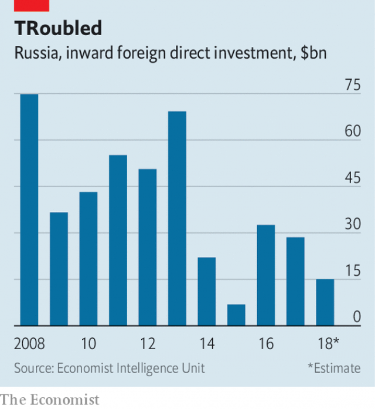

###### A bull at bay

# The arrest of Michael Calvey in Russia rattles foreign businesses 

##### The move signals Russia’s indifference to foreign investment 

 

> Feb 23rd 2019 

ONE OF MODERN Russia’s oldest and largest investment funds, Baring Vostok Capital Partners (BVCP) was launched in 1994. It has raised $3.7bn in capital, investing $2.8bn into 80 companies across the former Soviet Union, including some of Russia’s leading firms, such as its tech star, Yandex. Vedomosti, Russia’s top business daily, called the company “the symbol of direct investment in Russia”. BVCP’s American founder, Michael Calvey, has been unwaveringly bullish about the Russian market through crises, recessions and geopolitical tensions, staying put even as other foreign investors wound down their businesses after Russia annexed Crimea and launched a war in eastern Ukraine. Even in a country where business disputes can get messy, he was one of the last people anyone would expect to find behind bars. 

Yet that was exactly where Mr Calvey landed on February 15th, facing fraud charges carrying a sentence of up to ten years. His arrest, which came as government officials and business leaders gathered for a yearly investment conference in Sochi, sent shock waves through the Russian business world. Russian stocks slumped. Western business associations in Russia warned of the detrimental effect on the investment climate. Alexei Kudrin, head of Russia’s audit chamber and a close confidant of Mr Putin, called the situation “an emergency for the economy”. 

The case seems to stem from a corporate conflict over Vostochny Bank, in which BVCP holds a 52.5% stake. Prosecutors allege that Mr Calvey and his associates embezzled $37.7m from the bank. Mr Calvey has called the charges baseless, and says they are the outgrowth of a clash with two minority shareholders, Artem Avetisyan and Sherzod Yusupov, whom Baring Vostok accuses of fraudulently withdrawing assets from a smaller bank of theirs ahead of a merger with Vostochny in 2017. The dispute has gone to arbitration in London. The case against Mr Calvey was opened after Mr Yusupov complained to the Federal Security Service (FSB). The Bell, an independent Russian news site, reported that Mr Avetisyan has close ties with the country’s security services, including the son of Nikolai Patrushev, the hawkish head of Russia’s Security Council. 

In one sense, such a story is hardly unusual. As Boris Titov, Russia’s business ombudsman, wrote in a column in support of Mr Calvey, the interference of siloviki (former and current members of the security services) in commercial activity is a “systemic problem”. Russians even have a term for the illicit tactics, often employed in cahoots with crooked state authorities, used to seize assets: reiderstvo, or “raiding”. BVCP’s own list of ten successful investment principles includes “constructive relations” with the powers that be, a nod to those realities; it kept a famous Russian astronaut on its payroll to manage its own relations with the state. 

Nor are attacks on large foreign commercial interests novel. Mr Calvey’s arrest recalled the case of Bill Browder, a prominent American financier and one-time supporter of Vladimir Putin’s who was expelled from Russia in 2005. (He became a fierce Kremlin critic after his lawyer, Sergei Magnitsky, died in a Russian prison.) Yet while Mr Browder, an activist shareholder, took on major state-controlled companies, Mr Calvey tended to stay away from industries of interest to the state, focusing instead on rising private companies in consumer sectors. 

“If they can arrest Calvey, they are not afraid to arrest anyone,” tweeted Michael McFaul, a former American ambassador to Russia. A veteran of Salomon Brothers and the European Bank for Reconstruction and Development, he became known as a straight-shooter with a knack for navigating in Russia. Arkady Volozh, the billionaire founder of Yandex, called him the “market standard of decency and lawfulness”. German Gref, head of state-run Sberbank, Russia’s largest lender, declared Mr Calvey “a decent and honest person”. Kirill Dmitriev, the well-connected director of the Russian Direct Investment Fund, a state-backed sovereign-wealth fund, promised to “provide a personal guarantee” for Mr Calvey. 

With Russia and America locked in a hostile standoff, and Congress preparing another set of sanctions on Russia, the arrest of a prominent American businessman threatens to become a political flashpoint—and a potential bargaining chip for the Kremlin. The judge’s decision, a day after the arrest, to keep Mr Calvey in pre-trial detention for two months suggests that the case will not be resolved quickly or quietly. For the Western businesses still operating in Russia, the implications are chilling. Being a foreigner once provided a modicum of protection, says Alexis Rodzianko, president of the American Chamber of Commerce in Russia. “It makes every one of us now think, how far away am I from the cage?” 

 

The Kremlin has said it hopes the case will not harm investment. Perhaps that is because there is so little left (see chart). The government’s economic policy recognises as much. Its central concept is the idea of “national projects”, infrastructure and other plans that rely largely on capital from the state and state-owned enterprises. In his yearly state-of-the-union speech on February 20th, Mr Putin nodded at the challenges entrepreneurs face. “Honest businesses should not have to fear criminal prosecution,” he declared, a line that some interpreted as a veiled reference to Mr Calvey. 

The president ordered the Agency for Strategic Initiatives (ASI), a government think-tank, to help build a platform for businesses to report on pressure from law enforcement. This may have a less constructive effect than the president hopes. For the director of the ASI’s “New Business” department, whose responsibilities include initiatives to improve the investment climate, is Mr Avetisyan. 

