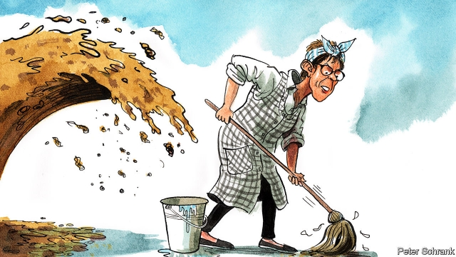

###### Charlemagne

# The secrets of the Saarland 

##### What the outsize influence of a tiny state says about Germany 

 

> Feb 23rd 2019 

AT THE END of the annual Munich Security Conference on February 17th, most of the foreign- and security-policy elites in attendance jetted back to their countries. But Annegret Kramp-Karrenbauer, the pluri-syllabic new leader of the Christian Democratic Union (CDU), motored instead to St Ingbert, a sleepy town in western Germany. There the front-runner to succeed Angela Merkel as chancellor donned an apron and headcloth and, pushing a mop around a stage, performed a comedy routine as her alter ego, Gretl, a wisecracking cleaning lady with a thick Saarland accent. To laughter from the audience of local residents and politicians at the carnival-season Volksfest, “Gretl” grumbled about the wiles of federal politics: “What a mess,” she despaired, divulging that she had been sent to Berlin to clean it all up. 

The contrast between the salons of Munich and her skit in St Ingbert says something about the rise of Ms Kramp-Karrenbauer (known by her initials of AKK). Before her move to Berlin in October, she was the premier of the Saarland, a hilly federal state of only 1m inhabitants abutting Luxembourg and France. Over its history it has been French, German and, for a decade after the second world war, independent. In their singsong, French-influenced dialect, folk here still refer to the rest of Germany as the Reisch (empire). To other Germans it is an odd place. Presenting François Mitterrand with a plate of Saumagen (sow’s stomach), Helmut Kohl apocryphally joked: “Eat up, or you’re getting the Saarland back.” 

AKK is not the only Saarländer to overcome her state’s marginal status. So did Peter Altmaier, Germany’s economy minister, Mrs Merkel’s closest cabinet ally, and a possible contender for the presidency of the European Commission. So, too, did Heiko Maas, Germany’s foreign minister (from the Social Democratic Party, or SPD); Sabine Weyand, the brains behind the EU’s negotiations with Britain over Brexit; and Oskar Lafontaine, the doyen of the socialist Left party. “The Heute Show”, a satirical television programme, deadpans that the Saarland is the real centre of power in Germany. 

It may not be a fluke. Saarländers have certain political strengths. One is charm. They are known for bon-vivant informality, with a Gallic knack for cooking and a greater propensity than other Germans to use the friendly du pronoun rather than the formal Sie. The state’s smallness virtually puts its politicians on first-name terms with residents. Saarländers are linguists by necessity and have good links to Brussels and Paris, giving them advantages in European politics. Mr Altmaier, a clubbable, multilingual problem-solver whose dinner parties are the stuff of Berlin political legend, typifies this Saarländisch mix of conviviality and down-to-earthness. So do Ms Weyand’s sardonic asides at the negotiating table and AKK’s routine with the mop. 

In substance, too, politicians from the Saarland have distinctive traits. The state long made its living from coal-mining—the last shaft closed in 2012—and is the most Catholic in Germany. The two traditions intertwine in local customs (Saint Barbara, the patron saint of miners, is revered), in a high degree of civic engagement (it has the densest network of volunteer organisations in Germany) and in a “Christian social” political culture emphasising egalitarianism. The local wing of the CDU, Germany’s largest party, is more “socially oriented” and closer to trade unions than the party in other parts of the country, explains Tobias Hans, AKK’s successor as premier. “Saarland was always marked or threatened by war,” adds Oliver Schwambach, an editor at the Saarbrücker Zeitung, the state’s most-read newspaper. He notes that Mr Maas’s grandmother never moved but held three passports during her lifetime: “So people here hate conflict of any sort. Elections here are less angry, politics is more mild than elsewhere.” 

All of which starkly characterises AKK, whose identification with the Saarland is so strong that she is still known as the Landesmutter, or “state mother”. As minister-president she was a modest, pragmatic consensus-builder and Volksfest regular who governed in a near-frictionless “grand coalition” with the centre-left SPD. She is socially conservative, opposing gay marriage. In the autumn she beat Friedrich Merz, a swaggering economic liberal from the Rhineland, to the CDU leadership, an anteroom to the chancellorship, by styling herself as a bridge-builder on polarising subjects like migration. She backed Mrs Merkel’s decision to keep Germany’s borders open in 2015, but insists there must be no repetition of those events. She is emotionally European and, those who encountered her in Munich concluded, has a good grasp of the world beyond Germany’s borders. 

Such typically Saarländisch traits made AKK Mrs Merkel’s preferred successor. They also help to explain why the chancellor has relied on Mr Altmaier in the major policy dramas of her leadership; as chief whip during the euro-zone bail-outs, environment and nuclear minister during her great switch from nuclear to green power, chief of staff during the migration crisis and now economy minister amid Donald Trump’s tariff wars. A reserved Protestant from the ex-communist east, the chancellor has a very un-Saarländisch background. But her cautious personality and centrist grand coalition make Merkelian Berlin a natural stamping-ground for politicians from that state. The likes of AKK thrive in a Germany that prefers stability over bracing reforms or ideological struggle. 

That points to the great caveat to the Saarlandisation of German politics and the great question-mark over AKK in particular: can she offer more than continuity? An economic slowdown is looming; Europe is divided; and Mr Trump is challenging the global trade order and the NATO security umbrella that have made Germany rich and safe over the decades. Pragmatic, cohesion-loving small-c conservatism has marked the comfortable Merkel era, but Germany—like Europe—will need something more dynamic from its leaders in the coming years. Gretl may need a bigger mop. 

