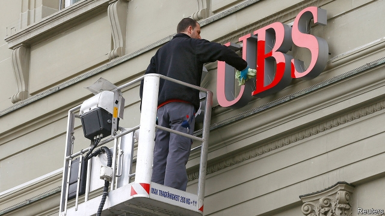

###### Lactose intolerance

# A gamble in France could cost UBS dear 

##### A court in France fines the Swiss bank €3.7bn for tax evasion 

 

> Feb 21st 2019 

 

THE MOST intriguing bit of the six-week tax-evasion trial of UBS in France late last year was dairy-themed. Prosecutors accused the Swiss bank of keeping coded notes to track how many “milk cans”—units of money—had been moved to Swiss accounts by tax-dodging French clients. UBS denied having any such parallel accounting system. A former manager insisted the notes related to bankers’ bonuses, not tax-shy funds. 

France’s Tribunal de Grande Instance, its high court in Paris, did not buy that explanation. On February 20th it found the Swiss bank guilty of helping thousands of rich French clients set up undeclared accounts, potentially containing over €10bn ($11.3bn), between 2004 and 2012. It fined the bank an eye-watering €3.7bn and added an additional €800m in damages for the French state. 

If upheld, it would be more than 12 times larger than France’s previous record criminal corporate fine, of €300m against HSBC, another bank—and not far short of the roughly $5.5bn that dozens of Swiss banks have collectively paid out to the United States, their tormentor-in-chief, in tax-evasion cases over the past decade. UBS paid American authorities $780m in 2009, in a case widely considered more egregious than its alleged French transgressions. 

The bank could have settled for much less—around €1bn—but chose to gamble, calling French demands “irrational” and politically motivated. That decision will look spectacularly unwise if the appeal the bank was quick to announce fails. UBS says it “strongly disagrees” with the verdict, which is “based on the unfounded allegations of former employees”. It insists that “no offence in France was established”. Speaking outside court, UBS’s general counsel called the ruling “incomprehensible”. 

Investors will certainly be struggling to understand how the bank got itself in a position of facing penalties equivalent to 92% of last year’s net profit. Worse, the potential hit is far from covered: at the end of 2018 UBS had the equivalent of €2.1bn set aside to cover possible losses from litigation and settlements. 

The bank must now try to overturn a decision which, it claims, “effectively applies French law in Switzerland”. Meanwhile, the odds of other big firms targeted by France risking a trial rather than coughing up to avoid time in the dock have surely lengthened hugely. 

