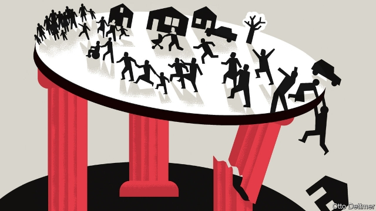

###### Free exchange

# A new book argues weakened communities threaten liberal democracy 

##### Raghuram Rajan’s “The Third Pillar” says that society matters 

 

> Feb 21st 2019 

UNTIL RECENTLY, economists’ prescription for struggling places was bloodless: let them die. “Some towns cannot be preserved”, this newspaper argued in 2013, attracting a larger-than-usual volume of correspondence from dissenting readers. But the electoral successes of Donald Trump and the campaign to yank Britain out of the European Union (EU) have shaken the dismal science. Prominent economists have begun to consider what an efficient response to geographic inequality might look like. In a paper published in 2018, for example, Benjamin Austin, Edward Glaeser and Lawrence Summers of Harvard University argued for employment subsidies targeted at struggling places. 

The reconsideration of place-based policies can often seem grudging—something to be tolerated, in order to keep those on the losing end of regional inequality from embracing populism or killing themselves with drugs. Economists’ reluctance is understandable: efforts to help struggling communities might well deter people from moving when they would otherwise have relocated to more promising places. But it is also short-sighted, argues Raghuram Rajan, an economist at the University of Chicago and the former head of India’s central bank. In a compelling new book, “The Third Pillar: How Markets and the State Leave the Community Behind”, he argues that communities are not so much a source of friction inhibiting the smooth operation of the global economy, as an indispensable part of a healthy society. 

Mr Rajan believes in markets but has often made himself the bearer of awkward economic news. In 2005 he soured the mood at an annual conference of central bankers by asking whether financial innovation had made the world a riskier place. In a book published in 2010 he argued that the policies that unwittingly led to the global financial crisis, for example mortgage subsidies, were often responses to economic “faultlines”, such as inequality; those faultlines are still in place, ready to wreak future havoc. “The Third Pillar” similarly urges economists to recognise a blind spot. The places where people grow up, live and work are not simply agglomerations of economic activity. They shape people’s identities and “anchor the individual in real human networks”. Communities provide leverage to those who might otherwise find themselves bullied by the state or by markets. Their function has changed dramatically since pre-industrial times, but communities remain a critical piece of social infrastructure. 

That community matters might seem a banal observation to non-economists. But it sits inconveniently alongside many aspects of an economist’s worldview. Economic progress has often meant the replacement of personal, community interactions with efficient but more impersonal ones. The less sentimental people are about where they live or who they work for, the more readily they can move in response to market pressures, boosting productivity and limiting the damage from creative destruction. Community-based economic activity, by contrast, can be inefficient. Lending a friend money or caring for an ailing relative seem like nice things to do. But larger and more transparent financial markets attract more funds and expand access to credit, while a market for care work allows for welfare-enhancing specialisation and trade. 

Mr Rajan acknowledges the negative effects of tight-knit communities. The book provides a short history of the evolution of community, state and market in Europe, which begins in the stifling world of the feudal manor. Community relationships governed nearly every aspect of life, maintaining order and stability at the cost of economic stasis and oppression. Disruptions to that world created the conditions for the maturation of the state, and for economic progress. As the world became more interconnected, states and markets assumed roles once played by the community—from insuring against hardship to funding investment. 

Communities today can still be intrusive and intolerant. But they also provide support, inspiration and a backdrop for people’s emotional and spiritual lives. Communities, furthermore, are where the abstractions of global economics and politics become real. Strong states and deep markets might have enabled unprecedented prosperity and individual liberty, but they are prone to excesses. It has often fallen to communities to correct imbalances of power. Mr Rajan points to social movements, born of community action, that were responsible for the spread of primary education and the expansion of the franchise. 

The past half-century has been difficult for the third pillar, however. Globalisation and technological change have deprived many places of sources of employment and wealth. Regions’ fates seem increasingly determined from afar, by supranational organisations like the EU or by fickle global financial markets. Trade and technology have transformed many industries into winner-takes-all affairs. Opportunity has become concentrated in expensive superstar cities, which attract the most talented members of communities and leave everyone else without such opportunities. Mr Rajan reckons that the weakening of communities that has followed these trends makes the world vulnerable. The frustrated residents of struggling places mistrust elites, and seek meaning instead in the ugly politics of populist leaders. 

Promising solutions are hard to come by. Still, Mr Rajan offers reasonable recommendations. Devolution of policymaking authority might invigorate community spirit. Governments should also practise “responsible sovereignty”, he reckons, and limit unnecessarily disruptive forms of economic integration, like reckless financial globalisation. But the thrust of “The Third Pillar” is that society matters after all. Having been insufficiently mindful of this over the past few decades, business and government leaders may have little option but to brace themselves for frustrated communities demanding change. 

