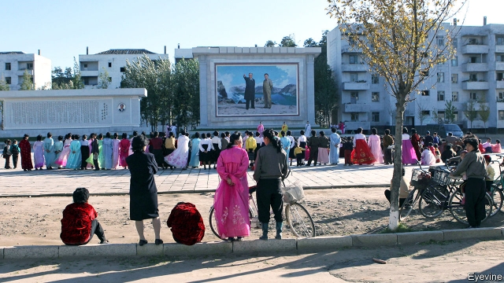

###### Going for broker

# A surprising number of North Korean refugees send money home 

##### But it is risky and expensive 

 

> Feb 21st 2019 

IN FEBRUARY 2018 Jessie Kim found out that she had been sending money to a dead man. Ms Kim, now a 27-year-old student in Seoul, fled North Korea for China in 2011. She had been sending her father in Yanggang province in the North around $1,000 a year since she arrived in South Korea in early 2014. Two years later she doubled the contributions, working several part-time jobs, after her aunt told her that her father had been in an accident and needed money for medical bills. But another call from her aunt last winter, claiming that her father was asking for yet more money, made her suspicious. “He wasn’t the kind of man to ask his daughter for money,” she says. Ms Kim made enquiries through the broker who had facilitated the transactions. She eventually found out that her father had died in the accident in 2016 and that the money had gone to her aunt’s family instead. 

Ms Kim’s case illustrates the pitfalls of supporting relatives in a country that is all but cut off from global communications and financial-services networks. Ordinary North Koreans are not allowed to receive money or even phone calls from abroad. Foreign banks are hesitant to handle any transaction associated with the North, for fear of falling foul of sanctions, intended to curtail its nuclear programme, that have been imposed by America and others. 

Yet the relationship between the 30,000-odd North Korean refugees in South Korea and their relatives back home shows that the North is much less closed than at first appears. A growing proportion of those who have settled in the South manage to send money home. In 2018, 62% of refugees surveyed by the Database Center for North Korean Human Rights (NKDB), an NGO in Seoul, said they had transferred funds to relatives or friends in North Korea, up from 50% in 2013. Most respondents say they sent between $500 and $2,000 a year, which was mostly spent on basic living expenses, health and education. The annual total may run into the tens of millions of dollars. 

That is low compared with remittances from workers sent abroad by the state, which are estimated to be in the hundreds of millions. (Sanctions require that these overseas workers return home by the end of this year.) But it is substantial both relative to North Korean GDP per person, reckoned to be between $1,000 and $2,000 a year, and as a share of income earned by North Koreans in South Korea, who make around $1,300 a month on average. The majority of recipients live in North Hamgyeong and Yanggang on the northern border with China, the home provinces of most of those fleeing the North. (The proximity to the Chinese border also enables communication using smuggled Chinese SIM cards.) 

The money is sent through a sophisticated network of brokers in South Korea, China and North Korea. Like the majority of refugees, these are usually women; often less compelled to work for the state, they are more active in the North’s informal economy than men. If a refugee in South Korea wants to make a transfer, she may contact a broker in the North who owes a smuggler in China. The refugee may offer to pay some portion of the broker’s debt; in return, the intermediary gives an equivalent amount to the refugee’s family in the North, usually in dollars or Chinese yuan. The system is based on trust—and extravagant fees. The broker who facilitates the transaction takes a cut of around 30%. Uninitiated participants with weak networks may fall victim to scams, says Ms Kim, though she claims they are rare: wronged customers can get their brokers into trouble by reporting them to the Chinese or North Korean authorities. 

In a few cases, money flows the other way. A small number of refugees surveyed by NKDB said that they had received money from relatives in the North. But those who make it abroad are vastly more likely to be able to support their relatives. That this complicates relationships is not lost on Ms Kim. “I didn’t know my father was dead for two years because my aunt lied to me,” she says. “But I understand why she did it.” 

