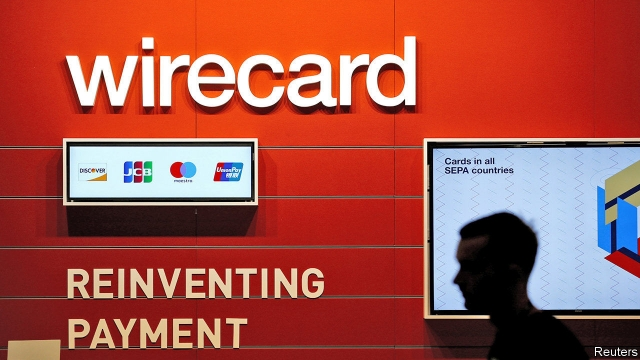

###### Shooting the messenger

# Germany’s regulator bans short-selling in Wirecard 

##### The firm’s share price slid after allegations of false accounting surfaced 

 

> Feb 21st 2019 

THOSE WHO profit from the misery of others are not often popular. Short-sellers, who try to make money by selling borrowed shares and buying them back later at a lower price, have long been viewed with suspicion. They are blamed for exacerbating price falls so that they can reap bigger returns. In times of market stress authorities often ban them. In 1610 regulators in Amsterdam forbade short-selling, blaming it for a fall in the value of the Dutch East India Company. Two centuries later Napoleon prohibited it as an act of treason. 

On February 18th BaFin, Germany’s financial regulator, banned investors from taking new net short positions in Wirecard, a German digital-payments firm, after its share price fell by over 40% in under three weeks. The crash marked a swift change in its fortunes. In 2018 Wirecard displaced Commerzbank, a 149-year-old lender, in the DAX 30, an index of Germany’s biggest firms. 

Wirecard was worth €20.7bn ($23.6bn) on January 29th, just before the Financial Times reported that Edo Kurniawan, a senior executive in the company’s Singapore office, was suspected of using fraudulent accounting techniques to inflate reported revenues. The share price slid. On February 1st it fell further when the same newspaper reported that Rajah & Tann, a law firm commissioned by Wirecard to investigate the allegations, had presented preliminary evidence to senior management in May 2018 suggesting the offences were a part of a pattern of book-padding. On February 8th, as Wirecard’s Singapore office was visited by the police, its market value fell to €11.7bn. 

The firm refutes the reports, claiming that the Financial Times has acted unethically. Its management says an internal investigation is ongoing, and that a second, external investigation by Rajah & Tann is still under way and has produced “no conclusive evidence of criminal misconduct”. The firm says it is working closely with the police in Singapore. It says it plans to take legal action against the Financial Times. 

Investors in Wirecard remained spooked until BaFin intervened on February 18th. The regulator cited Wirecard’s “importance for the economy” and the “serious threat to market confidence” following the collapse in its share price. Wirecard processes payments for 250,000 merchants, including Aldi and Lidl, two of Germany’s biggest retailers, and numerous airlines. The value of Wirecard rose by 16% after the regulator took action. 

The ban may have been a risky move. The regulator is meant to act in the public interest. This is the first time BaFin has used the measure to protect a single company. (In 2008, with the financial crisis in full swing, they restricted short-selling of 11 bank stocks.) Crispin Odey, a hedge-fund manager with short positions in Wirecard, has claimed that BaFin has opened the door to potential lawsuits. In his view, according to reports by Bloomberg, the regulator should have ensured that Wirecard’s employees did not engage in any wrongdoing before it took action. 

Action might be justified if markets have been manipulated. Prosecutors in Munich say they are looking into possible violations of securities regulations. But the Financial Times has rejected allegations of unethical reporting or market manipulation as “baseless and false”. 

Despite their unpopularity, short-sellers perform useful functions in markets. They help prevent bubbles from forming and are adept at rooting out malfeasance. Studies find that in the months before financial fraud at a company is revealed, short-selling of its stock tends to spike. Jim Chanos, a well-known short-seller, famously predicted the demise of Enron, an energy-trading firm that went bust in 2001. 

BaFin claims Wirecard had been the target of repeated “short attacks.” But short-selling a company that is suspected of false accounting does not undermine markets—rather, it is a sign they are working. Making Mr Chanos give up his short position would not have saved Enron from bankruptcy, after all. He was the messenger, not the problem. 

