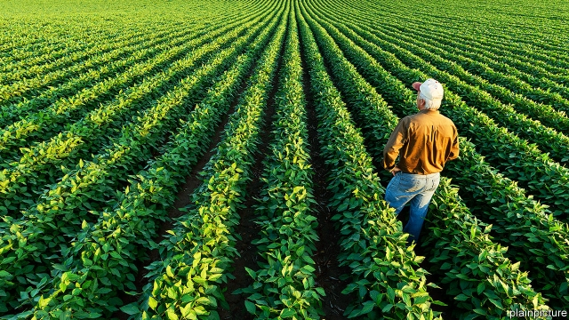
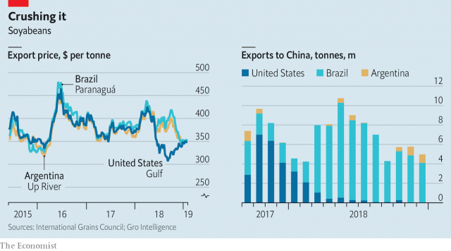

###### Soy sources

# The global soyabean market has been upended 

##### There may be permanent effects 

 

> Feb 21st 2019 

“WE’VE BEEN gambling up to this point,” says Tim Bardole, a soyabean farmer from Iowa. After the price of soyabeans crashed last summer (see chart), he held on to most of his harvest and waited for the market to recover. But seven months later, and with large loans to repay, he sold up. “We decided we’d better take what we have,” he says. 

The cause of the crash was a 25% tariff on American soyabeans imposed by China, the world’s biggest importer, as one shot in the trade war between the two countries. Yet peace is supposedly in the offing. The two countries are locked in negotiations over a deal, ahead of a deadline of March 1st that has been imposed by America (though on February 19th President Donald Trump declared the timing to be flexible). That Mr Bardole cut his losses despite those talks is not that surprising. Even if the tariff is lifted—which is far from certain—the past year’s disruption will probably leave a permanent scar. 

 

The trade war caught American soyabean farmers at a particularly bad time. They had just planted a bumper crop, encouraged by strong demand and a drought in Argentina, a competitor. When the tariff was implemented it was too late to switch to other crops such as corn. Demand from China—which in 2017 accounted for 60% of American exports—collapsed. The result was a glut. 

To replace American beans China has ramped up its imports from Brazil, pushing up prices in South America. Meanwhile the European Union, Mexico and even Argentina have been tempted by low American prices—but not enough to replace lost Chinese demand. To help American farmers cope, Mr Trump’s administration handed them a one-off payment of $1.65 per bushel ($61 per tonne). Without it Mr Bardole would have lost money on this year’s crop. He might have sold his crop anyway, but the support has allowed others to sit on theirs. Farmers will have 25m tonnes of beans in stock at the end of this year’s selling season, according to an official estimate, up from 12m tonnes last year. 

In January Liu He, China’s deputy prime minister, said China would buy 5m tonnes of soyabeans after meeting Mr Trump. Even so, the pace of Chinese purchases is a fraction of what it would ordinarily be around this time of year. 

If the tariffs are lifted, some Chinese demand will recover. The billions of dollars’-worth of infrastructure that facilitates American sales to China is still in place. And China could turn back to America for other reasons. To cope with the loss of American exports of soyabeans, for instance, it has lowered the minimum protein content in pig feed. But that risks hogs’ health and can stunt their growth. Furthermore, Chinese pig farms have been hit by a nasty bout of African swine fever, forcing farmers to cull 5-15% of their hogs, according to Michael Magdovitz of Rabobank, a firm that specialises in financing agriculture. But this should prove temporary. 

Despite all this, many are sceptical that Chinese demand will ever fully recover. “It was nice” to have guaranteed demand from China, says Mr Bardole, but “those days are gone.” Others worry that the Chinese will respond to this episode by investing more in developing Brazilian agricultural infrastructure, permanently decreasing their reliance on America. 

Not everyone is pessimistic. The current situation “is nothing compared with what we went through in the 1980s,” says Randy Souder, another Iowan farmer. He remembers that he coped with low prices then by producing more efficiently. If some farmers are forced out of business, he reckons others will “pick up the acres” and spread their equipment costs over a larger area of land. 

Prices have crept up in recent months. Mr Magdovitz says they have been supported by the limited Chinese purchases, optimism that a deal will be agreed and Mr Trump’s subsidies. America’s economy as a whole may not depend on exporting to China. But if recent experience is anything to go by, soyabeans are an exception. 

  

