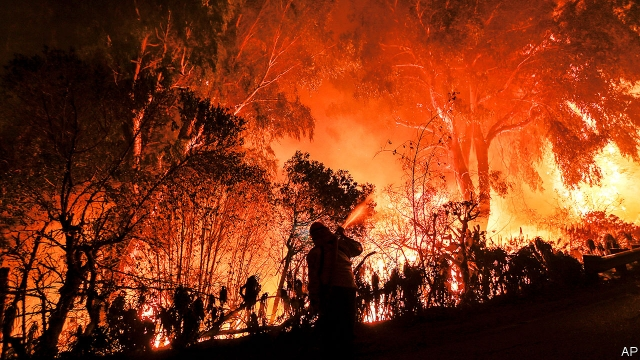
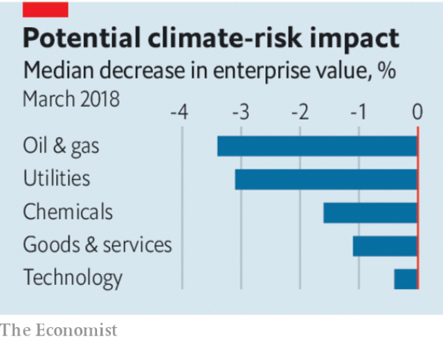

###### Business risk

# Climate change and the threat to companies 

##### Firms urgently need to rethink how they approach climate risk 

 

> Feb 21st 2019 

CHIEF EXECUTIVES who care about climate change—and these days most profess to—often highlight headquarters bedecked with solar panels and other efforts to lower their carbon footprint. Last week Volkswagen, a carmaker, told its 40,000 suppliers to cut emissions or risk losing its custom. Plenty of investors, meanwhile, say they are worried about being saddled with worthless stakes in coal-fired power plants if carbon taxes eventually bite. Yet the reality is that meaningful global environmental regulations are nowhere on the horizon. The risk of severe climate change is thus rising, posing physical threats to many firms. Most remain blind to these, often wilfully so. They should start worrying about them. 

Nature disrupting supply chains is nothing new. Businesses have coped with floods, droughts and storms since long before the joint-stock company became popular in the 19th century. Two things have changed. First, supply chains have grown complex and global (just look at VW). As links have multiplied so, too, have points of possible failure. Many sit in the tropics, more given to weather extremes than the temperate West. 

Second, global warming is fuelling more such extremes everywhere (see article). In 2017 Houston experienced its third “500-year flood” in less than four decades, California suffered five of its 20 worst wildfires ever and parts of the Indian subcontinent were underwater for days following epic monsoon downpours. That year insurers paid out a monumental $135bn in compensation. Another $195bn in estimated losses was uninsured. Power plants often run slow because the river water they use for cooling is too hot. Last year commercial traffic along the Rhine, the world’s busiest waterway, ran aground when rains failed to replenish its sources. 

Corporate-risk managers have just about come to grips with tangled supply chains. But they are rotten at assessing their exposure to a changing climate (see article). Unfamiliar with bleeding-edge climate models, which tell you what disruption to expect next, risk managers fall back on retrospective tools like flood maps, which are tried, tested—and wrong. 

 

One study last year found that accounting for physical risks to corporate assets would shave 2-3% off the total market value of over 11,000 globally listed firms. That is less than many stocks move in a given day, and a fraction of the estimated 15% downward effect of a transition to cleaner energy. Unlike the energy transition, though, some physical harm to corporate assets is all but guaranteed. Not only that, but the risks rise as the world warms. And the average conceals a huge range. Some companies would lose nearly one-fifth of their enterprise value. Most have no clue where they stand. 

They have few pressing incentives to find out. Markets tend to punish honesty about previously unacknowledged risks, not reward it. Rather than learn that nature poses a “material” threat—which firms are obliged to disclose to shareholders—it is safer not to look in the first place. Although credit-raters and insurers are busily reassessing climate risk, companies’ premiums and credit have scarcely got more expensive. On the rare occasion markets do reprice a company’s risk, they do so in a hurry. PG&E, a Californian utility, was forced into bankruptcy protection in January after insurers and creditors fled when they concluded that it could be on the hook for billion-dollar liabilities over its possible role in sparking wildfires. 

Such cases would be rarer if companies were legally obliged to assess and disclose their climate vulnerabilities. An international group set up by the Financial Stability Board, a global set of regulators, issued voluntary guidelines for public companies in 2017. These should be made mandatory. 

It is in businesses’ long-term interest to own up to the threats they face. A post-disaster payout from a cheap insurance policy is better than nothing—but a lot worse than avoiding disruption. Adaptation could mean erecting flood barriers around factories or battening down warehouse roofs to withstand stronger gales. Insurers reckon a dollar spent on such measures saves five in reconstruction. It may involve lobbying politicians to fill the estimated $110bn-280bn shortfall in annual public spending on resilience. In extreme cases, it may require retreat from a business. If this lays bare the seriousness of global warming’s effects, the world may even get serious about tackling its causes. 

