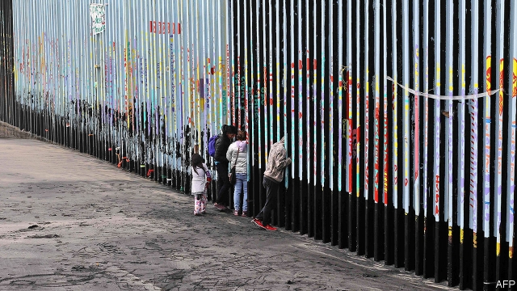

###### The southern border

# Don’t complain about Donald Trump’s powers, curtail them 

##### For the president to declare a state of emergency is spurious. It may well also be legal 

 

> Feb 21st 2019 

SINCE THE day he became president, Donald Trump has trampled political norms. He has cosied up to foreign dictators while traducing his own officials. He has demanded that the Justice Department investigate his adversaries and mused about pardoning himself. He lies so frequently that it seems like a tic. In declaring a spurious state of emergency on America’s southern border, has he at last gone too far and provoked a crisis? 

The president’s action on February 15th was born of frustration and fear for his political future. Having repeatedly promised to build a wall on the Mexican border, he had to do it. Unsurprisingly, his original plan of getting Mexico to pay failed. Mr Trump’s attempts to cajole Congress to provide the money, including by shutting down the government, fared no better. Boxed in by his own foolish promises and ineptitude, he has fallen back on the ruse of declaring an emergency and grabbing what money he can from the military budget. 

As a lawsuit already filed by 16 states points out, there is no emergency on the southern border in any normal sense. Last year 400,000 people were apprehended there, down from 1.6m in 2000. Meanwhile the border force has doubled in size. Drug seizures are down, mostly because less marijuana is coming in. 

America does face genuine emergencies. Perhaps the greatest of these is the terrible opioid epidemic that kills some 50,000 people every year and will continue to do so for years to come (see Briefing). Mr Trump plans to spend just $1bn over two years saving some of these lives. Devoting $8bn to putting more barriers in the Sonoran Desert is the wrong priority. 

Whether Mr Trump is overreaching his authority, and in what ways, is a legal question. The courts may rule that the business of defining what is an emergency belongs to the executive. Better, then, to assume the real problem is not so much that the president is exceeding his powers as that those powers are excessive. This is largely Congress’s fault, and it is for Congress to fix. 

For decades, presidents both Republican and Democratic have asserted greater powers for themselves, and have often been allowed to get away with it. Having declared an open-ended war on terror, George W. Bush set up military commissions and authorised warrantless wiretaps. Barack Obama invented new categories of illegal immigrant, which he then protected. Every president since Gerald Ford has declared at least one national emergency. Many are no longer emergencies, yet they linger, along with some of the powers they brought with them. Nearly 40 years after Iranian revolutionaries took Americans hostage, Jimmy Carter’s emergency declaration is still in force. 

Congress has also passed laws increasing the power of the executive, which Mr Trump is now exploiting. One of the three pots of money he intends to raid to pay for his wall is the Defence Department’s anti-drug fund. In 2016 Congress passed a bill that appears to give him the power to do just that. More cash will come from a Treasury asset-forfeiture fund, which can also be tapped easily. Only Mr Trump’s third target, the military construction budget, requires a declaration of emergency. He has a good chance of getting his way there, too. His emergency powers are broad, and he could veto a motion of disapproval which Congress is due to vote on (see article). 

Mr Trump has made an appallingly sloppy case for his emergency declaration. He mused publicly for weeks about whether to issue it, as though he were still a reality-TV star building tension. He cannot even stick to the line that there is an emergency. “I didn’t need to do this,” he explained on February 15th. But, he said, he wants to get the wall built quickly. It is provocative enough when a president asserts new powers. It is more so when he admits that he is doing so because it is convenient. 

Such shamelessness is clarifying, however. Just as Mr Trump’s refusal to release his tax returns showed that the tradition of presidential candidates doing so was only a tradition, just as his failure to divest himself of his business interests demonstrated that a president cannot be forced into it, his cynical declaration of an emergency reveals how vague and expansive that power is. It would be best if Mr Trump acted nobly. But a nation founded on law should know not to expect that of its leaders. 

Congress should take stock of its defences against bad leadership and strengthen them, as in the 1970s after Richard Nixon’s resignation. It could curtail emergency powers, say by changing the law so that emergencies expire automatically after a month or two unless Congress re-authorises them. Republicans may be tempted to keep things as they are. They should remember how it feels when the boot is on the other foot. 

