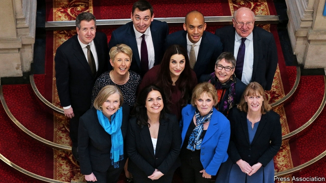

###### British politics

# The fragmentation of the big parties 

##### The resignation of 11 MPs from their parties may not sound much. But it could yet disrupt Britain’s broken politics 

 

> Feb 21st 2019 

IN THE PAST few years many of the MPs in Britain’s main parties have grown increasingly unhappy. One reason Brexit has proved tricky is that the party divide does not map onto views about Europe. This week 11 moderate MPs, eight Labour and three Conservative, decided that they had had enough—and more may join them. Given that Parliament seats 650 MPs, their resignation to create a new Independent Group might seem a minor tremor. But it matters: as a verdict on Labour’s leader, Jeremy Corbyn; as another complication in resolving Brexit; and as a warning of an earthquake that could yet reshape Britain’s two-party system. 

One of the eight Labour MPs, Luciana Berger, is Jewish. She has been subjected to unrelenting racist attacks from within the party. Mr Corbyn’s feeble response—he has not met Ms Berger since 2017—has led many of his MPs to conclude that Labour has surrendered to anti-Semitism. This week even the deputy leader, Tom Watson, lamented that he sometimes no longer recognised his own party. The resigning MPs are right. Mr Corbyn has failed a test of leadership and shown that he cannot tell right from wrong. 

The mass resignations also underline how far Brexit now trumps party loyalties. The Leave-Remain divide identifies voters and MPs more than the old left-right one does. The threat of more resignations will strengthen the hand of Brexit moderates who have not left. Mr Corbyn will be under pressure to show that the option of a second referendum, which is popular in his party, is genuine and not a meaningless ploy, as some suspect. To pacify rebellious Conservatives, including some in her cabinet, Theresa May, the prime minister, will be under renewed pressure to promise she will not leave the European Union on March 29th without a deal. 

The hardest question is whether this week’s resignations will lead to a realignment. The MPs have only just started on that journey (see article). Most already faced a high risk of deselection by their party. They have not yet formed a new party of their own or developed a programme. They are backbenchers with mostly limited ministerial experience. Moreover, a huge obstacle stands in the way. Britain’s brutal first-past-the-post electoral system protects incumbent parties and creates difficulties for new ones. That is why the system has endured for so long. 

Yet the new group has a chance of pulling off something spectacular. Some in Labour face the contradiction of striving to win power when they have concluded that their leader is unfit to be prime minister. Mrs May has said that she will not lead the Conservatives into the next election. Were she to be succeeded by a hardline Brexiteer, tensions within the Tories could become unbearable. Despite the weakness of today’s Liberal Democrats, still suffering after coalition with David Cameron’s Tories, some polls suggest that a new centrist party could attract many votes from those disenchanted with both main parties’ drift to the extremes. 

If it is not to lose momentum, the Independent Group has to move fast. It not only needs more defections, but must also work with other parties, including the Scottish and Welsh nationalists as well as the Lib Dems and Greens. It must cohere around a strong message, most obviously its opposition to a no-deal Brexit and its call for a second referendum. And it will need to unite behind one leader. The likeliest candidate just now is Chuka Umunna, the MP for Streatham, who once made a bid to become Labour leader. 

Realignments are rare in British politics, but they do happen. Labour displaced the Liberals in the 1920s, the Scottish nationalists overwhelmed Labour in Scotland in 2015 and the UK Independence Party secured and won a Brexit referendum. This week’s rebellion could yet subside—like the Social Democratic Party (SDP), formed by four former Labour MPs in 1981. The SDP merged with the Liberals, but not before galvanising Labour moderates to reform their party. If the Independent Group managed nothing more, it would still count as a success. 

