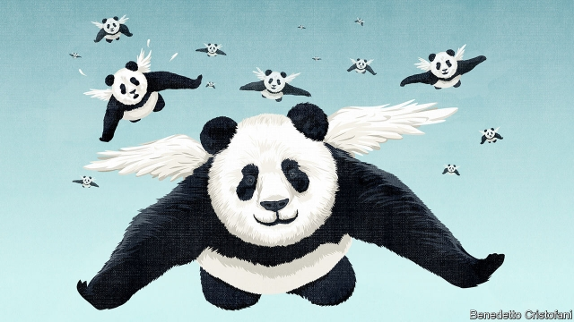

###### Pandas can fly

# The struggle to reform China’s economy 

##### How Xi Jinping could both calm the trade war and make China richer 

 

> Feb 21st 2019 

FOR THE past two weeks Chinese and American negotiators have been locked in talks in Beijing and Washington to end their trade conflict before the deadline of March 1st, when America will ratchet up tariffs on Chinese goods or, perhaps, let the talks stretch into extra time. Don’t be distracted by mind-numbing details on soyabean imports and car joint-ventures. At stake is one of the 21st century’s most consequential issues: the trajectory of China’s $14trn economy. 

Although President Donald Trump started the trade war, pretty much all sides in America agree that China’s steroidal state capitalism makes it a bad actor in the global trading system and poses a threat to security. Many countries in Europe and Asia agree. At the heart of these complaints is the role of China’s government, which funnels cheap capital towards state firms, bullies private companies and breaches the rights of foreign ones. As a result, China grossly distorts markets at home and abroad. 

The backlash is happening just as China’s model of debt, heavy investment and state direction is yielding diminishing returns. Growth this quarter may fall to 6%, the worst in nearly three decades. Many suspect that the true figure is lower still. By opening the economy and curbing the state, Xi Jinping, China’s autocratic leader, could boost performance within China’s borders and win a less hostile reception beyond them. He is loth to limit the power of the government and the party, or to accept American demands. But China’s path leads to long-term instability. 

Its leaders are entitled to feel smug. The party has presided over one of history’s great successes. Since 1980 the economy has grown at a 10% compound annual rate as nearly 800m people have lifted themselves out of poverty. A country that struggled to feed itself is now the world’s biggest manufacturer. Its trains and digital-payments systems are superior to those of Uncle Sam, and its elite universities are catching up in the sciences. Although inequality and pollution have soared, so have living standards. 

Yet as our essay this week explains, since Mr Xi took power in 2013, China has in some ways gone backwards. Two decades ago it was possible, even sensible, to imagine that China would gradually free markets and entrepreneurs to play a bigger role. Instead, since 2013 the state has tightened its grip. Government-owned firms’ share of new bank loans has risen from 30% to 70%. The exuberant private sector has been stifled; its share of output has stagnated, and firms must establish party cells which then may have a say over vital hiring and investment decisions. 

Regulators meddle in the stockmarket, critical analysis is suppressed and, since a botched currency devaluation in 2015, capital flows are tightly policed. Mr Xi has ignored Deng Xiaoping’s advice to “hide your capabilities and bide your time”, launching the “Made in China 2025” plan, an attempt to use state direction to dominate high-tech industries. This has alarmed the rest of the world, though it has yet to produce results. 

Make no mistake, Mr Xi’s approach can continue for some time. Whenever the economy slows, stimulus is injected. In January banks extended $477bn of loans, a new record. But structural shifts are working against China. The working-age population is shrinking. Investment is a swollen 44% of GDP. As resources are sucked up by wasteful projects and inefficient state firms, productivity growth has slowed. Now that debt has surged, interest payments will amount to nearly three-quarters of new loans. 

The backlash abroad risks becoming yet another drag. As barriers to trade rise, China cannot rely on the rest of the world for growth. Its share of world exports will struggle to rise above today’s 13%. Its biggest and most sophisticated firms, such as Huawei, are viewed with suspicion in Western markets (see article). Mr Xi promised a “great rejuvenation” but what beckons is lower growth, more debt and technological isolation. 

China’s leaders have underestimated the frustrations behind the trade war. They have assumed that America could be placated with gimmicks to cut the trade deficit, and that the row will end when Mr Trump leaves the Oval Office. In fact American negotiators, with the support of Congress and the business establishment, have demanded deep changes to China’s economy. Western opposition to China’s model will outlast Mr Trump. 

To deal with hostility abroad and weakness at home, Mr Xi should start by limiting the state’s role in allocating capital. Banks and financial markets must operate freely. Failing state firms should go bust. Savers must be permitted to invest abroad, so that asset prices reflect reality, not financial repression. If money flows to where it is productive, the charge that the economy is unfairly rigged will be harder to sustain and the build-up of bad debts will slow. 

Mr Xi also needs to temper China’s industrial policy. It is too much to imagine that it will privatise its 150,000 state firms. But it should copy Singapore, where a body called Temasek holds shares in state firms, giving them autonomy while requiring that they operate as efficiently as the private sector. Spending on industrial policy should shift away from grandiose schemes such as Made in China 2025 towards funding basic research. 

Lastly, China must protect the rights of foreign firms. Within China that means giving foreigners full control of subsidiaries, including over their technological secrets. Beyond its borders it means respecting intellectual property, which will be in China’s interest as its firms grow more sophisticated. 

Given China’s poor record, America will need room to respond through tariffs or arbitration if China does not meet its commitments. But America should also reward good behaviour. If Chinese firms can use greater transparency to persuade it that they are operating on commercial principles, they should be treated like businesses from any other country. 

Today, these reforms seem a distant prospect. But they were accepted wisdom among China’s technocrats a decade ago. They are also popular at home. Corporate bosses and senior officials say that they want American pressure to get through to Mr Xi in a way they cannot. Under him, China is becoming trapped in a bad cycle of sluggish growth, debt, state control and hostility abroad. A more economically liberal China would end up richer and make fewer enemies. It is time for Mr Xi to change course. 

  

