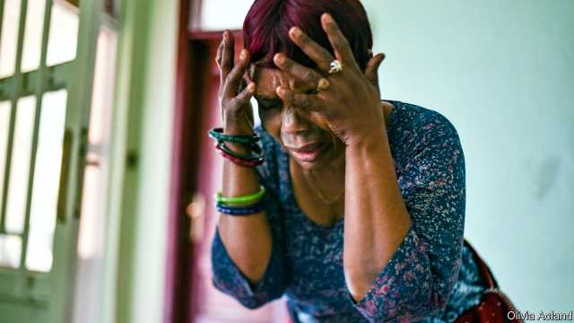

###### No woman, no cry

# An entrepreneur brings professional grieving to eastern Congo 

##### There is money to be made in the mourning business 

 

> Feb 21st 2019 

DEBORAH NZIGIRE, a 65-year-old Congolese woman, is nervous when she sits down for her job interview. Her hands are clasped tightly together, her words are slow and deliberate; she is blinking too much. “What inspired you to pursue this career?” asks one of the two people on the interview panel. Her answer is garbled, she mentions money. When asked to give a demonstration, she giggles awkwardly and leaves the room. She comes back in crying. 

“Bettina,” she howls and throws herself to the ground. “Bettina, Bettina, why did you leave us?” She thumps the floor with a flattened palm, her body convulses with sobs as she moans and wails. The interviewer’s eyes fill with tears. Mrs Nzigire (pictured) has got the job. 

She is the first recruit in Gilbert Kubali’s new enterprise to bring professional mourning to the east of the Democratic Republic of Congo. In the distant capital, Kinshasa, the mourning business is well-established and lucrative—you need not look far to find pleureuses (“criers”) to hire for a funeral. But in Goma, a city of 1m people in the east, it has not yet taken off and Mr Kubali has spied an opportunity. “I hope to monopolise the market,” he says. 

Ostentatious grief is tied up with a traditional belief that the dead linger long after their pulses have stopped. “We believe that the dead person is not dead, they are watching us like a film,” explains Mrs Nzigire. “If you do not cry they will be angry.” Angry ancestors are known to come back and disrupt the lives of their progeny. Further, it is shameful for a family member not to cry at a loved one’s funeral—and highly imprudent. Their insouciance may be interpreted as a sign that they were responsible for the death through witchcraft. One of the functions of the trained mourners is to elicit tears in others, too. 

But the pleureuses are expensive. To hire ten women for a week of mourning costs some $1,500. On top of this the women expect food, drink and transport costs. This may be why the industry has not yet flourished in the east. There are more wealthy people in the capital. 

Mr Kubali reckons, though, that if the women are good enough and if he advertises well, he will find customers. He plans to fly a professional out from Kinshasa to train his ten ladies. 

As for the women, crying on demand is simple, says Mrs Nzigire. In a part of Congo that has been ravaged by raping militias, there is much pain. Financial worries haunt the population, 77% of whom have less than $2 a day. “In every moment there is some kind of problem… your mind is always turning, asking where can I find money?” she explains. “That makes you sad and you cry. We are always ready to cry.” 

