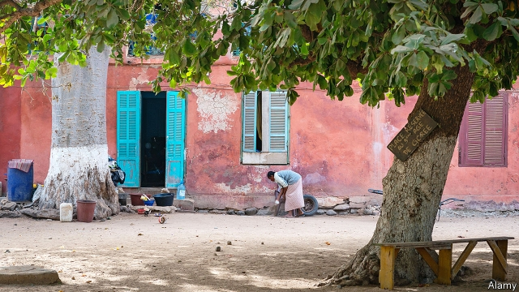

###### The new alms-giving

# How Africa is creating welfare states 

##### Africa is stitching together social safety-nets even though it is still poor 

 

> Feb 21st 2019 

UNDERNEATH THE mango tree that marks the centre of Kondo, a village in northern Tanzania, Mwanaidi Saidi prises open a green box. Inside are the 110,000 Tanzanian shillings ($47) the 35-year-old has saved since she joined the country’s nascent welfare scheme. “The money helps me solve small problems,” she says. It has helped her buy school uniforms for her four children, medicine for her ill mother and ingredients to make the samosas she sells by the side of the road. 

Tanzania’s main welfare scheme, known as the Productive Social Safety Net (PSSN), has expanded quickly since it was created in 2013. Today Ms Saidi’s is one of 1.1m households, or about 10% of the total, that are enrolled. Recipients receive some money simply for being poor. They can earn extra cash from toiling on public-works projects or for making sure their children attend school and health clinics. On average, recipients are paid the equivalent of $13 per month. 

Richer African countries such as Botswana and South Africa have operated welfare schemes for many years. Poorer ones are now rushing to do the same. Kenya has created several, including one that sends money to households in drought-stricken areas. Ethiopia’s main welfare programme, which requires recipients to work, used to operate only in the countryside but is spreading to cities. From 2010 to 2015 the countries of sub-Saharan Africa launched an average of 14 schemes per year, up from seven per year between 2001 and 2009. These countries spend an average of 1.2% of GDP per year on social safety-nets, using a broad definition that includes pensions as well as support for children and the poor. That is only a little less than the average for developing countries (1.6%). 

It is an extraordinary development. Many of the African countries building welfare systems today are far poorer than countries in Europe, Latin America and Asia were when they did the same. In sub-Saharan Africa as a whole, 41% of people subsist on less than $1.90 a day. Welfare alone cannot bring that proportion down to zero. But it helps. It also changes poor Africans’ expectations of their governments. 

One reason so many African countries are building social safety-nets is that they have become wealthier and more politically stable. Another is that they have lots of examples to copy. African countries have learned not just from each other but also from countries such as Brazil and Mexico. Attitudes are changing, too. Political leaders have often been flinty-hearted. Armando Guebuza, then the president of Mozambique, claimed in 2007 that “the lack of a habit of hard work” was perpetuating poverty in his country. But in Tanzania, argues Ladislaus Mwamanga, the director of the Tanzania Social Action Fund, the agency administering PSSN, poverty is no longer seen as a character flaw. 

Donors increasingly see handing out cash as an efficient form of aid. Academics have shown that very poor people are not feckless; when you give them money, they spend it wisely. Fully 90% of the cost of Tanzania’s programme is funded by donors such as the World Bank and the British and Swedish governments. Mr Mwamanga says that, since PSSN amounts to just 0.4% of GDP per year, “in theory” Tanzania could take on more of the burden. 

Senegal also started distributing money to poor households in 2013. As in Tanzania, the programme has grown quickly, and now covers about 20% of the population. But the political context is quite different. Although many of the bureaucratic costs associated with Senegal’s cash-welfare programme are paid by aid agencies, almost all the money distributed to paupers comes from the government. As a result, it has become a political football. 

Pape Malick Gningue, the director of Senegal’s main welfare scheme, calls it the “baby” of Macky Sall, the current president. Mr Sall promised to create the scheme in 2012 while running for the top job. Once in office, he insisted that it was rolled out quickly to every town and village in the country. Mistakes were inevitably made in the rush. But Mr Sall, who faces a re-election battle on February 24th, can point to it as something he has done for poor people. A meeting with welfare recipients in Darou Thioub, near Dakar, is briefly hijacked by a woman who loudly declares that the others should credit Mr Sall for the money they receive. She turns out to be a local politician for the president’s party. 

African welfare is hardly generous. In Senegal, households receive $43 every three months (though Tanzania’s even smaller average payment of $13 a month is the equivalent of 21% of household disposable income). Families are large in both countries, so the money is spread thinly. The women in Darou Thioub say that they “eat” the cash within a few days. Most spend it on school fees or on tiny makeshift businesses, such as buying packets of soap powder which they divide and sell on. 

But at least much of the money does actually go to poor people. In Senegal, an analysis in 2016 found that 93% of cash welfare recipients were living below the poverty line. That makes social safety-nets very different from things like fuel and fertiliser subsidies, which tend to go to middle-class people. Cash welfare may also reach the poor better than new schools and hospitals do. Aline Coudouel at the World Bank says that the poorest people often cannot reach such institutions, or are turned away when they do. 

Welfare can be targeted too accurately at the poor. Lant Pritchett, a development economist at Harvard University, argues that there is a trade-off between precision and political consensus. A welfare programme that helps only the poorest people is likely to remain small and stingy because middle-class voters see no reason to expand it. Some schemes are abolished or run down when donor money dries up. 

African countries may have found a way around this problem, however. In Tanzania the decision over who receives the money from PSSN is devolved to villages, where at public meetings residents discuss the merits of neighbours’ cases. Auditors from the central government then check that the chosen lot are genuinely poor. Roping in local people as advisers and overseers of the scheme not only cuts costs; it also gives them a stake in it. 

Mark Sefu, a 60-year-old man who lives in the same village as Mwanaidi Saidi, has some complaints about how the poor were chosen. “Fair? It wasn’t fair at all!” he exclaims. He says he was penalised for having a house that was not ramshackle (one of the criteria used to evaluate recipients), even though it took him 15 years to build. And yet Mr Sefu concedes that the selection process “belongs to all of us”. 

Senegal’s government also relies on local people to pick the neediest families. There, the result sometimes looks like patronage or even nepotism. In Thiaroye sur Mer, east of Dakar, one village has an eight-member “targeting committee”. A woman on the committee, Oury Diagne, says that she is particularly keen to help a man who has been injured. The man and his wife live with many children in a clapped-out home that ought to be pulled down, she explains. Asked how she knows so much about the man, Ms Diagne explains that he is her half-brother. 

Compared with the older, more bureaucratic social-safety nets in Europe, Asia and the Americas, the new ones in Africa can seem rather ropy and ad hoc. But they are gradually becoming less so. With help from the World Bank, Senegal is creating an impressive national social register containing many details about the country’s poorest people. Its main welfare scheme is already beginning to feel permanent, because it has created a constituency in favour of its perpetuation. Ousmane Basse, Senegal’s director of welfare strategy, says that the programme would be hard, if not impossible, to abolish. 

The spectacle of an African government doing something specifically to help the poorest people in a country is novel. Governments have mostly tried to reduce poverty by promoting economic growth, which tends to mean courting businesses and building infrastructure. Growth is essential. But the best way to tackle deep poverty is to start at the bottom, with poor people themselves. 

