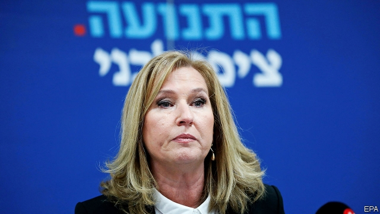

###### Labour pain

# The decline of the Israeli left 

##### As the Palestinian issue has faded, so have Israel’s left-wing parties 

 

> Feb 21st 2019 

“PEACE HAS become a dirty word.” That was the main reason given by Tzipi Livni (pictured) for quitting politics on February 18th. Over the course of two decades in the Knesset, Ms Livni, once a protégé of Binyamin Netanyahu, Israel’s nationalist prime minister, came to support the establishment of a Palestinian state. But too many voters moved in the opposite direction. Her party, Hatnuah, was unlikely to win any seats in April’s election, in which it will no longer take part. 

The Palestinian issue was once the dividing line between left and right in Israeli politics. But as hope for a solution has waned, so too have the fortunes of left-wing parties. Most prominent among them is Labour, which sought peace with the Palestinians under leaders such as Yitzhak Rabin, Shimon Peres and Ehud Barak (all former prime ministers). In April it will be lucky to win a dozen seats (out of 120). To its left is Meretz, which may not win enough votes to be represented in the Knesset. 

Roughly half of Israelis support a two-state solution, but three-quarters of them do not believe an agreement can be reached soon. The latest peace talks broke down in 2014. A decade of prosperity and relative stability under Mr Netanyahu has left Israelis comfortable with the status quo. When asked about their priorities, they usually place the Palestinian issue fourth, after security, the economy and education, says Dahlia Scheindlin, a pollster. 

Labour’s manifesto reflects this. It focuses on bettering the lives of the middle class. The party’s leader, Avi Gabbay, refuses to disclose details of his peace plan and sees no reason to remove Israeli settlements in the West Bank. Without the Palestinian issue, though, little marks Labour out from most other parties. It long ago lost its socialist ideology. Mr Gabbay is a former telecoms executive who served as environment minister under Mr Netanyahu. Some call Labour’s leadership “Likud light”. 

Not Mr Netanyahu, though. The prime minister has spent years trying to brand the left as a threat to Israel’s existence. One campaign advertisement released before the election in 2015 suggested that a Labour government would open the door to the jihadists of Islamic State. Older Israelis remember Labour as the party that built the country; younger ones lack such reverence. The centre-left has become factious. Labour ended its alliance with Hatnuah last month. At least three parties will compete in April for a centre-left electorate that has not increased in size for a generation. After each loss at the polls, Labour boots out its leader. Mr Gabbay is the ninth party head since 2000. Likud has had just two. 

Labour has failed to take many votes from Likud and is threatened by the emergence of new centrist parties and alliances. Benny Gantz, a former army chief, has launched a party that has taken much of Labour’s support. More threatening, still, is a last-minute merger between Mr Gantz’s party and Yesh Atid, headed by former chat-show host Yair Lapid. 

Labour got a boost from a primary on February 11th that elected a diverse slate of candidates. Mizrahim (Jews of Arab descent) and women took many of the top spots. Even so, Labour will probably not win enough seats to lead the opposition, let alone form a government. After a decade of right-wing rule, perhaps just staying alive is an accomplishment. 

