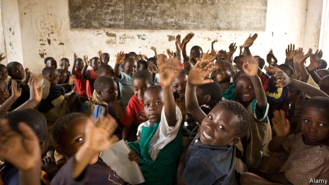
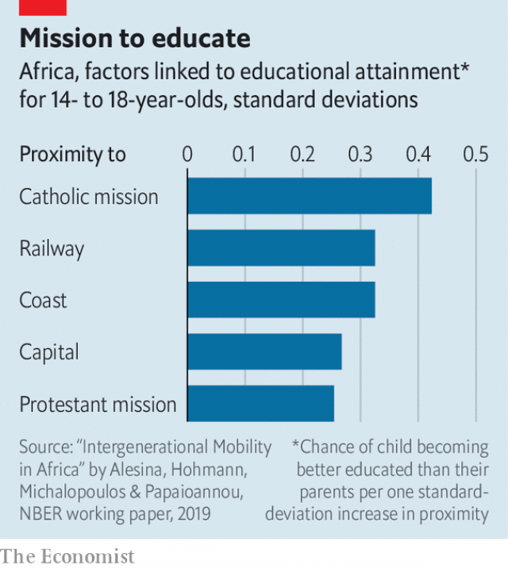

###### Education and mobility

# The geography of education in Africa 

##### Why mission schools still matter 

 

> Feb 21st 2019 

EDUCATION IN sub-Saharan Africa has come a long way. About 70% of children can expect to finish primary school, up from 45% in 1971. Progress though, has not been evenly spread. A new paper sheds light on why. The strongest predictor of whether children will finish primary school is their parents’ level of education. But geography also plays a role. Children who grow up near big cities are more likely to climb the educational ladder. Living near certain colonial-era institutions, such as railways or mission stations, also improves children’s chances of becoming better educated than their parents. Living near diamond mines or oil wells does not. 

 

