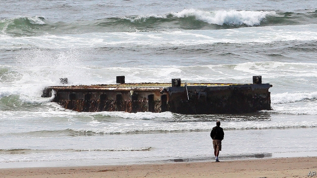

###### The hitch-hiker’s guide to the Pacific

# A long-term natural experiment hints at how species disperse 

##### The aftermath of a tsunami spreads species across an ocean 

 

> Feb 21st 2019 

THAT SPECIES might spread overseas by hitching lifts on floating vegetation is an idea going back to Charles Darwin. It is a plausible thought, but hard to test. A test of sorts has, however, been made possible by the tsunami that struck the Pacific coast of Japan in 2011, in the wake of a submarine earthquake. 

The incursion and regression of this tsunami dragged with it millions of pieces of debris, many of them buoyant. After a year or so some of the debris started arriving on the coast of North America—and it is arriving still. James Carlton, of Williams College, Connecticut, and his colleagues have been studying the living creatures on board pieces of it, and Dr Carlton gave a round-up of what they have so far found to an audience at the AAAS meeting in Washington. 

Disappointingly for lovers of Darwin’s vision of land animals moving from place to place on natural rafts, an intensive examination of 634 objects, ranging from a plastic bottle to a floating dock 20 metres long that had been ripped free of its moorings (see picture) failed to reveal any terrestrial species. A lot of marine ones turned up, though, providing work for an army of 80 taxonomists wielding the latest genetic bar-coding equipment. 

The current species count is 379—mostly animals but also some seaweeds—of which two-thirds are alien to North American waters. The majority of the animals are invertebrates such as molluscs, polychaetes and bryozoa. But not all. A few fish made it across the Pacific, too. Indeed, some of the fishing boats that had been swept away by the wave supported veritable ecosystems. 

One, for example, had what Dr Carlton described as a “tide pool” in its stern. This contained a population of barred knifejaws, a species of black-and-white-striped reef fish. Another was home to 20 yellowtail amberjacks. 

The knifejaws, in particular, are interesting because they are local to the northwest Pacific. Since the arrival of the tsunami debris, however, a group of them has been found in Monterey Bay, California—an area which is intensively studied because of a nearby marine-biology laboratory. Whether this new knifejaw population will prosper remains to be seen. But even if it has only a transient existence its establishment suggests that, even if land animals have difficulty making the crossing, for marine creatures Darwin was correct. 

