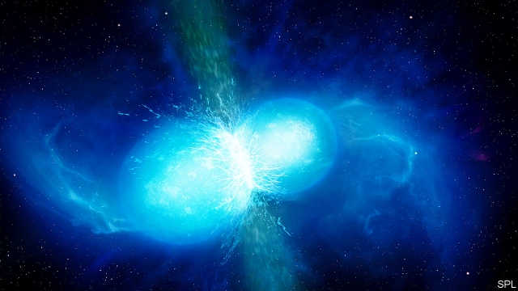

###### How heavy elements were made

# A lot of the periodic table is a result of neutron stars colliding 

##### Such collisions are the ultimate nuclear reactor 

 

> Feb 21st 2019 

LIVING THINGS are star stuff. Other than hydrogen, which comes from the Big Bang, which marked the birth of the universe, the familiar elements of which flesh is composed—carbon, oxygen, nitrogen and so on—were created by the energy-releasing process of nuclear fusion that powers stars. But fusion has its limits. The balance of forces inside an atomic nucleus means that creating an element heavier than iron (number 26 on the periodic table) consumes energy, rather than releasing it. Further up the table, beyond lead (number 82), nuclei tend to fall apart spontaneously. In other words, they become radioactive. 

To synthesise elements heavier than iron—and particularly those heavier than lead—therefore requires a lot of work. Some of this work happens in stellar explosions called supernovae. Calculations suggest, however, that even supernovae would be hard put to explain the abundance of the heaviest elements, including metals such as gold and platinum as well as radioactive ones like uranium. One hypothesis is that these elements are the products of collisions between ultradense objects called neutron stars. And, as Brian Metzger of Columbia University told the AAAS, that hypothesis has now been confirmed by data. 

The neutron-star hypothesis of nucleosynthesis also depends on supernovae, but at one remove. Neutron stars are the collapsed leftovers of particular types of supernova involving stars with eight or more times the mass of the sun. During the course of such events the exploding star’s core collapses, creating pressures so great that most of the electrons and protons of the atoms within are forced to merge, to create neutrons. The resulting object is therefore small (with a radius of around 10km) and has the same sort of density as an atomic nucleus. A sugar-cube-sized piece of it, in other words, would weigh as much as a mountain. 

A single neutron star cannot create new elements. But two neutron stars orbiting each other might. The pair will gradually lose energy, in the form of low-power gravitational waves, and will come closer and closer together as a result. Eventually, they will collide, creating an explosion called a kilonova that is accompanied by an enormous gravitational wave. This explosion throws neutrons in all directions. 

On Earth one established way of making heavy elements from light ones is by neutron bombardment. In this process existing nuclei absorb neutrons, becoming heavier but also unstable. In the reverse of what happens when a neutron star is created, neutrons within the bombarded nuclei then spit out electrons and turn into protons. The upshot is a more massive nucleus, and one with more protons in it. More protons means a higher atomic number. The nucleus in question has thus been transformed into a heavier element. 

In effect, this is a small-scale version of what happens after a neutron-star collision. The liberated neutrons bombard any matter in the surrounding space, giving each of the atoms in that matter a large number of serial upgrades of their atomic numbers. The only problem with this theory was that until recently no one had seen a kilonova, and so it was not known for sure that they existed. As Dr Metzger described, that changed on August 17th 2017 when LIGO, a gravitational-wave detector in North America, made its first observation of a neutron-star collision. It took place a long time ago in a distant galaxy in a constellation called Hydra, but gravitational waves travel at the speed of light, which is finite, so there was a considerable delay in the arrival of the signal on Earth. 

In the wake of the gravitational wave, optical telescopes looked to its source. That let astronomers collect spectra from the explosion and thus determine which elements were created. Kilonova GW170917, as the event was called, ejected material equivalent to 5% of the sun’s mass. Among much else, this ejection produced gold (around ten Earth masses’ worth) and platinum (50 Earth masses’ worth). 

Kilonovae are rare events, happening perhaps once every 10,000-100,000 years per galaxy. They would have been commoner in the past, when the short-lived, high-mass stars that create neutron stars were more abundant. Even so, elements with atomic numbers above 26, whether generated by supernovae or neutron stars, make up only 0.1% of the mass of atoms in the universe. 

Future observations using LIGO (which is being upgraded) and forthcoming detectors in Japan and India will permit more refined analysis. It now, though, seems clear that, while human bodies are composed largely of star stuff, part of the jewellery they wear started life in a kilonova. And the scarcity of those precious metals, which makes them so desirable, is a direct consequence of the rarity of kilonovae. 

