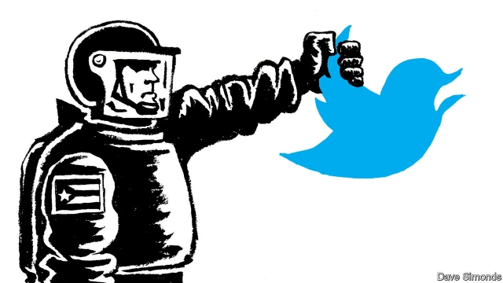

###### Twitter, but not better

# Cuba’s leaders adopt social media, not democracy 

##### The regime is tweeting. That does not mean it is more tolerant of dissent 

 

> Feb 21st 2019 

THE DAY BEFORE Miguel Díaz-Canel became president of Cuba last April, a newscaster on state-controlled television urged Cubans to join in a tuitazo (outpouring of tweets). The hashtags he proposed were PorCuba (“ForCuba”) and SomosContinuidad (“WeAreContinuity”). Mr Díaz-Canel himself joined Twitter in August. For the first few weeks he followed only Nicolás Maduro, Venezuela’s embattled despot, and Evo Morales, Bolivia’s leftist president. In December, in an attempt to make Cuba’s dictatorship appear more accountable to its people, he instructed government departments to make themselves more visible on social media. Now 24 of the 26 ministries tweet, as do most of the ministers who lead them. 

Increasingly, Cuba’s 11m citizens can tweet back. In December 3G mobile networks became available to anyone on the communist island for the first time. Previously, Cubans’ main access to the internet was through public Wi-Fi hotspots, for which they pay by the hour. Just 37,000 homes have internet connections. Access to 3G, which is paid for by the megabyte, encourages Cubans to migrate from data-hungry services like Facebook and Instagram to less-voracious Twitter. By the end of January the country’s 5.3m mobile-phone owners had bought nearly 1.4m 3G packages. 

Two-way tweeting seems to narrow the distance between rulers and ruled. After a tornado struck Havana in January, Betsey Díaz Velázquez, the minister of internal trade, tweeted a list of discounted food available to people in the affected area. When people scolded the government by tweet for failing to provide for those who had lost their homes, she offered them free food. “A year ago I couldn’t name a single Cuban minister,” said Camilo Condis, an entrepreneur, last December. “Now I know all their handles, recognise their faces, and I’ve even had a chance to interact with some of them.” 

Lately, though, the conversation has turned angry. The ill-will arises from the government’s attempt to enact a new constitution through a referendum to be held on February 24th. It would make modest changes to the existing constitution, such as legalising private property (subject to regulation by the state) and limiting the president to two five-year terms. Tempers flared after the national assembly announced in December (by tweet) that a provision allowing for same-sex marriage would be dropped. In its place is a fudge that would recognise marriage as a “social and legal institution”, to be defined later. 

Cubans who favour gay rights vented using the hashtag YoVotoNo (IVoteNo). Its use has widened to include other gripes about the new charter, such as its failure to allow Cubans to elect their leaders directly. Few expect the referendum to be a fair vote. The hashtag has become so popular that the government felt obliged to counter with YoVotoSi (“IVoteYes”).   

This has been plastered on buses, state-run grocery stores and ice-cream parlours. At the annual parade on January 28th in honour of José Martí, a hero of independence, the government distributed T-shirts—a luxury in Cuba—emblazoned with the pro-constitution hashtag. People who disagree too actively with the sentiment have been detained and roughed up by police. Cuba’s rulers have learned how to tweet, but they have not forgotten how to shut people up. 

