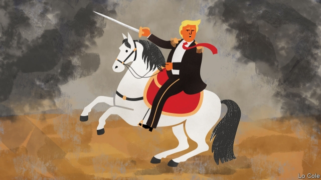

###### Bello

# Donald Trump, the implausible would-be liberator of Venezuela 

##### Will the United States invade? 

 

> Feb 21st 2019 

FOR THE PAST month most of the democratic world has united in an effort to remove Nicolás Maduro, Venezuela’s dictator, through popular, diplomatic and economic pressure. Some 50 countries have recognised Juan Guaidó, the speaker of the national assembly, as the country’s interim president with the aim of forcing a democratic election. On this issue, Donald Trump, who has led the offensive, has enjoyed both international support and bipartisan backing at home. 

The American president seemed to care little for nurturing that consensus on February 18th, when he gave a speech in Miami about Venezuela that grazed the line separating foreign policy from domestic politics. He let off a fusillade against “socialism and communism”. The speech seemed directed at shoring up his support in Florida, a swing state with lots of voters who have Cuban and Venezuelan roots. By conflating “socialism” with totalitarian communism, Mr Trump was taking a swipe at Democrats who have recently adopted that word. But he was also ignoring the fact that the opposition to Mr Maduro in Venezuela and in Latin America includes moderate socialists. 

For some, Mr Trump’s muscular embrace of the cause of democracy in Venezuela seems odd. In other places he has been happy to embrace dictators and ignore the erosion of human rights. Nevertheless, Latin American leaders who have met the president since 2017 say that he has always raised the issue of Venezuela. That may be because of the Florida connection. 

Administration officials say that Venezuela is different because it is “in our hemisphere”. It has a direct impact on the United States: mass emigration and Venezuela’s tolerance of drug trafficking and Colombian guerrillas in its territory destabilise the region. But there is an echo, too, of the Monroe Doctrine. Formulated by President James Monroe in 1823, this was an expression of solidarity with the fledgling Latin American republics against European absolute monarchies. But it became the cloak for interventions, especially against elected left-wing governments during the cold war. It is because of that history that when Mr Trump repeats that “all options are open” in Venezuela, many Latin Americans part company with him. But not all: some Venezuelans in exile have long wanted the United States to use force to remove Mr Maduro and his Cuban backers, pointing to the suffering they are inflicting. 

Mr Trump does not like foreign wars; his threats are intended to persuade the army commanders in Caracas to switch sides. Perhaps they will, but there is little sign of it. The immediate focus of the administration and Mr Guaidó is February 23rd, when they plan to deliver food and medicines, which Mr Maduro has promised to block. The longer he survives, the more pressure Mr Trump will face to turn threats into action. What might be the implications of a military intervention? 

A quick victory would, perhaps, have few detractors. Some point to the relatively low cost of the invasion of Panama in 1989. This toppled General Manuel Noriega in six weeks: 23 Americans were killed, along with some 300 Panamanian soldiers and the same number of civilians. But Panama is a pocket state. It had American bases and no proper army. Venezuela is a very different proposition. 

Optimists claim that its army would not put up a fight. It is corrupt, top heavy, has no modern combat experience and its kit is poorly maintained. “They underestimate us,” said General Vladimir Padrino, Mr Maduro’s defence minister, in response to Mr Trump’s speech. “We are called upon to carry out our historic task: defending the fatherland.” Outsiders tend to play down the ideological commitment of some in the armed forces. Military units have political commissars, many of them Cubans. Even if most of the air force’s 23 Sukhoi jets are grounded, it only needs one to be operational to, say, bomb Bogotá, if Colombia becomes the launchpad for a military intervention. There are many guns in the hands of pro-regime militias. Venezuela has a tradition of guerrilla warfare. 

An American invasion would thus be highly risky. It would also be counter-productive, because it would deprive a new government of legitimacy and revive anti-imperialism across Latin America when the main issue is the defence of democracy. Yes, Cuba is intervening in Venezuela, and there is scant evidence that Mr Maduro will go peacefully. Even so, maintaining the broadest possible political front against him remains the best option. 

