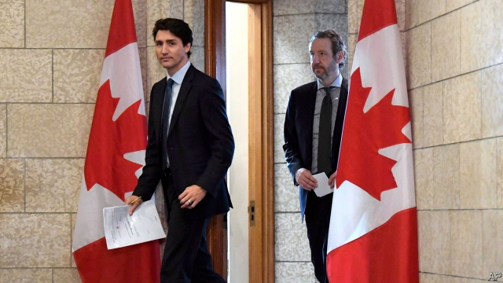

###### Butts out

# Resignations rattle Justin Trudeau 

##### The departure of Gerald Butts, the Canadian prime minister’s closest aide, has not calmed a scandal 

 

> Feb 21st 2019 

WHEN JUSTIN TRUDEAU, Canada’s prime minister, demoted Jody Wilson-Raybould, the justice minister and attorney-general, in a cabinet shuffle on January 14th he gave no explanation. On February 7th the Globe and Mail, a newspaper, provided one. It quoted anonymous sources as saying that Ms Wilson-Raybould was being punished for resisting pressure from someone in the prime minister’s office to drop the prosecution for fraud of SNC-Lavalin, a construction and engineering firm. The company, which is accused of paying bribes in Libya during the rule of Muammar Qaddafi, would have been let off with a fine, the report alleged. 

Mr Trudeau denied that he gave such instructions to Ms Wilson-Raybould. Her presence in cabinet, as minister of veterans’ affairs, was proof there was nothing to the story, he said on February 11th. She resigned the next day. Now Gerald Butts, the prime minister’s principal secretary, has followed her. He quit on February 18th, saying that neither he nor Mr Trudeau’s staff had put pressure on the justice minister. 

This is a grievous loss to Mr Trudeau. Mr Butts was a close friend, who helped him lift the Liberals from third-party status to win the election in 2015. Both men no doubt hope that Mr Butts’s departure will calm the controversy before the next election due in October. The Liberals trail behind the Conservatives in the polls. 

That seems a vain hope. Mr Butts’s resignation “does not in any way settle this matter”, said Andrew Scheer, the Conservatives’ leader. The scandal has brought Mr Trudeau’s foes together. Conservatives and the New Democrats, a left-leaning opposition party, had already secured investigations by the parliamentary ethics commissioner and the House of Commons justice committee. Now they are demanding a separate independent inquiry into the government’s handling of the SNC-Lavalin case. 

This was never going to be an easy year for Mr Trudeau. Canada’s relations with the United States are tense. Ontario, the most populous province, has taken the federal government to court over its plan to impose a national price for carbon emissions. Energy-rich Alberta accuses Mr Trudeau of moving too slowly to build an oil pipeline. On February 19th a convoy of lorries from Alberta came to Ottawa to make that point. 

More damage may be on the way. Ms Wilson-Raybould has so far refused to comment on the SNC-Lavalin affair, but is expected to testify before the justice committee on February 25th. As attorney-general, she gave advice to the government that is subject to solicitor-client privilege. She has hired a former justice of the Supreme Court to advise her on what she can say. If she speaks about the substance of the accusations, and does not back up Mr Trudeau’s story, he will be in grave trouble. 

