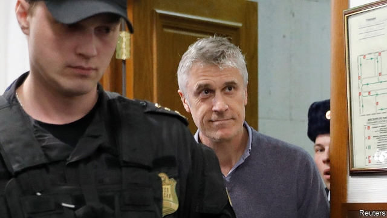

###### Economic reform

# Business this week 

 

> Feb 23rd 2019 

It is shaping up to be a bad year for Britain’s car industry. In the latest blow, Honda decided to close its plant in Swindon in 2021, putting 3,500 jobs at risk. It is the first time the Japanese carmaker has closed one of its factories (it is also stopping production of one of its models at a facility in Turkey). Honda said it was accelerating its commitment to electric cars, and stressed that Brexit was not a factor in its calculation to shut up shop. Many observers think otherwise. See article. 

Flybmi was less shy about blaming Brexit for its troubles. The British regional airline called in the administrators amid rising fuel and carbon prices, but was explicit about the uncertainty surrounding Brexit, which caused it difficulties securing valuable flying contracts in Europe. 

The European Union threatened to react in a “swift and adequate manner” if America imposes additional tariffs on European car imports. America’s Commerce Department recently submitted a document to Donald Trump that reportedly recommends levying duties on European cars on the ground that damage to America’s car industry is a threat to national security. The president has 90 days to decide whether to act. 

The decision by India’s central bank to increase the interim dividend it pays to the government raised more questions about its political independence. The payment will help the government meet its fiscal targets ahead of the forthcoming election. 

Anil Ambani, one of India’s most prominent businessmen, was found guilty of contempt of court by the country’s supreme court for not paying Ericsson, a Swedish network-equipment company, for work it carried out at Reliance Communications. Mr Ambani founded Reliance, which recently filed for bankruptcy. The court said Mr Ambani would be sent to prison if he didn’t pay, prompting Reliance to promise to comply. 

The nosedive in financial markets towards the end of last year led HSBC to report a lower annual profit than had been expected. The bank announced net income of $12.6bn. That was below analysts’ forecasts of $13.7bn, which John Flint, the chief executive, ascribed to being “very much a fourth-quarter problem”. 

International investors reacted with shock to the arrest of Michael Calvey in Moscow. Mr Calvey, an American, runs Baring Vostok, a big private-equity firm in Russia. He has been accused, along with other executives, of defrauding a bank that is owned by Baring Vostok and will remain in custody ahead of a trial in April. Mr Calvey denies the accusations, which he says are rooted in a dispute involving two shareholders. See article. 

A French court found  ubs guilty of helping people evade tax and fined it €3.7bn ($4.2bn). It also ordered the Swiss bank to pay €800m to the French state in damages. UBS is to appeal against the verdict, arguing that it was based on “unfounded allegations”. It said the court had failed to establish that any offence had been committed in France, and therefore it had applied French law to Switzerland, posing “significant questions of territoriality”. See article. 

Estonia’s financial-services regulator ordered Danske to close its sole Estonian branch, which is at the centre of a €200bn ($227bn) money-laundering scandal. Meanwhile Swedbank, which is based in Stockholm, saw its share price plunge after a TV programme aired accusations that it was involved in the scandal. 

New York’s mayor, Bill de Blasio, criticised Amazon’s decision to cancel its plan to build one of its two new headquarters in Queens. The online retailer pulled out in the face of growing opposition from newly emboldened left-wing Democrats, who questioned the subsidies it would receive. Mr de Blasio said Amazon had been offered a “fair deal”. 

Walmart reported solid growth in sales for the quarter covering the Christmas period. Online sales in America surged by 43% as the retailer ramped up its grocery delivery and pick-up services. Meanwhile, Britain’s competition regulator said it might block the planned merger of J. Sainsbury with Asda, a subsidiary of Walmart. The merger would create Britain’s biggest supermarket company. A furious J. Sainsbury criticised the Competition and Markets Authority, saying it had “moved the goalposts” in its analysis. 

Greggs, a cheap but cheerful purveyor of sandwiches and bakery food in Britain, reported an “exceptionally strong start” to 2019, which it attributed to the roll out of its vegan sausage roll. Derided by some (Piers Morgan pilloried Greggs for being “PC-ravaged clowns”) the company said the publicity had boosted sales of its other “iconic sausage rolls” and food. Some predict this will be the year of the vegan. 

