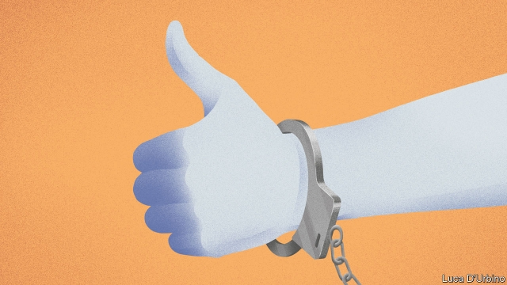

###### Social media

# America’s cops take an interest in social media 

##### Best to avoid terms like “police brutality” 

 

> Feb 21st 2019 

SHOULD THE police monitor social media? The question seems to have an obvious answer. Social media, says Joe Giacalone, a retired New York Police Department detective who now teaches at John Jay College, is “a treasure trove for investigators. People post stuff they shouldn’t…vehicles, weapons, you name it. If you’re dumb enough to post something on social media and you’re wanted for a crime, you deserve to get caught.” In this sense, social media is no different from any other public space. If criminals brag about or plot their exploits publicly online, police should be able to use that information without obtaining a warrant, just as if they overheard chatter in a bar or on a street corner. 

But there is a difference between an individual officer looking at posts from someone suspected or accused of a specific crime, and the sort of mass monitoring made possible by data-scraping and automated surveillance. There is also a difference between looking for evidence of criminal activity and monitoring politically unpopular, but still legally protected, speech. Records obtained by the American Civil Liberties Union of Northern California (ACLU-NC) revealed that in 2015 a police department in Fresno used a social-media monitoring firm that boasted it could “avoid the warrant process when identifying social-media accounts for particular individuals,” and could “identify threats to public safety” by monitoring terms including “policebrutality”, “wewantjustice”, “Dissent” and “Blacklivesmatter”. Other law-enforcement agencies in California used a similar service whose marketing materials referred to “unions [and] activist groups” as “overt threats”. 

Nor is such monitoring limited to state and local police forces. Immigration and Customs Enforcement hoovers up vast amounts of information, including from social-media posts. On January 17th the ACLU-NC sued seven federal agencies that failed to respond properly to Freedom of Information Act requests about their social-media surveillance. The only agency that responded at all was the FBI, which could “neither confirm nor deny the existence of records”. 

While some might applaud the FBI for tracking threats online, others recall its Cointelpro initiative, which lasted from 1956 to 1971 and involved surveillance and infiltration of groups the agency deemed subversive, including civil-rights organisations. In 2017 an FBI report warned of terror threats from a “Black Identity Extremist” movement; some fear that police agencies will once again subject activists to disproportionate and extra-legal scrutiny, and in so doing chill protected speech and rights of association. 

As in other debates over the surveillance of public spaces, targeting, scale and cost all matter. Few people would object to police tracking known or even suspected criminals online; more would agree with Matt Cagle, the ACLU-NC’s technology and civil-liberties lawyer, that “government should not be conducting suspicionless surveillance of First Amendment-protected activity.” Similarly, most people probably understand that their social-media posts are public (to varying extents, depending on how they use their privacy settings). They might be uncomfortable if they knew that the government could, without a warrant, collect and search everything they have ever posted. 

Although police can follow someone in public without a warrant, doing so means that an officer thinks it worth his time. Data-mining programs make it possible to track millions of people online with minimal effort. Technology, says Rachel Levinson-Waldman, senior counsel to the Brennan Centre’s Liberty and National Security Programme, “enables a much more significant level of surveillance at a much lower cost”. As people live more of their lives online, surveillance will inevitably follow. Americans must decide how much of it they are willing to tolerate. 

  

