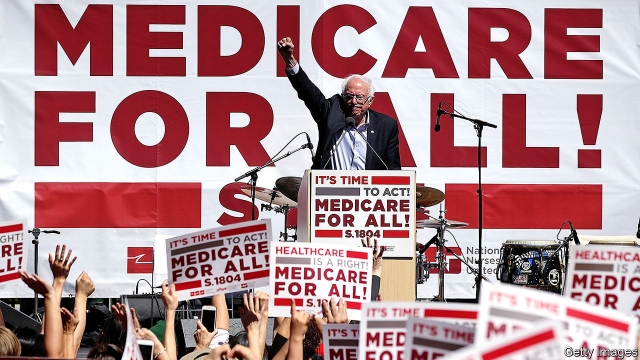

###### The 2020 electionThe Democrats

# Bernie Sanders jumps into a crowded pool 

##### His success in pulling Democrats to the left may be his undoing 

 

> Feb 21st 2019 

BERNIE SANDERS, the self-declared socialist senator from Vermont, had a good long run against Hillary Clinton in the 2016 Democratic presidential primary. His left-wing pitch has fared even better. Slogans that were lampooned then—Medicare for all, a $15 nationwide minimum wage, free tuition at public colleges—are now mainstream. Among Democratic presidential hopefuls, fealty to these mantras can even seem mandatory. 

In his announcement video, an 11-minute monologue, Mr Sanders sounded triumphant. “Three years ago during our 2016 campaign, when we brought forth our progressive agenda, we were told that our ideas were ‘radical’ and they were ‘extreme’,” Mr Sanders says. “Well, three years have come and gone.” He sees a successful run in 2020 as a coda to his revolution. The antagonists remain the same this time round—billionaires, especially President Donald Trump; multinational companies; bad trade deals. But Mr Sanders also seems keen to talk about sexism towards women and racism against blacks, two groups that did not warm to him in 2016. 

This time he enters a busy field with an agenda that is no longer outlandish. Elizabeth Warren, a Massachusetts senator, is another longtime idol of the left who brings other flashy ideas—such as a wealth tax and universal child-care—along with a stronger command of detail. Even Kamala Harris, the Californian senator who took pains to say that she is “not a democratic socialist”, has nonetheless endorsed Medicare for all, the Green New Deal and a $15 minimum wage. Mr Sanders may stand out, with his broadsides against banks and trade deals, but his ideological lane has become uncomfortably crowded. 

What that means for his chances of winning is unclear. If Democratic primary voters are looking for a contest over ideological purity, then Mr Sanders, as the Medicare-for-all hipster who supported the idea before it was cool, is favourably positioned. He is performing well in early polls. On the morning of his announcement, punters on PredictIt, a political-betting market, thought him a leading candidate, trailing only Ms Harris and Joe Biden (who has not yet announced his plans). They rated him twice as likely to be the candidate as Ms Warren. 

But if voters prize electability, Mr Sanders has less of a chance. Even if there is now little daylight between him and his primary rivals, the label of out-and-out socialist could hinder him. Mr Trump’s strategists see fear-mongering over socialism as a winning strategy. His re-election campaign quickly released a statement denouncing “an agenda of sky-high tax rates, government-run health care and coddling dictators like those in Venezuela”. 

If elected, Mr Sanders would be inaugurated at the spry age of 79. His Democratic rivals might be too courteous to bring that up. But Mr Trump, though just five years younger, surely would. In an interview with a local radio station, Mr Sanders was eager to tackle that criticism: “We have got to look at candidates not by the colour of their skin, not by their sexual orientation or by gender, and not by their age”. He also noted that he has “a great deal of energy”. 

