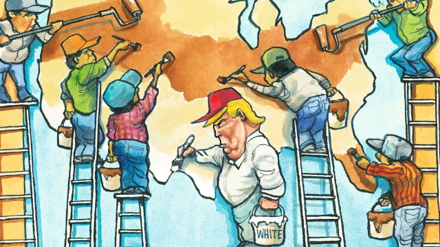

###### Lexington

# Donald Trump’s real target is not illegal immigration but diversity 

##### That battle is already lost 

 

> Feb 23rd 2019 

WHEN JUAN GARCIA started work as an urban planner for the government of Gaston County in 1997, he reckons he was the only Latino among its 1,400 employees. Hub of a dying textiles industry, on the western edge of Charlotte, the county was missing out on the boom already rippling through the periphery of North Carolina’s most dynamic city. For that reason Gastonia, its altogether less zippy capital, was not seeing many of the Mexican immigrants then pouring into the state, to labour on the building sites erupting in Charlotte and revive the poultry industry in Union County, east of the city. But this was about to change. 

Finding opportunities overlooked by others in Gastonia’s run-down factories and mills, migrants started settling in the town’s trailer parks and poor black neighbourhoods. Its Hispanic population soared, to around 6,000, or 9% of the total, within a few years. This caused friction with Gastonia’s white majority, recalls Mr Garcia, who was born in Colombia. “Mexicans like to get physically closer when they’re talking to you than Anglos do. They might slaughter a chicken in their yard. They play loud music there.” But the ill-will rarely went beyond grumbling about the migrants’ poor English. Some in Gastonia said this reflected the much deeper tensions in the South between whites and blacks. Resentment of immigrants was only a brief distraction from that main drama. In any event, the migrants, many of whom had either moved from Texas or come directly from the Rio Grande, expected no favours. “So long as you treat people the right way, you’re all right,” shrugged Elvira, who came to North Carolina to pick tobacco 25 years ago and now works at the “Las Americas” supermarket in Gastonia. 

The influx of Hispanics to the town, and hundreds of unfashionable cities like it, illustrates how much they have changed America over the past three decades. The Hispanic population has risen ninefold since the 1960s, to around 60m. Its members, many of them second- and third-generation immigrants, are dispersing across the country, driving growth and changing the social fabric wherever they go. While the white population is on the cusp of declining, most states have flourishing Hispanic communities. North Carolina, which had around 40,000 Hispanics in 1990, now has almost a million. The high growth rates it has meanwhile sustained owe a lot to this migrant infusion. 

To men like Julian, in other words, who had popped into Las Americas on a half-hour break between his jobs. From 5.45am to 3.30pm he works as a machinist in one of Gastonia’s surviving looms; between 4pm and 11pm he drives a fork-lift in a packaging factory. Thus have Gastonia’s Hispanics filled gaps in its old industries, taking low-skilled jobs that blacks and whites no longer want. Meanwhile the many small landscaping and construction businesses they launched have forged an overdue connection between Gastonia and the new services-based economy of the South, a 20-minute drive across the Catawba river in Charlotte. Recognising the community’s importance, as well as its needs, Gaston County now employs over 100 Hispanic public servants, with a premium on bilingual doctors, nurses and social workers. 

This transformation is the essential context in which to view Donald Trump’s talk of a crisis at the southern border. The president appears to be motivated less by genuine concern for the state of the border than by his white supporters’ feelings of anxiety over demographic change. His promise of a border-wall, which few immigration experts think America needs, following a steep decline in the number of illegal crossings, is a sign of that. In fact, were Mr Trump not so obviously using his promised border-wall as a political device, he might have built one by now. Last year he turned down an offer from the Democrats that would have given him wall money in return for comprehensive immigration reform—far more money than his emergency is likely to get him. In short, the physical promise of the wall is largely a figment. It is a symbol of Mr Trump’s tacit pledge to his white supporters to defend them against the diversifying of American society that many fear. It is too late for that, however. Most of the growth in America’s Hispanic population is the result of natural increase, not immigration. Mr Trump’s nativist stand is positively Canute-like. 

It also carries great costs. The most important is the forgone opportunity to cauterise America’s immigration sore that his presidency represents. The anxiety of Mr Trump’s followers is exacerbated—explained, even—by the chaotic legacy of decades of illegal immigration. It stands to reason that America’s roughly 11m illegal migrants, most of whom are Hispanic, are willing to work harder, in tougher conditions, than indigenous people. Economists may argue over the effect of that on wages; but it is a theoretical disadvantage to natives that they are bound to resent. 

Meanwhile the insecurity illegal migrants live with is a barrier to assimilation, which also causes tension. It was fairly amazing that most of the shoppers in Las Americas, despite having spent years in America, spoke little or no English. The answer to these tangled problems has long been clear. America needs to regularise the status of millions of illegal immigrants, while further improving border security to win consent for that change. Given Mr Trump’s hold on the nativist right, he could have done this. Yet that would have required him to want to fix the mess, and not seek to profit from it. 

The pay-off for his party will be short-lived, however, because of another development among Hispanics. For several reasons, including the fact that many are illegal and unable to vote, their political clout has lagged behind their numerical rise. In North Carolina, they are 10% of the population and 3% of registered voters. Yet Hispanic citizens are now entering the property-owning middle-class in vast numbers. The looming calamity for Republicans, who have done so much to alienate them, is that such people vote. 

