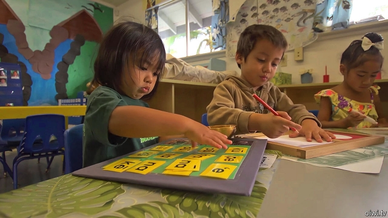

###### Speak, memory

# The surprising revival of the Hawaiian language 

##### Could that success be replicated elsewhere? 

 

> Feb 21st 2019 

SO SING THE children at Hawaii’s Punana Leo O Hilo kindergarten on the Big Island of Hawaii. “It is raining on the uplands, it is raining by the sea.” The chant is much like any other “Rain, rain, go away” nursery rhyme, but it has an unusual power: it is one of the tools that has brought about the revival of a near-dead language. 

The decline of Hawaiian was not, as is the case with most disappearing languages, a natural demise caused by migration and mass media. In 1896, after the overthrow of the Hawaiian monarchy by American business interests, schools were banned from using the language, and children were beaten for speaking it. By the late 20th century, aside from a couple of hundred people on one tiny island, English had replaced Hawaiian and only the old spoke the language to each other. 

The civil-rights movement brought a revival of interest among the young, centred on the University of Hawaii at Hilo. Larry Kimura, a professor there, was not satisfied that the language should be merely a subject taught at college: he and his students wanted to bring it back to life. The idea for how to do that came from a visiting Maori, who suggested “language nests”, which had been successfully used to revive New Zealand’s native language. 

In 1985, when educating children in Hawaiian was still banned, Kauanoe Kamana and her husband Pila Wilson, both students of Kimura’s, created the first Punana Leo (which means “language nest”) at Hilo. Neither was a native speaker, but both were determined to bring up their children as such. They gathered together a small group of children, including their own son and daughter, and elderly native speakers. The movement grew: there are now 12 kindergartens and 23 schools, some of them stand-alone Hawaiian-medium schools, some Hawaiian-medium strands within English-medium schools. The number of children being educated in Hawaiian has risen from 1,877 in 2008 to 3,028 in 2018. Along with Japanese, Hawaiian is the non-English language most commonly spoken among children. 

The success has been hard-won. Campaigners had to get the law changed, and they also had to fight scepticism. “People in the community, even in our families, were saying: ‘You’ll ruin your children’s future, they won’t be able to go to college, they’ll be total failures’.” Such fears turned out to be unfounded. All the pupils at Nawahi, the main Hawaiian-medium school, complete high school, compared with the state average of 83%; 87% go to college, compared with a state average of 55%. 

But academic outcomes are not the primary focus, says Mr Wilson. “We value our connection with our ancestors more than we value being millionaires,” he says. Mr Kimura explains that the schools have allowed Hawaiians to pass on their culture, including the creation myths written by Kalakaua, Hawaii’s last king. “You folks have heirlooms,” he says of the British relationship to its monarchy. “We don’t. These are our crown jewels.” 

Combating the dominance of English is tough. Seventeen-year-old Kalamanamana Harman, who has been educated entirely in Hawaiian—and, with a place at Dartmouth, is one of the movement’s academic success stories—says that the wobbly moment for young Hawaiian-speakers comes at the beginning of high school. “At the age of 13, we tend to speak English a lot. It’s kind of like a virus.” But Hawaiian has a different sort of power. “We like to use it outside school, just to communicate in a secret language, so other kids want to learn it.” She is teaching it to the non-Hawaiian-speakers in her football team. 

Efforts have been made to revive other American languages. The most notable has been the rebirth of a truly dead language, Wopanaak, which used to be spoken by the Mashpee Wampanoag tribe of Massachusetts but died out in the 19th century. Fortunately, a 17th-century translation of the Bible into Wopanaak made reclamation possible, and it is now the medium of instruction in a kindergarten modelled on Punana Leo. But none has got as far as Hawaiian. “If you look around the world, it’s a very rare success,” says Andrew Cowell of the University of Colorado. He attributes that to the advantage of exclusivity—it is the only Native American language in Hawaii, whereas many states have a number of different tribes, each with its own language—and to support from the university. 

Kalamanamana Harman recalls a sense of isolation when she was brought up as a Hawaiian-speaker. “It’s hard being different from other kids,” she says, “but you see the value of it over time.” She intends to bring up her children as Hawaiian-speakers. Recalling her kindergarten days, she sings a snatch of the “Rain, rain, go away” chant, and points out that her name in Hawaiian means “rays of the sun”. 

