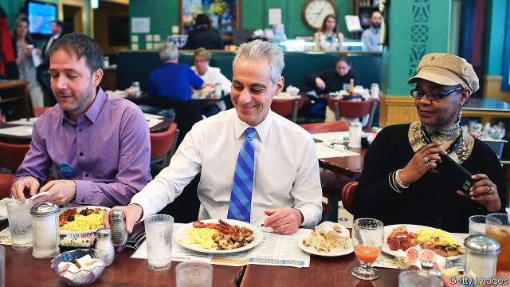
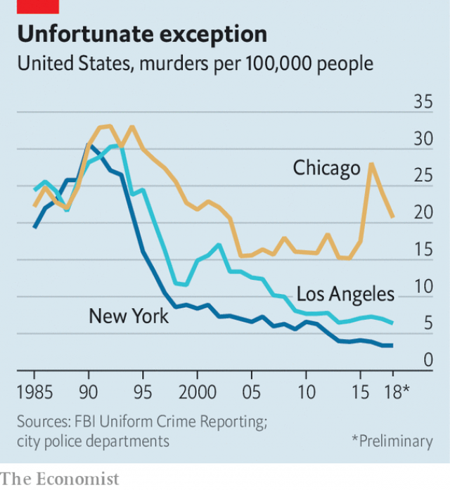

###### The heat-seeking missile

# What Rahm Emanuel has done for Chicago 

##### His “global city” still has deep-seated fiscal and social problems 

 

> Feb 23rd 2019 

RAHM EMANUEL is restless. He swallows an indigestion tablet, buttons a blue cardigan, then paces his office on the fifth floor of City Hall. On February 26th voters will choose between 14 candidates vying to replace him as mayor of Chicago. How does he think his two terms will be remembered? Predecessors let problems fester, he says, but “there wasn’t a single challenge we didn’t attack”. City debt, a lack of corporate investment, rotten schools, violence, racial segregation, corruption—all have long blighted America’s third-biggest city. “But we never walked away,” he says. 

Take his boasts with a pinch of salt. When pressed on Chicago’s large, lingering fiscal problems he is scornful, slaps your correspondent’s knee, then adds a sharp kick to his foot. “Nobody in public life solves anything. They improve it. If you’re here to solve it, call me,” he says. 

Mr Emanuel shrank the city’s structural deficit by hundreds of millions of dollars by cutting spending and increasing taxes. He has also been prone to raising new debt to pay off old, a bad habit known locally as “scoop and toss”. But Chicago’s finances never deteriorated as much as, say, Detroit’s, because the city’s economic engine kept whirring. 

David Axelrod, an ally from when both men worked for Barack Obama, praises the mayor as energetic, like a heat-seeking missile. “He is a brilliant guy, for all his quirks,” he says. In particular, Mr Axelrod admires him for tackling the city’s enormous fiscal problems. Credit-rating agencies have grown more optimistic about Chicago, after listing its bonds as junk. But the city’s long-term fiscal health is still doubtful. Ed Bachrach, co-author of a new book on Chicago, says overall city debt rose from $7.5bn to $9.7bn in seven years to 2017. Worse is a colossal, unfunded liability of some $40bn for pensions of city workers. Even Mr Emanuel admits he only “stopped the bleeding”. 

The wider economy is doing well, though the city can seem cut off from the rest of Chicagoland, as the cluster of suburban cities around Chicago is known. Disputes occasionally flare, as when Chicago politicians talk of expanding city limits around O’Hare airport. Some mayors strive to co-operate with their suburban neighbours to get things done—John Hickenlooper, who ran Denver between 2003 and 2011, was a good example. Mr Emanuel has preferred distant horizons, branding his as a “global city”. A two-decade-old Chicagoland “Mayors’ Caucus” does little. 

At least Chicago’s 2.7m population is stable after decades of decline. Its jobless rate is just 4% and poverty is falling. Last year nearly 58m tourists came for theatre, comedy, sports and museums. New walking and cycle tracks have been built by the river and lake. By one measure O’Hare again claims to be America’s busiest airport. It is set for a $12bn expansion. 

Mr Emanuel prodded firms such as McDonald’s to bring their headquarters to Chicago. The metropolis draws more foreign direct investment projects than any in America and is behind only London, Paris, Singapore and Amsterdam worldwide. Manufacturing, which still employs 9% of workers, is surprisingly strong. Ford announced on February 7th that it would add 500 jobs to a factory in the city. 

Chicago’s school system used to be a national joke. It was long dominated by intransigent teachers’ unions and almost went bust. At last that is changing. Longer school days, shorter holidays and the belated introduction of universal pre-school mean that children spend more time studying. Mr Emanuel claims the average child will gain the equivalent of an extra four years in school as a result. 

The mayor also closed 48 underused schools in poor, depopulating neighbourhoods. He is defensive about that, admitting it was “tough on them, on families, on me politically”. Black residents, almost the only ones affected, turned on him; Mr Axelrod says he should have found a way to soften the blow in already suffering districts. But the decision made sense, given a financially strained school system with capacity for 550,000 but only 360,000 children enrolled. 

As important, head teachers got more autonomy and added courses for high achievers—38,000 children are enrolled in International Baccalaureate programmes. Results are improving. More pupils finish: a pitiful 56% graduated seven years ago, whereas 78% do so now. The head of city schools, Janice Jackson, says that “for the first time there is a comprehensive push” to get everyone to complete high school. 

If Mr Emanuel thinks everything has gone so well, why did he back out of his well-funded bid for a third term last September? He says he was dissuaded by seeing polls that indicated he could win. Had they indicated the opposite, the ultra-competitive politician claims he would have relished the challenge, “because that’s the weird psychology of a middle Jewish kid”. Instead the 59-year-old will write a book, earn money somewhere and plot an eventual return to public life. 

 

More probably, he knew he faced a brutal campaign. In 2015 he was only narrowly re-elected. Black voters, one-third of the electorate, used to support him, but many resent the school closures and the persistence of violence and poverty in their districts. Chicago has failed to match the success of New York and Los Angeles in cutting murder rates sharply (see chart). 

The police chief, Eddie Johnson, praises a surge of 1,000 new officers and other efforts, like the “Becoming a Man” programme to deter 7,500 school pupils from being drawn into gangs. But many think the mayor has failed badly on crime. Mr Emanuel is scorned especially for a delay in the release of police footage of a policeman shooting Laquan McDonald, a black teenager, 16 times in 2014. 

After the video at last emerged in November 2015, violence soared and Mr Emanuel’s chances of re-election slumped. The policeman involved was recently found guilty, the first murder conviction of a serving officer in decades. That trial, under way as the campaign began, would have overwhelmed Mr Emanuel’s message. The mayor said he would not run the day before it started. 

What are Chicago’s prospects after him? Mayors usually are “larger than life and embody the energy” of a mighty urban centre, says Mr Axelrod. That hardly seems true of the people competing to succeed Mr Emanuel. Only Bill Daley, a stolid man who is the son and brother of two other long-serving mayors, might be recognised outside the Windy City. He is backed by rich donors who hope he will extend Chicago’s economic recovery. He might manage that, but he’s no missile. 

