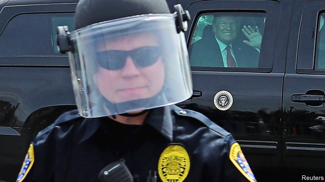
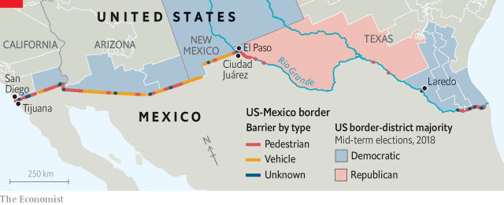

###### Of judges and journeys

# Will the courts let Donald Trump build his wall? 

##### Even if they do, this will not fix what ails the border 

 

> Feb 21st 2019 

A FEW HOURS after Donald Trump tweeted about “the attempted Invasion of Illegals, through large Caravans, into our Country”, Carmen sat in a church office in suburban Maryland, quietly sobbing. Five years ago she and her son, who was then three, fled from El Salvador and her violent husband. “It’s difficult to leave your country,” she says. “You have your family and your friends. Your whole life is rooted there. But when it comes to your child’s safety, I don’t think there is anything a mother wouldn’t do.” They crossed Guatemala, Mexico and the Rio Grande before presenting themselves to immigration cops in New Mexico. After being detained, she applied for asylum, and was released to await a hearing. She is still waiting. 

If America has a border crisis, it comes not from any sort of invasion—in the year to September 2018, the authorities caught 396,579 people trying to cross the southern border, fewer than half as many as in 2007—but from people like Carmen and her son: families fleeing troubled states in Central America to seek asylum. Mr Trump’s steel-bollard fencing, even if it survives a legal and political assault, will do nothing to fix that problem. 

Mr Trump wants to add 234 miles of fencing to the roughly 700 that already exist along America’s border with Mexico. He has identified four sources to pay for it. Congress gave $1.4bn. He also plans to take $601m from the Treasury Department’s asset-forfeiture funds and $2.5bn from the Defence Department’s anti-drug fund. His administration argues that declaring a national emergency, which he did on February 15th, gives him access to $3.6bn appropriated for military-construction projects. Not everyone agrees. 

Public Citizen, an advocacy group, filed suit in a federal court hours after Mr Trump’s declaration, on behalf of an environmental group as well as three landowners in Texas who believe they will face “an imminent invasion of their privacy and the quiet enjoyment of their land” during and after construction of the wall. They argue that historically low immigration numbers mean that no national emergency exists at the southern border. Mr Trump seemed to acknowledge that during a press conference, saying: “I didn’t need to do this, but I’d rather do it much faster.” They also argue that the statute Mr Trump has cited to let him use the $3.6bn does not apply, because the border wall is neither a military-construction project nor essential to support the mission of the armed forces. 

Another suit, filed the next day in the same court by three environmental groups, centres on the harm to wildlife and other “far-reaching environmental impacts” that building a wall could cause. The plaintiffs acknowledge that the National Emergencies Act of 1976 fails to define “emergency”. But, they contend, “common usage” of the term involves “elements of suddenness and surprise” that “require an urgent response”. Not only did Mr Trump say he did not need to declare an emergency, he bandied the idea around for weeks before the declaration as a strategy to circumvent Congress if his budget negotiations failed. 

On February 18th a group of 16 states sued Mr Trump in a federal court in San Francisco. They argue that his declaration evinces a “flagrant disregard of fundamental separation of powers principles ingrained in the United States constitution”—specifically the Appropriations Clause in Article I, which states that the government can spend only money provided by Congress. The states also argue that their National Guard units stand to lose millions in federal funding when the administration reallocates it to the wall. 

At least one of these cases will probably end up before the Supreme Court, where precedent cuts both ways. On the one hand, courts typically defer to the president on questions of national security. On the other, the Supreme Court ruled against then-president Harry Truman in 1952, striking down his attempt to seize steel mills in Youngstown Sheet & Tube Company v Sawyer. In a concurring opinion that has come to define the limits of executive authority, Justice Robert Jackson wrote that when a president “takes measures incompatible with the expressed or implied will of Congress”, his power “is at its lowest ebb”. Mr Trump seems to be in that territory. Congressional Democrats will try to pass a resolution condemning his money grab. 

Yet even if courts invalidate Mr Trump’s emergency declaration, he is likely to have almost $4.5bn to spend on a project of dubious practical utility. Christopher Wilson, of the Wilson Centre’s Mexico Institute, believes the discussion over where to erect new fencing “would be a rational conversation…20 years ago, before we had 700 miles of fencing along the border. Now we’re talking about where to put a 30-foot fence on top of a 1,000-foot mountain.” 

Walls work best, argues Doris Meissner of the Migration Policy Institute, a think-tank, “where urban areas touch other urban areas”. El Paso and Juárez, for example, form a single binational conurbation bisected by the Rio Grande. In sparsely populated areas, cameras and remote sensors are sufficient for picking up suspicious movements; in cities people can slip across borders more easily. 

Dee Margo, El Paso’s mayor, says that he would favour spending not on a wall, but on more staff to process the tens of thousands of people, cars and lorries that cross the border daily. He is not alone. All but one member of Congress from a border district is a Democrat (see map), and all, including the lone Republican, oppose Mr Trump’s wall. Fear-mongering about violent immigrants notwithstanding, 22 of the 23 border counties are safer than similarly sized counties elsewhere. 

 

If the goal is to stanch the flow of drugs coming from Mexico, money would be better spent improving scanners and other infrastructure at ports of entry, where most of them arrive hidden in vehicles. Better data analytics would improve risk-screening for people and vehicles crossing. But not all new infrastructure has to be high-tech: Mr Wilson praises dogs for their ability to sniff out drugs. The spending bill includes $776m for such measures, which is welcome, but only a seventh of what Mr Trump wants to spend on his wall. 

The bill also includes funds for another 75 immigration judges. That is also welcome but probably insufficient. Hiring tends to lag behind funding. In the last fiscal year Congress funded 484 immigration judges, but at year’s end just 395 were working. And as of September there was a backlog of 319,000 pending asylum cases. Between 2010 and 2017 the number of asylum claims filed annually rose from 28,000 to 143,000, with many coming from Venezuela, Guatemala and El Salvador. Political instability and violence in Central America pushes people north. But some are also drawn by America’s inefficient asylum system, which lets people stay and work while their claims are assessed. 

The real problem is structural. America’s immigration-enforcement system was designed to cope with the sort of migration that historically came from Mexico—single men looking for work, eager to dodge immigration police. It is not suited to today’s flow, which consists largely of families and children eager to present themselves to police so they can claim asylum. Sadly, ambitious immigration reform has eluded Washington for years, and this administration is unlikely to take up that poisoned chalice (see Lexington). 

Instead, it is poised to spend billions on a project that will let Mr Trump fulfil a campaign promise while changing little along the border. That money would be better spent on technology at ports of entry—and on improving America’s asylum system so that it draws fewer people northward, and leaves fewer people, like Carmen and her son, in limbo for so long. 

